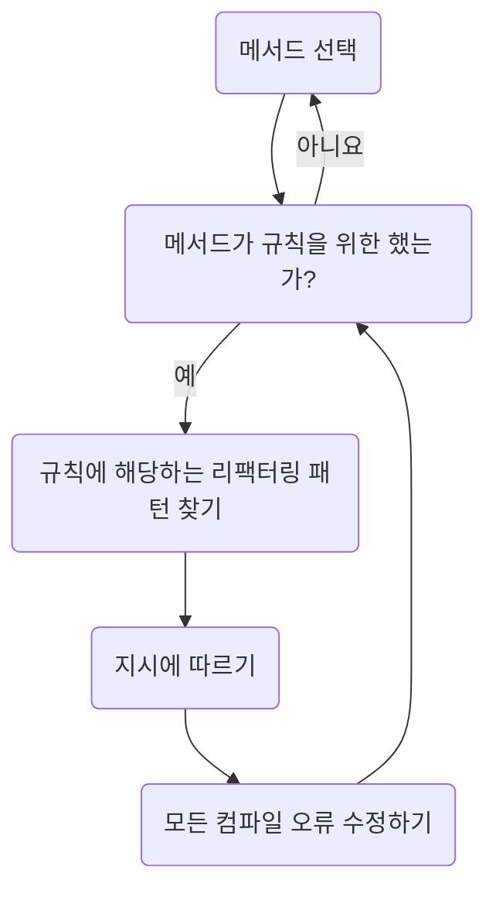

## 정의

- 좋은 코드: 사람이 읽기 쉽고, 유지보수가 용이하며, 의도한 대로 잘 동작하는 코드
- 리팩터링: 기능을 변경하지 않고 코드의 가독성과 유지보수가 쉽도록 코드를 변경하는 것.

## 이번 장에서 다룰 내용

- 리팩터링 구성요소 이해
- 일상 업무에 리팩터링 도입
- 리팩터링에 있어 안전의 중요성
- 1부의 핵심 예제 소개

## 리팩터링에 필요한 구성 요소

- 스킬(Skill): 어떤 코드가 잘못됐으니 리팩터링이 필요한지를 파악하는 스킬이 필요합니다. 숙련된 프로그래머는 코드 스멜에 대한 지식을 가지고 이를 알아낼 수 있습니다. 그러나 코드 스멜은 (판단과 경험이 필요해서) 경계가 모호하거나 다양하게 해석될 수 있으므로 배우기가 수비지 않습니다. 그러한 이유로 주니어 개발자들은 코드 스멜을 스킬이라기보다는 육감 같은 것으로 이해합니다.
- 문화(Culture): 리팩터링에 시간을 들이는 것을 권장하는 문화와 절차가 필요합니다. 많은 경우 이것은 테스트 주도 개발에서 많이 사용되는 레드-그린-리팩터 순환 절차로 구현됩니다. 그러나 테스트 주도 개발은 매우 어려운 스킬이며 레드-그린-리팩터는 기존 코드 기반에서 리팩터링을 하는 데는 큰 도움이 되지 않습니다.
- 도구(Tool): 우리가 하는 작업이 안전하다는 것을 보장할 무언가가 필요합니다. 이를 실현하는 가장 일반적인 방법은 자동화된 테스트입니다. 그러나 이미 언급한 바와 같이 효과적으로 자동 테스트를 수행하는 방법을 배우는 것 자체가 어렵습니다.

## 1.1 리팩터링이란 무엇인가?

- 기능을 변경하지 않고 코드를 변경하는 것.

### 리팩터링을 해야 하는 이유

- 코드를 더 빠르게 만들기 위해
- 더 작은 코드를 만들기 위해
- 코드를 더 일반적이거나 재사용 가능하게 하기 위해
- 코드의 가독성을 높이고 유지보수를 용이하게 하기 위해

### 많은 사람이 프로그래밍을 코드를 작성하는 것으로 생각하지, 대부분 프로그래머는 코드를 작성하는 것보다 코드를 읽고 이해하는 데 많은 시간을 보냅니다.

- 리팩터링의 첫 번째 이유는 순전히 경제적인 것입니다. 프로그래머의 시간은 비싸기 때문에 코드베이스의 가독성을 높이면 새로운 기능을 구현하기 위한 시간을 확보할 수 있습니다.
- 두 번째는 유지보수가 용이해지면 버그가 줄어들고 수정이 쉬워집니다.
- 세 번째는 좋은 코드베이스는 생각하기 편합니다.

## 1.2. 스킬: 무엇을 리팩터링 할 것인가?

### 1.2.1 코드 스멜의 예

- 함수는 한 가지 작업을 수행해야 한다.

### 1.2.2 규첵의 예

- 규칙의 모든 이름은 절대 용어(absolute terms)를 사용하기 때문에 기억하기 쉽습니다.
- 상세 설명에서 종종 규칙을 적용하지 않을 경우를 명시합니다.
- 설명에는 규칙의 의도도 기술되어 있습니다.
- 리팩터링을 배울 때는 절대 용어로 된 이름을 익히는 데만 집중합니다.
- 이름이 내면화되면 예외를 학습할 수 있습니다.

## 1.3 문화: 리팩터링은 언제 할까?

- "리팩터링은 샤워하는 것과 같습니다"(켄트 백)
- 리팩터링은 정기적으로 수행하는 것이 효과적이고 비용이 적게 들기 때문에 가능하면 일상 업무에 통합하는 것이 좋습니다.

### 프로그래밍 작업으로 문제를 해결할 때 사용하는 6단계 작업 절차

1. 탐색(Explore): 항상 실험부터 시작해야 합니다. 무엇인가를 신속하게 구현하면 고객이 무엇을 필요로 하는지 함께 확인할 수 있습니다.
2. 명세화(Specify): 무엇을 만들지 알게 되면 그것을 명세화합니다. 최적의 경우, 이것은 자동화된 테스트의 형태가 됩니다.
3. 구현(Implement): 코드를 구현합니다.
4. 테스트(Test): 코드가 2단계의 명세(사양)을 따르는지 확인합니다.
5. 리팩터링(Refactor): 코드를 전달하기 전에 다음 사람이 쉽게 작업할 수 있는지 확인합니다.
6. 전달(Deliver): 가장 일반적인 것은 풀 리퀘스트 또는 특정 브랜치로 푸시하는 것입니다.

### 1.3.1 레거시 시스템에서의 리팩터링

- "우선 변경하기 쉽게 만든 후 변경하라"(켄트 백)

### 1.3.2 언제 리팩터링을 하지 말아야 할까?

- 한 번 실행하고 삭제할 코드.
- 폐기되기 전 유지보수 모드에 있는 코드
- 임베디드 시스템이나 게임의 고급 물리엔지과 같이 엄격한 성능 요구사항이 있는 코드

## 1.4 도구: (안전한) 리팩터링 방법

- 레시피처럼 사세하고 단계별로 구조화된 리팩터링 패턴
- 버전 관리(Git)
- 컴파일러

## 1.5 시작하는 데 필요한 도구

- 프로그래밍 언어: 타입스크립트
  - 타입스크립트는 완전한 `비객체지향` 코드(즉, 클래스가 전무한 코드)에서 고도의 `객체지향` 코드로 전환하는 방법을 제공합니다.
  - 드물지만 타입스크립트가 방해가 되는 경우가 있습니다.
- 편집기: 비주얼 스튜디오 코드
- 버전 관리: Git

## 1.6 핵심 예제: 2D 퍼즐 게임

- DRY(Don't Repeat Yourself), KISS(Keep It Simple, Stupid) 원칙을 준소하고 있지만, 완벽하지는 않습니다.
- https://github.com/wikibook/five-line

### 1.6.1 연습만이 살 길이다: 두 번째 코드베이스

- https://github.com/wikibook/bomb-guy

## 1.7 실제 환경에서 소프트웨어에 대한 주의 사항

- 코드 스멜은 우리가 자동화된 리팩터링 프로그램을 만들 수 없기 때문입니다.
- 자동화된 테스트와 리팩터링을 별도로 배우는 것이 훨씬 쉽습니다.

## 요약

- 리팩터링을 수행하려면 리팩터링 대상을 식별하는 `스킬`과 리팩터링 단계를 명시적으로 가진 `문화`, 리팩터링을 돕는 `도구`의 조합이 필요합니다.
- 일반적으로 코드 스멜은 리팩터링 대상을 설명하는 데 사용됩니다. 이것들은 모호해서 주니어 프로그래머가 내면화하기 어렵습니다. 이 책에서는 학습하는 동안 코드 스멜을 대체할 구체적인 규칙을 제공합니다. 규칙에는 세 가지 추상화 수준이 있습니다. 매우 구체적인 이름, 예외 형태로 뉘앙스를 더하는 설명, 마지막으로 그것들이 나오게 된 스멜의 의도입니다.
- 자동화된 테스트와 리팩터링을 별도로 학습하면 진입 장벽을 낮출 수 있습니다. 자동화된 테스트 대신 컴파일러, 버전 관리 및 수동 테스트를 사용합니다.
- 리팩터링의 작업 절차를 레드-그린-리팩터 반복에서 테스트 주도 개발로 연결됩니다. 이는 자동화된 테스트에 의존한다는 것을 의미합니다. 그래서 이를 대신해 새로운 코드를 만들 때 사용하는 6단계의 작업 절차(탐색, 명세화, 구현, 테스트, 리팩터링, 전달)를 사용하거나 코드를 변경하기 직전에 리팩터링을 수행하도록 권장합니다.
- 이 책의 1부에서는 비주얼 스튜디오 코드, 타입스크립트, Git을 사용해 2D 퍼즐 게임의 소스코드를 바꿉니다.

---

- [파이브 라인스 오브 코드](https://product.kyobobook.co.kr/detail/S000200661796)
