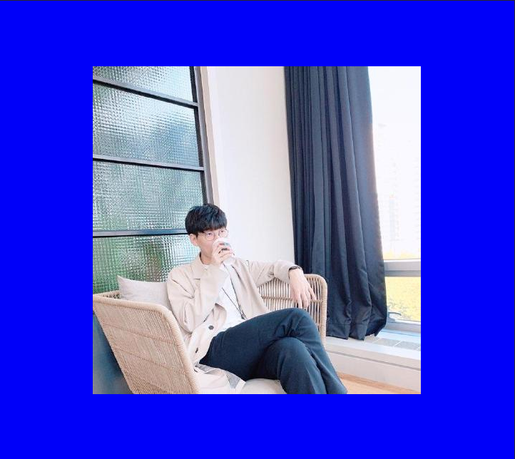
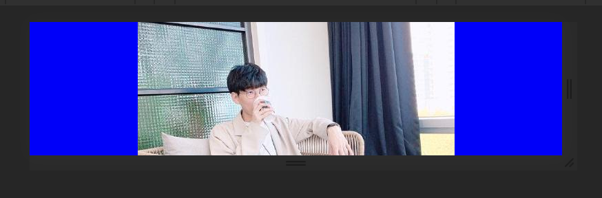
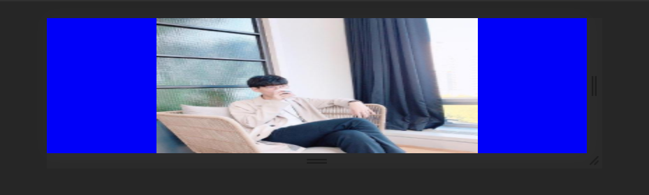
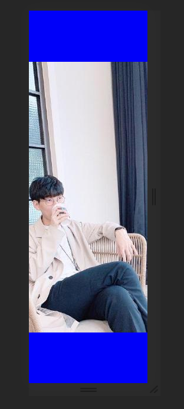

- flex를 이용해 중앙 정렬을 합니다.

```html
<!DOCTYPE html>
<html lang="ko-KO">
	<head>
		<meta charset="UTF-8" />
		<meta name="viewport" content="width=device-width, initial-scale=1.0" />
		<title>flex로 center 정렬</title>
		<style>
			.popup {
				position: fixed;
				top: 0;
				left: 0;
				bottom: 0;
				right: 0;
				display: flex;
				justify-content: center;
				align-items: center;
				background: blue;
			}
		</style>
	</head>

	<body>
		<div class="popup">
			
		</div>
	</body>
</html>
```



- 이 경우 팝업 안의 컨텐츠보다 높이가 작아질 경우 img의 일부가 화면 밖으로 벗어나게 됩니다.



- flex-direction를 column으로 변경하고 안의 컨텐츠에 overflow를 hidden으로 설정합니다.

```html
<!DOCTYPE html>
<html lang="ko-KO">
	<head>
		<meta charset="UTF-8" />
		<meta name="viewport" content="width=device-width, initial-scale=1.0" />
		<title>flex로 center 정렬</title>
		<style>
			.popup {
				position: fixed;
				top: 0;
				left: 0;
				bottom: 0;
				right: 0;
				display: flex;
				justify-content: center;
				align-items: center;
				background: blue;
				flex-direction: column;
			}

			img {
				overflow: hidden;
			}
		</style>
	</head>

	<body>
		<div class="popup">
			
		</div>
	</body>
</html>
```



- 세로에서 발생하던 문제가 가로에서 재현됩니다.



- img의 width를 100%로 설정해주어서 문제를 해결합니다.

```html
<!DOCTYPE html>
<html lang="ko-KO">
	<head>
		<meta charset="UTF-8" />
		<meta name="viewport" content="width=device-width, initial-scale=1.0" />
		<title>flex로 center 정렬</title>
		<style>
			.popup {
				position: fixed;
				top: 0;
				left: 0;
				bottom: 0;
				right: 0;
				display: flex;
				justify-content: center;
				align-items: center;
				background: blue;
				flex-direction: column;
			}

			img {
				overflow: hidden;
				width: 100%;
			}
		</style>
	</head>

	<body>
		<div class="popup">
			
		</div>
	</body>
</html>
```
