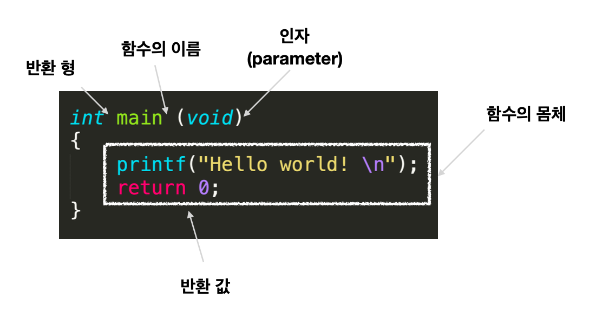
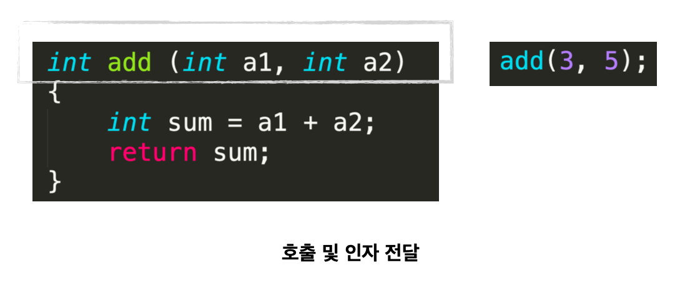

## 프로그래밍 언어란?

- 기계어
  - 0과 1로 이루어진 언어입니다.
  - 기계가 이해할 수 있습니다.
- 프로그래밍 언어
  - 비교적 사람이 이해할 수 있는 언어입니다.
  - 기계가 이해할 수 없습니다.
- 컴파일러
  - 프로그래밍 언어를 기계어로 바꾸어 기계가 이해할 수 있도록 합니다. 이러한 작업을 `컴파일`이라고 합니다.

### Low-level

- 기계어, 어셈블리 언어입니다.
- 기계는 이해할 수 있지만 사람은 이해하기 어려운 언어입니다.

### High-level

- C, Python, Java 같은 언어입니다.
- 기계는 이해할 수 없지만 사람이 이해하기 쉬운 언어입니다.

## C 언어의 역사

- 1971년 UNIX라는 운영체제의 개발을 위해 만들어졌습니다.
  - 기존의 언어는 Assembly 언어로 만들어져 있었습니다.
  - 기존 언어는 하드웨어에 대한 의존도가 높았습니다.
  - Dennis Ritchie, Ken Thompson
  - ALGOL 60(1960) - CPL(1963) - BCPL(1969) - B(1970) - C(1971)

## 변수

- 변수는 말 그대로 변하는 수 입니다.
  - 상황에 따라 크기가 변하는 수와 상황에 따라 값이 변하는 것을 의미합니다.

### 상수

- 변경이 불가능한 데이터입니다.
- Literal(그대로인) 상수 : 이름이 없는 상수
- Const(constant, 변함없는) 상수 : 이름이 있는 상수

## 변수의 형(type)

- 1 byte = 8 bit = 2^8

### 정수형

- char < short < int < long < long long
- char : 1바이트(-128 이상 +127 이하)
- short : 2바이트(-32,768 이상 +32,767이하)
- int : 4바이트(-2,147,483,648 이상 +2,147,483,647이하)
- long : 4바이트(-2,147,483,648 이상 +2,147,483,647이하)
- long long : 8바이트(-9,223,372,036,854,775,808 이상 + 9,223,372,036,854,775,807 이하)

### 실수형

- float < double < long double
- float : 4바이트(±3.4 _ 10^-37 이상 ±3.4 _ 10^-38 이하)
- double : 8바이트(±1.7 _ 10^-307 이상 ±1.7 _ 10^-308 이하)
- long double : 8바이트(double 이상의 표현)

## 함수란?

- x를 넣었을 때, y로 반환 시켜주는 것입니다.

### 함수의 구성




## 산술 연산자

- \+ : 덧셈
- \- : 뺼셈
- \* : 곱셈
- \/ : 나눗셈
- \% : Modulo
- \= : 대입

```cpp
#include <stdio.h>

int main(void)
{
  int num1 = 2, num2 = 2;
  printf("%d + %d = %d\n", num1, num2, num1 + num2);
  printf("%d - %d = %d\n", num1, num2, num1 - num2);
  printf("%d * %d = %d\n", num1, num2, num1 * num2);
  printf("%d / %d = %d\n", num1, num2, num1 / num2);

  return 0
}
```

## 연산자 짧게 쓰기

```cpp
#include <stdio.h>

int main(void)
{
  int num1 = 2, num2 = 4, num = 6;
  num += 3;
  num2 *= 4;
  num %= 5;
  printf("%d %d %d", num1, num2, num3);

  int num1 = 2, num2 = 2;
  int num3 = num1++;
  int num4 = ++num2;
  printf("%d\n%d\n%d\n%d\n", num3, num4, num1, num2);

  return 0
}
```

## 논리 연산자

- \&& : AND
- \|| : OR
- \! : 부정

```cpp
#include <stdio.h>

int main(void)
{
  int num1 = 10;
  int num2 = 12;
  int result1, result2, result3;

  result1 = (num1 == 10 && num2 == 12);
  result2 = (num1 < 10 && num2 > 12);
  result3 = (!num1);

  printf("result1: %d \n", result1);
  printf("result2: %d \n", result2);
  printf("result3: %d \n", result3);

  return 0
}

```

## 사용자로부터 입력 받기

- 출력 : printf
- 입력 : scanf

```cpp
#include <stdio.h>

int main(void)
{
  int result;
  int num1, num2, num3;

  printf("3개의 정수 입력: ");
  scanf("%d %d %d", &num1, &num2, &num3);

  result = num1 + num2 + num3;
  printf("sum = %d\n", num1 + num2 + num3);

  return 0
}

```

### 프로그램 사용자로부터 두 개의 정수를 입력 받아서 두 수의 뺄셈과 곱셈의 결과를 출력하는 프로그램을 작성해 보세요.

```cpp
#include <stdio.h>

int main(void)
{
  int num1, num2;
  printf("숫자 2개 입력 : ");
  scanf("%d %d", &num1, &num2);
  printf("%d\n", num1 - num2);
  printf("%d\n", num1 * num2);

  return 0
}
```

### 하나의 정수를 입력 받아서, 그 수의 제곱의 결과를 출력하는 프로그램을 작성해 보세요. 예를 들어서 5가 입력되면 25가 출력되어야 합니다.

```cpp
#include <stdio.h>

int main(void)
{
  int num1;
  printf("숫자 1개 입력 : ");
  scanf("%d", &num1);
  printf("%d\n", num1 * num1);

  return 0
}

```

### 두 숫자를 입력받아 결과를 출력해주는 프로그램을 함수로 구현해 보세요.

```cpp
#include <stdio.h>

void sum(void)
{
  int num1, num2;
  printf("두 수를 입력하세요: ");
  scanf("%d %d", &num1, &num2);
  int num3 = num1 + num2;
  printf("%c\n", num3);
  printf("%d\n", num3);
}

int main(void)
{
  sum();

  return 0
}
```

## 서식 문자

| 서식 문자 | 출력 대상(자료형, type) | 출력 형태                      |
| --------- | ----------------------- | ------------------------------ |
| %d        | char, short, int        | 부호 있는 10진수 정수          |
| %ld       | long                    | 부호 있는 10진수 정수          |
| %lld      | Long long               | 부호 있는 10진수 정수          |
| %u        | Unsigned int            | 부호 있는 10진수 정수          |
| %o        | Unsigned int            | 부호 없는 10진수 정수          |
| %x, %X    | Unsigned int            | 부호 없는 10진수 정수          |
| %f        | float, double           | 10진수 방식의 부동 소수점 실수 |
| %Lf       | Long double             | 10진수 방식의 부동 소수점 실수 |
| %c        | char, short, int        | 값에 대응하는 문자             |
| %s        | char\*                  | 문자열                         |

```cpp
#include <stdio.h>
int main(void)
{
  long long num = 100;
  printf("%lld", num);

  char a = 'a';
  printf("%c", a);

  return 0
}
```

## 문자의 표현

- 숫자만 읽을 수 있는 컴퓨터에게 문자를 읽게 하는 방법은 문자를 숫자로 표현하게 하는 것입니다.(ASCII code)

## ASCII code

- ASCII(American Standard Code for Information Interchange, 미국 정보보안 표준 부호) code

```cpp
#include <stdio.h>

int main(void)
{
  char ch1 = 'A', ch2 = 65;
  int ch3 = 'Z', ch4 = 90;

  printf("%c %d \n", ch1, ch1);
  printf("%c %d \n", ch2, ch2);
  printf("%c %d \n", ch3, ch3);
  printf("%c %d \n", ch4, ch4);

  return 0
}
```

### 프로그램 사용자로부터 알파벳 문자 하나를 입력 받아서 이에 해당하는 아스키 코드 값을 출력하는 프로그램을 작성해 보세요.

- 문자 A를 입력하면 정수 65를 출력 해야 합니다.

```cpp
#include <stdio.h>

int main(void)
{
  printf("문자를 입력해 주세요: ");
  char a;
  scanf("%c", &a);
  printf("%d\n", a);

  return 0
}
```

## 반복문 - for

```cpp
for(초기식; 조건식; 중감식) {

}

for(int num=0; num <3; num++) {
  printf("Hello world!");
}
```

### 예제

```cpp
#include <stdio.h>

int main(void) {
  int total = 0;
  int i, num;

  printf("0 ~ num 까지의 덧셈을 할 때, num은? ");
  scanf("%d", &num);

  for(i = 0; i < num+1; i++) {
    total += i;
  }
  printf("0 ~ %d 까지의 덧셈 결과: %d\n", num, total);

  return 0
}
```

### 프로그램 사용자로부터 두 개의 정수를 입력 받습니다. 그리고 두 정 수 사이의 수를 모두 더한 결과를 출력하는 프로그램을 작성합니다.

```cpp
#include <stdio.h>

int main(void)
{
  int num1, num2, result = 0;
  printf("두 수를 입력하세요: ");
  scanf("%d %d", &num1, &num2);
  for (int i = num1; i <= num2; i++)
  {
    result += i;
  };
  printf("%d\n", result);

  return 0
}
```

### 계승(factorial)을 계산하는 프로그램을 작성해보자.

```cpp
#include <stdio.h>

int main(void)
{
  int num, result = 1;
  printf("수를 입력하세요: ");
  scanf("%d", &num);
  for (int i = 1; i <= num; i++)
  {
    result *= i;
  }
  printf("%d\n", result);

  return 0
}
```

## 반복문 - while

- 조건을 만족하는 동안, 내용을 수행한다.

```cpp
while (조건)
{
  내용
}

while (num < 5)
{
  printf("Hello world! %d\n", num);
  num = num + 1;
}
```

### 9단을 while문을 써서 출력해 보세요.

```cpp
#include <stdio.h>

int main(void)
{
  int i = 1;
  while (i < 10)
  {
    int result = 9 * i;
    printf("9 x %d = %d\n", i, result);
    i++;
  }
  return 0;
}
```

### 사용자에게 입력받은 단의 구구단을 while문을 써서 출력하되, 역순으로 출력해 보세요.

```cpp
#include <stdio.h>

int main(void)
{
  int num;
  printf("숫자를 하나 입력해 주세요\n");
  scanf("%d", &num);
  int i = 9;
  while (i >= 1)
  {
    int result = num * i;
    printf("%d x %d = %d\n", num, i, result);
    i--;
  }

  return 0;
}
```

## 반복문 - do ~ while

- 최소 한번은 무조건 실행을 해야 할 때 사용합니다.
- 조건을 먼저 검사하고 내용을 수행하는 while과 달리, `내용을 수행을 먼저 하고 조건을 검사`합니다. 때문에 최소 한번은 무조건 실행이 됩니다.

```cpp
do {
  내용
} while(조건)

do {
  prinf("Hello world!\n");
  num = num + 1;
} while(num < 3);
```

### 사용자에게 입력 받은 단의 구구단을 do~while문을 써서 출력하되, 역순으로 출력하세요.

```cpp
#include <stdio.h>

int main(void)
{
  int num;
  printf("숫자를 하나 입력해 주세요\n");
  scanf("%d", &num);
  int i = 9;
  do {
    int result = num * i;
    printf("%d x %d = %d\n", num, i, result);
    i--;
  } while (i >= 1);

  return 0;
}
```

## 반복문의 중첩

### 입력한 숫자 만큼 별(\*)을 찍어줍니다.

```cpp
#include <stdio.h>

int main(void)
{
  int num;
  printf("숫자를 하나 입력해 주세요\n");
  scanf("%d", &num);
  char st[2] = "*";
  for (int i = 0; i < num; i++)
  {
    for (int j = 0; j <= i; j++)
    {
      printf("%s", st);
    }
    printf("\n");
  }

  return 0;
}
```

## 분기문 - if

- 조건이 참이면, 내용을 수행합니다.

```cpp
if (조건) {
  나용
}

if (num % 2 == 0) {
  printf("%d", num);
}
```

## 분기문 - if else

```cpp
if (조건 1) {
  내용 1
} else if (조건 2) {
  내용 2
} else if (조건 3) {
  내용 3
}

if (num % 2 == 0) {
  printf("2의 배수 입니다.");
} else if (num % 3 == 0) {
  printf("3의 배수 입니다.");
} else if (num % 5 == 0) {
  printf("5의 배수 입니다.");
}

```

## 입력받은 숫자까지 홀수의 합을 더한다.

```cpp
#include <stdio.h>

int main(void)
{
  printf("숫자 하나 입력해 주세요.\n");
  int num = 0;
  scanf("%d", &num);
  int result = 0;
  for (int i = 0; i <= num; i++)
  {
    if (i % 2 == 1)
      result += i;
  }
  printf("%d\n", result);

  return 0;
}
```
