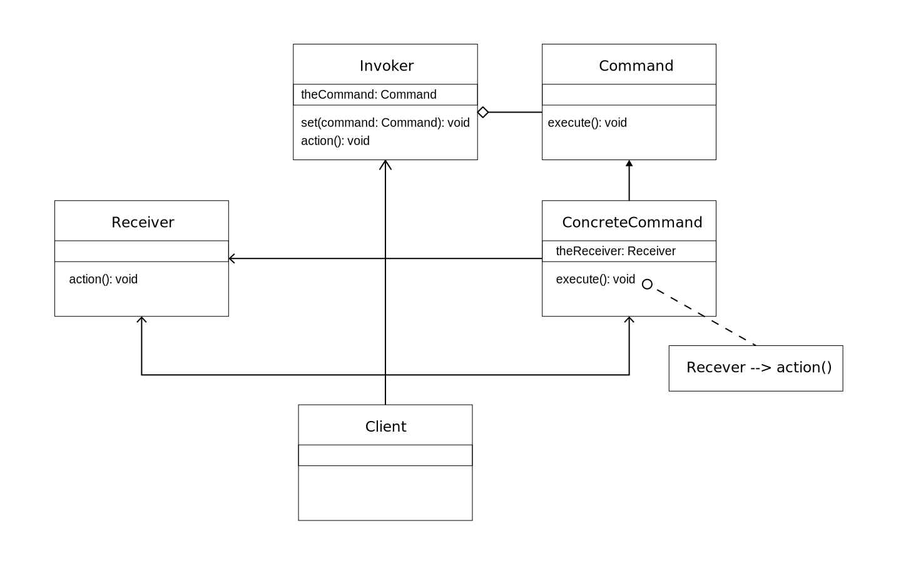

## 객체의 행위를 클래스로 만들어 캡슐화 하는 패턴

---

## 커맨드 패턴은 행위에 대한 패턴입니다.

- 클래스와 객체들이 상호작용하는 방법 및 역할을 분담하는 방법과 관련된 패턴입니다.
- 한 객체가 혼자 수행할 수 없는 작업을 여러 개의 객체로 어떻게 `분배`하는지, 또 그렇게 하면서도 객체 사이의 `결합도를 최소화`하는 것에 중점을 둡니다.
- 템플릿 메소드, 인터프리터, 역할 변경, 비지터, `커맨드`, 스트래티지, 미디에이터, 이터레이터, 메멘토, 옵저버, 스테이트 등이 있습니다.

---

## 커맨드 패턴을 부르는 다양한 명칭

- 커맨드 패턴
- 명령 패턴
- 작동(Action) 패턴
- 트랜잭션(Transaction) 패턴

---

## 커맨드 패턴이란?

- 커맨드 패턴(Command pattern)이란 `요청을 객체의 형태로 캡슐화`하여 사용자가 보낸 요청을 나중에 이용할 수 있도록 매서드 이름, `매개변수` 등 요청에 필요한 정보를 저장 또는 로깅, 취소할 수 있게 하는 패턴입니다.
  - 가장 주의 깊게 볼 사항은 커맨드 자체를 `객체화`한다는 점입니다.
  - `재사용성`이 높은 클래스를 설계하는 패턴을 말합니다.
  - 요청 자체를 `캡슐화`합니다.
  - 절차지향 프로그램에서는 이를 `콜백 함수`, 즉 어딘가 등록되었다가 나중에 호출되는 함수를 사용해서 이러한 `매개변수화`를 표현할 수 있습니다. 명령 패턴은 `콜백을 객체지향 방식`으로 나타낸 것입니다.
- 이 패턴의 핵심은 `Command 인터페이스`입니다.

---

## 커맨드 패턴 들여다 보기

- 실행될 기능을 캡슐화함으로써 `기능의 실행을 요구하는 호출자(Invoker)` 클래스와 `실제 기능을 실행하는 수신자(Receiver)` 클래스 사이의 `의존성을 제거`합니다. 따라서 실행될 기능의 변경에도 `호출자 클래스를 수정 없이` 그대로 사용 할 수 있습니다.
  - 이렇게 하기 위해 행동과 리시버를 한 객체에 집어넣고 메소드 하나만 외부에 공개하는 방법을 사용한다.
  - 보통 OOP에서는 주체 객체와 대상 객체가 존재하고, 대상 객체에 대한 액션은 주체 객체에서의 메쏘드로 처리하는데, 이 `액션까지 객체`로 만든 뒤에 처리하는 것입니다.

---

## 개방-폐쇄 원칙(OCP, Open-Closed Principle)

- 명령어를 인보커에 언제든지 등록할 수 있고, 원하는 언제든지 인보커로 간단하게 실행시킬 수 있습니다. 추후 명령이나 리시버가 더 추가될 경우 기존 코드에 수정 없이, 두 객체를 만들고 setCommand() 로 추가해주면 됩니다. 즉, `OCP 원칙`을 잘 지켜냅니다.

---

## 커맨드 패턴의 확장

- `메타 커맨드` 패턴을 이용하게되면 명령으로 이루어진 메크로를 만들어서 여러 명령을 실행 가능합니다.
- `메크로 커맨드`는 커맨드를 확장해서 여러 개의 커맨드를 한꺼번에 호출할 수 있게 해 주는 간단한 방법입니다. 매크로 커맨드에서도 어렵지 않게 작업취소 기능을 지원할 수 있습니다.
- 프로그래밍을 하다 보면 요청 자체를 리시버한테 넘기지 않고 자기가 처리하는 `스마트 커맨드` 객체를 사용하는 경우도 종종 있습니다.

---

## 장점

- 작업을 수행하는 객체(리시버)와 작업을 요청하는 객체를 분리하기 때문에 `SRP 원칙(단일 책임 원칙)`을 잘 지킵니다.
- `이벤트`가 발생했을 때 실행될 기능이 다양하면서도 `변경`이 필요한 경우에 이벤트를 발생시키는 클래스를 변경하지 않고 `재사용`하고자 할 때 유용합니다.
- 기존 코드 수정 없이 새로운 리시버, 명령어 추가가 가능하기 때문에 `OCP 원칙(개방 폐쇄 원칙)`을 잘 지킵니다.
- 커맨드 단위의 별도의 액션(undo, redo) 등이 가능하고, 커맨드 상속 및 조합을 통해 더 정교한 커맨드를 구현할 수 있습니다.

---

## 단점

- 전체적으로 이해가 필요하고 복잡한 설계구조를 가집니다.

---

## 활용 상황

- 커맨드 발생 시점을 사용자가 커스터마이징 해야 하는 경우
  - 서로 다른 시간에 요청을 명시하고, 저장하며, 실행하고 싶을 때 사용합니다.
- 여러 커맨드를 조합하여 하나의 커맨드처럼 사용할 필요가 있는 경우
- 커맨드 실행 취소, 재 실행 등의 기능을 구현해야 하는 경우
  - 연산의 반복 사용을 통해 수행과 취소를 무한 반복할 수 있습니다.
- 수행할 동작을 객체로 매개변수화하고자 하는 경우
- 기본적인 연산의 조합으로 만든 상위 수준 연산을 써서 시스템을 구조화하고 싶을 때 사용합니다.

---

## Command 패턴 사용 방법

- 커맨드 패턴에는 `명령(command)`, `수신자(receiver)`, `발동자(invoker)`, `클라이언트(client)`의 네개의 용어가 있습니다.
- Command 인터페이스와 ConcreteCommand 구현체만 있어도 커맨드 패턴을 사용했다고 볼 수 있습니다. 다만 Receiver를 이용해 실제 명령의 실행 코드와 개념적인 명령을 분리하고, Invoker를 이용해 명령의 실제 실행을 Client와 분리하는 것이 좋습니다.
- 코드를 실행시키면, 장군이(client)이 전략(invoker)을 통하여 명령(command)를 내려 명령을 수행(Receiver)하게 됩니다.

---

## 식당 주문 시스템에 비유해서 알아보겠습니다.

- 어떤 식당에는 주방장과 웨이터가 있습니다. 이 식당에 어떤 손님이 들어와, 주문서에 스파게티를 작성하고 이를 웨이터에게 전달했습니다. 웨이터는 이 주문서를 읽고 주방장에게 스파게티 요리를 요청합니다.
- 손님 : Client
- 웨이터 : Invoker 객체
- 주문을 받는 것 : setCommand()
- 주문서 : Command 객체
- 주문을 주방장에게 전달하여 요리를 요청 하는 것 : execute()
- 주방장: Receiver 객체

---

### Client

- 말 그대로 명령을 내릴 `사용자`입니다.
- 클라이언트는 ConcreteCommand를 생성하고 Receiver를 설정합니다.
- 누가(Receiver) 무엇(Command)을 할지에 대해서만 알고 있습니다.
- 클라이언트 객체는 `발동자 객체`와 `하나 이상의 커맨드 객체`를 보유합니다.
  - 명령을 수행하려면, 클라이언트 객체는 발동자 객체로 커맨드 객체를 전달합니다.
- 클라이언트 객체는 어느 시점에서 어떤 명령을 수행할지를 결정합니다.

---

## Receiver

- 리시버는 요구 사항을 수행하기 위해 어떤 일을 처리해야 하는지 알고 있는 객체입니다.
- 실제로 Client의 원하는 요청을 수행하는 객체입니다.
- 누가 언제 요청해왔는지 모릅니다. 액션에 대해서만 관심(구현)을 가집니다.

---

## Invoker

- 인보커에는 명령이 들어 있으며, execute() 메소드를 호출함으로써 커맨드 객체에서 특정 작업을 수행해 달라는 요구를 하게 됩니다.
- Client의 요청을 받아 실제로 Receiver의 액션을 호출하는 객체입니다.
  - Client는 Invoker를 거쳐 Receiver에게 요청하기 때문에, Invoker에서 Receiver에 도달하기 전, 요청에 대한 이런저런 설정들을 할 수가 있습니다.
  - 발동자 객체는 필요에 따라 명령 발동에 대한 `기록`을 남길 수 있습니다.
- 한 발동자 객체에 다수의 커맨드 객체가 전달될 수 있습니다.

---

## Command

- ConcreteCommand의 추상 클래스입니다.
- 공통 인터페이스로 가집니다. 이 메소드에서는 리시버에 특정 작업을 처리하라는 지시를 전달합니다.
  - execute()
  - undo()
  - redo()

---

## ConcreteCommand

- 커맨드 객체는 수신자 객체를 가지고 있으며, 수신자의 메서드를 호출하고, 이에 수신자는 자신에게 정의된 메서드를 수행합니다.
- 커맨드 객체는 별도로 발동자 객체에 전달되어 명령을 발동하게 합니다.
- 특정 행동과 리시버 사이를 연결해 줍니다.
  - 인보커에서 execute() 호출을 통해 요청을 하면 ConcreteCommand 객체에서 리시버에 있는 메소드를 호출함으로써 그 작업을 처리합니다.
- 실제 구체적인 `요청 내용`을 담는 클래스입니다.
- 누가(Receiver)가 무엇을 해야하는지를 구현합니다.
  - execute 메소드 안의 로직

---

## NoCommand 객체

- NoCommand 객체는 일종의 널 객체(null object)입니다. 딱히 리턴할 객체는 없지만 클라이언트 쪽에서 null을 처리하지 않아도 되도록 하고 싶을 때 널 객체를 활용하면 좋습니다.
- 널 객체는 여러 디자인 패턴에서 유용하게 쓰입니다. 널 객체를 일종의 디자인 패턴으로 분류하기도 합니다.

---

## 스트레티지 패턴

- 추상화 수준이 더 많아진 스트레티지 패턴처럼 느껴질 수 있습니다.
- 차이가 있다면, 스트레티지 패턴은 전략을 실행하는 객체와 전략 객체의 관계가 중요하다면, 커맨드 패턴은 명령이 객체화되어 다루어지는 것이 중요합니다.

---

## UML



---

## Command interface

```ts
interface Command {
  execute: () => void;
}
```

---

## Invoker class

```ts
class Invoker {
  private theCommand: Command;
  // 생성자에서 버튼을 눌렀을 때 필요한 기능을 인지로 받습니다.
  constructor(theCommand: Command) {
    this.setCommand(theCommand);
  }
  public setCommand(newCommand: Command) {
    this.theCommand = newCommand;
  }
  // 버튼이 눌리면 주어진 Command의 execute 메서드를 호출한다.
  public pressed() {
    this.theCommand.execute();
  }
}
```

---

## Receiver class

```ts
// Receiver class
class Lamp {
  public turnOn() {
    console.log('Lamp On');
  }
}

class Alarm {
  public start() {
    console.log('Alarming');
  }
}
```

---

## ConcreteCommand

```ts
class LampOnCommand implements Command {
  // Receiver
  private theLamp: Lamp;
  constructor(theLamp: Lamp) {
    this.theLamp = theLamp;
  }
  // Command 인터페이스의 execute 메서드
  public execute() {
    this.theLamp.turnOn();
  }
}
class AlarmStartCommand implements Command {
  // Receiver
  private theAlarm: Alarm;
  constructor(theAlarm: Alarm) {
    this.theAlarm = theAlarm;
  }
  // Command 인터페이스의 execute 메서드
  public execute() {
    this.theAlarm.start();
  }
}
```

---

## Client

```ts
// Receiver
const lamp = new Lamp();
// ConcreteCommand
const lampOnCommand = new LampOnCommand(lamp);
// Receiver
const alarm = new Alarm();
// ConcreteCommand
const alarmStartCommand = new AlarmStartCommand(alarm);
// Invoker
const invoker1 = new Invoker(lampOnCommand); // 램프 켜는 Command 설정
invoker1.pressed(); // 램프 켜는 기능 수행
// Invoker
const invoker2 = new Invoker(alarmStartCommand); // 알람 울리는 Command 설정
invoker2.pressed(); // 알람 울리는 기능 수행
invoker2.setCommand(lampOnCommand); // 다시 램프 켜는 Command로 설정
invoker2.pressed(); // 램프 켜는 기능 수행
```

---

## 기능이 추가된 커맨드 패턴

```ts
const add = (x, y) => x + y;
const sub = (x, y) => x - y;
const mul = (x, y) => x * y;
const div = (x, y) => x / y;

class Command {
  execute: (x, y) => number;
  undo: (x, y) => number;
  value: number;
  name: string;
  constructor(execute, undo, value, name) {
    this.execute = execute;
    this.undo = undo;
    this.value = value;
    this.name = name;
  }
}

class AddCommand {
  constructor(value) {
    return new Command(add, sub, value, 'Add');
  }
}

class SubCommand {
  constructor(value) {
    return new Command(sub, add, value, 'Sub');
  }
}

class MulCommand {
  constructor(value) {
    return new Command(mul, div, value, 'Mul');
  }
}

class DivCommand {
  constructor(value) {
    return new Command(div, mul, value, 'Div');
  }
}

class Calculator {
  current: number;
  commands: any[];
  constructor() {
    this.current = 0;
    this.commands = [];
  }
  action(command) {
    const name = command.name;
    return `${name.charAt(0).toUpperCase()}${name.slice(1)}`;
  }
  execute(command) {
    this.current = command.execute(this.current, command.value);
    this.commands.push(command);
    console.log(`${this.action(command)}: ${command.value}`);
  }
  undo() {
    const command = this.commands.pop();
    this.current = command.undo(this.current, command.value);
    console.log(`Undo ${this.action(command)}: ${command.value}`);
  }
  getCurrentValue() {
    return this.current;
  }
}

const calculator = new Calculator();

calculator.execute(new AddCommand(100));
calculator.execute(new SubCommand(24));
calculator.execute(new MulCommand(6));
calculator.execute(new DivCommand(2));

calculator.undo();
calculator.undo();

console.log(`Value: ${calculator.getCurrentValue()}`);

// Add: 100
// Sub: 24
// Mul: 6
// Div: 2
// Undo Div: 2
// Undo Mul: 6
// Value: 76
```

---

## 클래스가 없는 커맨드 패턴

```javascript
const carManager = {
  requestInfo: function (model, id) {
    return `The information for ${model} with ID ${id} is foobar`;
  },
  buyVehicle: function (model, id) {
    return `You have successfully purchased Item ${id}, a model`;
  },
  arrangeViewing: function (model, id) {
    return `You have successfully booked a viewing of ${model} ( ${id} )`;
  },
};

carManager.execute = function (name) {
  return (
    carManager[name] &&
    carManager[name].apply(carManager, [].slice.call(arguments, 1))
  );
};

console.log(carManager.execute('buyVehicle', 'Ford Escort', '453543'));
console.log(carManager.execute('arrangeViewing', 'Ferrari', '14523'));
console.log(carManager.execute('requestInfo', 'Ford Mondeo', '54323'));
console.log(carManager.execute('requestInfo', 'Ford Escort', '34232'));
console.log(carManager.execute('buyVehicle', 'Ford Escort', '34232'));
```

---

## 참고

- [[Design Pattern] 커맨드 패턴이란](https://gmlwjd9405.github.io/2018/07/07/command-pattern.html)
- [커맨드 패턴 (Command Pattern)](https://johngrib.github.io/wiki/command-pattern/)
- [커맨드 패턴](https://ko.wikipedia.org/wiki/%EC%BB%A4%EB%A7%A8%EB%93%9C_%ED%8C%A8%ED%84%B4)
- [🙈[디자인패턴] 커맨드 패턴 ( Command Pattern )🐵](https://victorydntmd.tistory.com/295)
- [정리정리정리](https://jusungpark.tistory.com/18)
- [[디자인 패턴] 커맨드 패턴 (Command Pattern)](https://gdtbgl93.tistory.com/23)
- [[디자인 패턴 16편] 행동 패턴, 커맨드 (Command)](https://dailyheumsi.tistory.com/217)
- [코더가 아닌 개발자!! Why를 가지자!](https://jeongupark-study-house.tistory.com/65)
