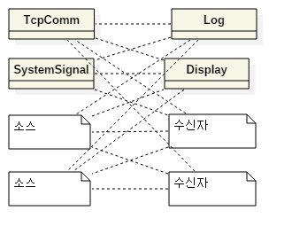
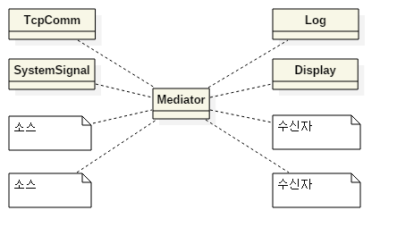
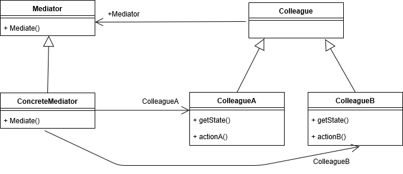
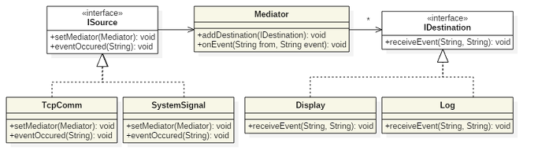

## 중재자 패턴은 행동 패턴으로 분류 됩니다.

- 중재자 디자인 패턴은 유연하고 재사용 가능한 객체 지향 소프트웨어를 설계하기 위해 반복되는 디자인 문제를 해결하는 방법 23가지 `GoF 디자인 패턴들 중 하나`입니다.
  - 객체는 구현, 변경, 테스트, 재사용이 쉬워야 합니다.
- 디자인 패턴 분류인 생성, 구조, 행동, 동시실행 중 프로그램의 실행 행위를 변경할 수 있기 때문에 `행동 패턴`으로 간주됩니다.

---

## 키워드

- 캡슐화
- 느슨한 결합
- 독립적인 상호작용

---

## 중재자 패턴 혹은 조정자 패턴 이란 무엇일까요?

- 모든 클래스간의 복잡한 로직(상호작용)을 `캡슐화`하여 하나의 클래스에 위임하여 처리하는 패턴입니다.
- 중재자 패턴을 사용하면 `객체 간 통신은 중재자 객체 안에 함축`됩니다.
- 객체들간의 상호작용을 캡슐화하여 다른 독립된 객체가 `느슨하게 결합`되어 쉽게 관리 할 수 있게 하는 패턴입니다. 이를 통해 서브클래스들이 많아지는 것을 제한하며, `종속성을 줄여주고`, `통제의 집중화`를 구현할 수 있습니다.

---

## 중재자 패턴은 결합도를 감소 시킵니다.

- 시스템을 설계하다 보면 이벤트가 발생하는 객체가 여러개(M)이고, 이들 이벤트를 받는 곳도 여러 곳(N)인 경우가 있습니다. 이런 경우에 모든 이벤트들을 주고 받기 위해서는 M:N의 관계가 생기게 됩니다. 이렇게 되면 전체 시스템이 복잡해지는 것은 당연하다. Mediator(중재자) 패턴은 이런 M:N 관계에 중간 객체를 도입하여 각각 M:1 관계를 만들어 주는 패턴입니다.

---

## M:1의 장점은 무엇일까요?

- M개의 object 사이에 이들의 관계를 control 하는 Mediator를 하나 넣어서 Mediator가 모든 object들의 communication을 관리하도록 합니다.
- M:N의 관계에서 `M:1`의 관계로 복잡도를 떨어뜨려 유지 보수 및 재사용의 확장성에 유리한 패턴입니다.
- 객체들은 더 이상 다른 객체와 서로 직접 통신하지 않으며 대신 중재자를 통해 통신합니다. 이를 통해 통신 객체 간 의존성을 줄일 수 있으므로 `결합도를 감소`시킵니다.

---

## 주요 쟁점들에 대해 알아보겠습니다.

- 패턴에서는 서로 명령을 주고 받을 수 있는 형식이 있다고 했을 때 서로 명령을 주고 받는 부분을 중재하는 형식을 정의를 합니다. 그리고, 원래 서로 명령을 주고 받았던 개체들은 중재자 개체를 알게 하고 중재자 개체는 이들 개체를 알게 합니다.
- Mediator은 Colleague가 Mediator에서 알려주는 것을 의미하고 ColleagueA도 마찬가지로 Mediator가 ColleagueA, B에게 알리는 것을 의미합니다.
- 각 소스들은 각각 이벤트가 발생했다는 사실만 별도의 객체에 알려 주고, 이벤트 수신자에게 이벤트를 보내는 역할은 그 객체가 담당하도록 만듭니다.
  - 복잡한 관계를 단순화 하기 위해서는 소스와 수신자를 동일화 시킬 필요가 있습니다.

---

## 구현 방식에 대해 알아보겠습니다.

- 소스는 setMediator() 메소드를 통해서 외부로부터 Mediator 객체를 주입 받습니다.
- 이벤트가 발생하면 Mediator 객체의 onEvent() 메소드를 호출하여 자신에게 발생한 이벤트를 전달 합니다.
- IDestination을 구현한 수신자 객체들은 생성된 후 Mediator 객체에 자신을 등록 시킵니다. 이를 통해 Mediator 객체가 이벤트 발생 시 이벤트를 전달 받을 수신자들을 알 수 있게 됩니다.

---

## 중개자 패턴의 장점을 정리해 보겠습니다.

- 시스템에 들어있는 객체 사이에서 오가는 메시지의 종류를 확 줄이고 단순화시킬 수 있습니다.
- class들을 느슨한 결합 상태로 유지할 수 있습니다.
- 객체들 사이에 Mediator를 넣어 연결관계를 캡슐화한다.
- Mediator는 M:N의 객체관계를 M:1로 전환합니다.
- 전체적인 연결관계를 이해하기 쉽습니다.(communication의 흐름을 이해하기 쉽습니다)
- 객체간의 상호작용은 Mediator가 처리합니다. 따라서 중개자 개체를 사용하여 단일 구성 요소에 대한 통신 논리를 추출하므로 `단일 책임 원칙`을 따릅니다. 또한 시스템의 `나머지 부분을 변경할 필요 없이 새로운 중재자를 도입`할 수 있습니다.
- 객체들 간 수정을 하지않고 관계를 수정할 수 있습니다.
- 각 객체들은 Mediator 객체를 제외한 `다른 객체는 알지 못합니다`.
- 객체들간의 관계의 복잡도, 의존성 및 결합도를 감소 시킵니다.

---

## 중개자 패턴은 무조건 좋을 것일까요?

- 특정 application 로직에 맞춰져있기 때문에 다른 application에 재사용하기 힘듭니다.
  - 옵저버 패턴과는 반대입니다. 재사용성은 좋지만 연결관계가 복잡해지면 이해하기 어렵습니다.
- 중재자 패턴 사용 시 중재자 객체에 권한이 집중화되어 굉장히 크며 복잡해지므로, 설계 및 중재자 객체 수정 시 주의해야 합니다.
- 때때로 시스템의 잘못된 설계로 인해 단단히 결합된 물체가 너무 많을 수 있습니다. 이 경우 중재자 패턴을 적용해서는 안됩니다.

---

## 중개자 패턴의 구성 요소에 대해 알아보겠습니다.

- Mediator : Colleague 객체간의 상호작용을 위한 `인터페이스`를 정의합니다.
- ConcreteMediator : Mediator의 인터페이스를 `구현`하여 객체간의 상호작용을 조정합니다.
- Colleague : `다른 Colleague와의 상호작용을 위한 인터페이스`를 정의합니다.
- ConcreteColleague : `Colleague의 인터페이스를 구현`하며 Mediator를 통해 다른 Colleague와 상호작용합니다.

---

## 적용범위

- 서로 연관된 GUI 구성요소들을 관리하기 위한 용도로 많이 쓰입니다.
- 커뮤니케이션을 하고자 하는 객체가 있을 때 서로가 커뮤니케이션 하기 복잡한 경우 이를 해결해주고 서로 간 쉽게 해주며 커플링을 약화시켜주는 패턴이다.
- 객체들간의 상호작용이 복잡해서 서로간의 의존관계가 구조화 되어있지 않고 이해하기 어려울 때. 즉, 서로 관련된 객체 사이의 복잡한 통신과 제어를 한 곳으로 집중시키고자 할 때 사용합니다.
- 하나의 객체가 많은 다른 객체들을 참조하고 있어 이것을 재사용하기 어려울 때 사용합니다.
- 어떤 클래스의 객체에서 특정 이벤트가 발생할 때마다 연결된 다른 클래스들에 알려야 할 때 사용합니다.
- 여러 class에 분산되어 있는 행위를 많은 sub classing 없이 재구성해야 할 때 사용합니다.

---

## Mediator Pattern을 구현해 보겠습니다.

---

## Colleague

```ts
abstract class Colleague {
	protected mediator: Mediator;

	join(mediator: Mediator) {
		this.mediator = mediator;
		mediator.addColleague(this);
	}

	sendData(data: string) {
		if (!this.mediator) {
			throw new Error('mediator is null');
		}
		this.mediator.mediate(data);
	}

	abstract handle(data: string);
}
```

---

### ConcreteColleague

```ts
class ConcreteColleague extends Colleague {
	id: number;
	constructor() {
		super();
		this.id = Math.random();
	}
	handle(data: string) {
		console.log(this.id, data);
	}
}
```

---

## Mediator

```ts
abstract class Mediator {
	colleagues: Colleague[] = [];

	addColleague(colleague: Colleague) {
		if (!colleague) {
			throw new Error('colleague is null');
		}
		this.colleagues.push(colleague);
	}

	abstract mediate(data: string);
}
```

---

## ConcreteMediator

```ts
class ConcreteMediator extends Mediator {
	mediate(data: string) {
		this.colleagues.forEach(colleague => {
			// 중재 기능 추가
			colleague.handle(data);
		});
	}
}
```

---

## App

```ts
const App = () => {
	const mediator = new ConcreteMediator();

	const colleague1 = new ConcreteColleague();
	const colleague2 = new ConcreteColleague();
	const colleague3 = new ConcreteColleague();

	colleague1.join(mediator);
	colleague2.join(mediator);
	colleague3.join(mediator);

	colleague1.sendData('111');
	colleague2.sendData('222');
	colleague3.sendData('333');
};

App();
```

---

## 비슷해 보이는 다른 디자인 패턴과의 차이점을 알아보겠습니다.

- 커맨드 패턴
- 퍼사드 패턴
- 옵저버 패턴

---

## 커맨드 패턴과의 차이점은 무엇일까요?

- 커맨드 패턴과 비슷해 보이지만 명령을 수행하는 주체가 Mediator가 아닌 Colleague 입니다.

---

## 퍼사드 패턴과의 차이점은 무엇일까요?

- 퍼사드 패턴과 비교하면, 퍼사드는 단방향(1:M)이지만, Mediator는 `양방향(M:1)`이며, 퍼사드는 퍼사드를 통해서만 갈 수 있도록 통로 역할과 연결만 할 뿐 `특별한 로직`은 가지고 있지 않습니다. 반면, Mediator는 로직을 가지고 있기 때문에 `행위 패턴`으로 분류되어 있습니다.
  - Mediator는 colleague들을 알아야 합니다.

---

## 옵저버 패턴과의 차이점은 무엇일까요?

- 옵저버 패턴은 Subscriber이 받기만 하는데 Mediator은 서로 통신한다는 것에서 차이가 있습니다.
- 옵저버 패턴은 1개의 Publisher에 대해 N개의 Subscriber가 존재합니다. 즉 복수의 Subscriber가 Publisher의 상태만 관찰합니다. 그러나 Mediator의 경우 M개의 Publisher와 n개의 Subscriber가 존재합니다. 즉 M개의 Publisher가 서로서로 상태를 관찰하기 때문에 Publisher가 Subscriber가 될 수도, Subscriber가 Publisher가 될 수도 있습니다.

---

## 옵저버 패턴과의 차이를 명확하게 알기 위해 비교해서 정리해 보겠습니다.

- 옵저버 패턴은 재사용성이 좋습니다. 그러나 복잡한 communication에서는 이해하기 힘듭니다. `1개의 Publisher`와 N개의 Subscriber로 이루어져 있습니다.
- 중개자 패턴은 재사용성이 안 좋습니다. 복잡한 communication에서 이해하기 쉽습니다. `M개의 Publisher`, N개의 Subscriber 사이의 communication을 `1개의 Mediator`를 이용해 캡슐화하고 있습니다.

---

## 다른 예제

```javascript
class Participant {
	constructor(name) {
		this.name = name;
		this.chatroom = null;
	}
	send(message, to) {
		this.chatroom.send(message, this, to);
	}
	receive(message, from) {
		console.log(`${from.name} to ${this.name}: ${message}`);
	}
}

class Chatroom {
	constructor() {
		this.participants = new Set();
	}
	register(participant) {
		participant.chatroom = this;
		this.participants.add(participant);
	}
	send(message, from, to) {
		if (to) {
			// single message
			to.receive(message, from);
		} else {
			// broadcast message
			this.participants.forEach(participant => {
				if (participant !== from) {
					participant.receive(message, from);
				}
			});
		}
	}
}

const yoko = new Participant('Yoko');
const john = new Participant('John');
const paul = new Participant('Paul');
const ringo = new Participant('Ringo');

const chatroom = new Chatroom();

chatroom.register(yoko);
chatroom.register(john);
chatroom.register(paul);
chatroom.register(ringo);

yoko.send('All you need is love.');
yoko.send('I love you John.');
john.send('Hey, no need to broadcast', yoko);
paul.send('Ha, I heard that!');
ringo.send('Paul, what do you think?', paul);
```

<!-- ---




 -->

---

## 참고

- [[자바 디자인 패턴 이해] 16강 중재자 패턴 (Mediator)](https://www.youtube.com/watch?v=7imEWnkVFFg&t=966s)
- [중재자 패턴(Mediator Pattern)](https://www.crocus.co.kr/1542)
- [[디자인패턴] Mediator Pattern (중재자 패턴)](https://ganghee-lee.tistory.com/8)
- [[디자인 패턴] 중재자 패턴(Mediator Pattern)](https://always-intern.tistory.com/5)
- [[Design Pattern] Mediator Pattern](https://beomseok95.tistory.com/284)
