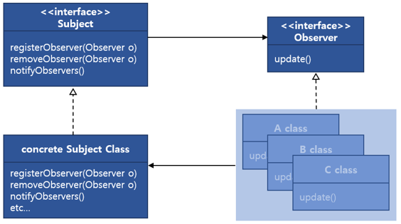

## 상태 변화를 감시자에게 통지합니다.

- 옵저버 객체들은 주체 주제 객체에 등록되어 있으며 주체의 데이터가 바뀌면 갱신 내용을 전달 받습니다.
- 옵저버 패턴은 한 객체의 상태가 바뀌면 그 객체에 의존하는 다른 객체들한테 연락이 가고 자동으로 내용이 갱신되는 방식으로 일대다(one-to-many) 의존성을 정의합니다.

---

## 다른 다른 명칭들은 무엇이 있을까요?

- 관찰자 패턴
- 종속자 패턴(dependent pattern)
- 게시-구독 패턴(publish-subscribe pattern)
- Pub/Sub(발행/구독) 모델

---

## 디자인패턴 분류는 행위(Behavioral) 패턴입니다.

- 디자인 패턴 분류인 생성, 구조, 행위 중 프로그램의 실행 행위를 변경할 수 있기 때문에 `행동 패턴`으로 간주됩니다.
- 객체나 클래스 사이의 알고리즘이나 `책임 분배`에 관련된 패턴입니다.
- 한 객체가 혼자 수행할 수 없는 작업을 여러 개의 객체로 어떻게 `분배`하는지, 그렇게 하면서도 객체 사이의 `결합도`를 최소화하는 것에 중점을 둡니다.

---

## 데이터 전달방식에는 2가지가 있습니다.

- 푸시 방식 : Publisher에서 정보나 상태가 변경될 때마다 Observer에게 보내는 방식입니다.
- 풀 방식 : Observer에서 정보가 필요할 때마다 Publisher에게 요청하는 방식입니다.

---

## observer 패턴에 대해 자세히 알아보겠습니다.

- 옵서버 패턴은 객체의 `상태 변화`를 관찰하는 관찰자들, 즉 옵저버들의 `목록을 객체에 등록`하여 상태 변화가 있을 때마다 `메서드 등을 통해 객체가 직접 목록의 각 옵저버에게 통지`하도록 하는 디자인 패턴입니다.
- 옵저버 패턴은 `감지할 객체의 클래스에 옵저버 인터페이스`를 주고, 만든 `객체를 옵저버 서버에 등록`하여 `옵저버 서버에서 함수를 호출해 인터페이스에 대응하는 함수를 실행`합니다.
- 주체자는 옵저버에 대한 정보가 없습니다. 오직 `옵저버가 특정 인터페이스를 구현한다`는 것만 알고 있습니다. 즉, `옵저버가 무슨 동작을 하는지 모릅니다`.
- 옵저버는 언제든지 새로 `추가`되거나 `제거`될 수 있습니다.
- 새로운 형식의 옵저버를 추가할 때에도 `주체에 전혀 영향을 주지 않습니다`. 이러한 관계를 `느슨한 결합(Loose coupling)`이라고 합니다.
- 상속받은 `객체를 배열로 저장`해서 배열을 `반복문을 돌려 모두에게 이벤트를 전파`하는 방식입니다.

---

## 디자인 원칙 - 개방 폐쇄 원칙(OCP)

- 서로 상호작용을 하는 객체 사이에서는 가능하면 `느슨하게 결합`하는 것이 좋습니다.
- 옵저버 패턴은 주체와 옵저버가 느슨하게 결합되어 `개방 폐쇄 원칙`을 지키게 도와주며, `캡슐화`가 잘 된 객체를 만들 수 있도록 도와줍니다.
  - 주체는 `observer 인터페이스 구현하는 객체 목록에만 의존`하기 때문입니다.
- 새로운 형식의 옵저버를 추가하려해도 주체를 전혀 변경할 필요가 없습니다.
  - 새로운 클래스에서 `observer 인터페이스만 구현`해주면 됩니다.
- 주체나 옵저버가 바뀌더라도 `서로에게 전혀 영향을 주지 않습니다`. 그래서 주체와 옵저버는 서로 `독립적으로 재 사용할수 있습니다`.
- 느슨하게 결합하는 디자인을 사용하면 변경 사항이 생겨도 무난히 처리할 수 있는 유연한 객체지향 시스템을 구축할수 있습니다. 객체 사이의 상호 `의존성을 최소화` 할 수 있기 때문입니다.

---

## Observer

- 데이터의 변경을 `통보 받는` `인터페이스`입니다.
- Observer는 Subject에 생긴 변화에 관심을 가집니다.
- Subject에서는 Observer 인터페이스의 update 메서드를 호출함으로써 ConcreteSubject의 데이터 변경을 ConcreteObserver에게 통보합니다.

---

## ConcreteObserver

- ConcreteSubject의 변경을 `통보받는` `클래스`입니다.
- Observer 인터페이스의 `update 메서드를 구현`함으로써 변경을 통보받습니다.
- 변경된 데이터는 ConcreteSubject의 `setState 메서드를 호출함으로써 변경을 조회`합니다.
- 옵저버 자신이 생성한 인자값을 전달할 수도 있습니다.

---

## Subject

- `이벤트를 발생시키는 주체`입니다.
- ConcreteObserver 객체를 `관리`하는 요소입니다.
- `Observer 인터페이스를 참조`해서 ConcreteObserver를 관리하므로 ConcreteObserver의 `변화에 독립`적일 수 있습니다.
- Subject는 `Observer들을 알고 있는 객체`입니다.
  - 여러 Observer가 Subject에 포함 될 수 있습니다.
- Observe를 `구독, 구독 해지, 정보 전달하는 메소드`를 가지고 있습니다.
- 임시로 작동을 멈추거나 재개하는 메서드를 이용해 이벤트가 계속해서 있을 때 홍수같이 발생하는 요청을 제어할 수도 있습니다.

---

## ConcreteSubject

- 변경 관리 대상이 되는 `데이터가 있는 클래스`(통보하는 클래스)입니다.
- 데이터 `변경을 위한 메서드인 setState`가 있습니다.
- setState 메서드에서는 자신의 데이터인 subjectState를 변경하고 Subject의 notifyObservers 메서드를 호출해서 ConcreteObserver 객체에 변경을 통보합니다.

---

## 대표적인 사례

- 옵서버 패턴은 여러 프로그래밍 라이브러리와 시스템에서 구현되는데 거의 모든 GUI 툴킷도 해당합니다.
- 데이터의 변경이 발생했을 경우 상대 클래스나 객체에 의존하지 않으면서 데이터 변경을 통보하고자 할 때 유용합니다.
  - 다양한 버튼과 리스너들(Observer)
- 객체의 속성 값 변화에 따른 응답을 처리할 때 사용합니다. 종종 콜백은 속성 값 변화를 처리하기 위해 호출될 뿐 아니라 속성 값 또한 바꿉니다. 때때로 이벤트 연쇄의 원인이 될 수 있습니다.
- 외부에서 발생한 이벤트(사용자 입력같은)에 대한 응답을 처리할 때 사용합니다. 이벤트 기반 프로그래밍에서 많이 보입니다.

---

### JavaScript에서의 사례

- JavaScript에서 addEventListener를 콜백과 함께 등록해놓으면 해당 이벤트가 발생할 때마다 콜백을 실행하는 것과 같이 이벤트(Subject)를 구독하여(addEventListener) 변화를 감지할 때마다 옵저버(callback)에게 알려서 실행하는 것입니다.

---

### MVC

- 옵서버 패턴은 모델-뷰-컨트롤러(Model-View-controller, MVC) 패러다임과 자주 결합됩니다.
- 옵저버 패턴은 MVC에서 모델과 뷰 사이를 느슨히 연결하기 위해 사용됩니다. 대표적으로 모델에서 일어나는 이벤트를 통보받는 옵저버는 뷰의 내용을 바꾸는 스위치를 작동시킵니다.
  - MVC의 Model이 Subject 역할
  - MVC의 View가 Observer 역할

---

## 주의점

- Subject와 Observer가 `느슨한 결합`을 갖는 것이 중요합니다.
  - Observer 등록 순서 등에 특정 로직이 의존하지 않도록 합니다.
- 생각해보면 옵저버 패턴이라는 이름이 좀 미묘합니다. 스스로 감시하다가 변화를 알아차리는 것이 아니라, 변화를 통지받고 변화를 알게 됩니다. 그래서 게시-구독 패턴이라는 별명도 있습니다.
- `옵저버는 상태를 갖지 않아도 됩니다`. 상태는 Subject의 담당이므로 Subject와 Observer의 일대다 관계가 성립합니다.
- 만약 Observer의 행위가 Subject에 영향을 주는 로직이 있다면, 무한 루프가 발생할 수 있으므로 주의할 필요가 있습니다.

---

## 코드

## 

---

### 1. Observer 인터페이스 정의

```ts
interface Observer {
  update(title: string, news: string): void;
}
```

---

### 2. Publisher 인터페이스 정의

```ts
interface Publisher {
  observers: Observer[];
  add(observer: Observer): void;
  delete(observer: Observer): void;
  notifyObserver(): void;
}
```

---

### 3. NewsMachine 클래스

```ts
class NewsMachine implements Publisher {
  observers: Observer[];
  title: string;
  news: string;

  constructor() {
    this.observers = [];
  }

  add(observer: Observer) {
    this.observers.push(observer);
  }

  delete(observer: Observer) {
    this.observers = this.observers.filter((item) => {
      return item !== observer;
    });
  }

  notifyObserver() {
    this.observers.forEach((observer) => {
      observer.update(this.title, this.news);
    });
  }

  setNewsInfo(title: string, news: string) {
    this.title = title;
    this.news = news;
    this.notifyObserver();
  }

  getTitle() {
    return this.title;
  }

  getNews() {
    return this.news;
  }
}
```

---

### 4. AnnualSubscriber 클래스

```ts
class AnnualSubscriber implements Observer {
  news: string;
  publisher: Publisher;

  constructor(publisher: Publisher) {
    this.publisher = publisher;
    publisher.observers.push(this);
  }

  update(title: string, news: string) {
    this.news = `${title} ${news}`;
    this.display();
  }

  display() {
    console.log(`오늘의 뉴스 : ${this.news}`);
  }

  withdraw() {
    this.publisher.delete(this);
  }
}
```

---

### 5. EventSubscriber 클래스

```ts
class EventSubscriber implements Observer {
  news: string;
  publisher: Publisher;

  constructor(publisher: Publisher) {
    this.publisher = publisher;
    publisher.observers.push(this);
  }

  update(title: string, news: string) {
    this.news = `${title} ${news}`;
    this.display();
  }

  display() {
    console.log(`이벤트 유저 : ${this.news}`);
  }
}
```

---

### 6. main함수

```ts
const newsMachine = new NewsMachine();
const annualSubscriber = new AnnualSubscriber(newsMachine);
const eventSubscriber = new EventSubscriber(newsMachine);
newsMachine.setNewsInfo('옵저버', '첫번쨰');
newsMachine.setNewsInfo('두번쨰', '옵저버');
newsMachine.delete(eventSubscriber);
newsMachine.setNewsInfo('취소', '가능');
annualSubscriber.withdraw();
newsMachine.setNewsInfo('불릴까?', '불가능');
```

---

## 정리

- 옵저버 패턴은 한 객체의 상태가 바뀌면 그 객체에 의존하는 다른 객체들에게 연락이 가고 자동으로 정보가 갱신되는 1:N 의 관계를 정의합니다.
- 연결은 인터페이스를 이용하여 느슨한 결합성을 유지합니다.
- 주체, 옵저버 인터페이스를 적용합니다.
- 옵저버 패턴은 푸시 방식과 풀 방식으로 언제든지 구현할 수 있습니다.

## 참고

- [TypeScript 디자인 패턴 - 옵저버 패턴](https://vallista.kr/2020/05/22/TypeScript-%EB%94%94%EC%9E%90%EC%9D%B8-%ED%8C%A8%ED%84%B4-%EC%98%B5%EC%A0%80%EB%B2%84-%ED%8C%A8%ED%84%B4/)
- [옵서버 패턴](https://ko.wikipedia.org/wiki/%EC%98%B5%EC%84%9C%EB%B2%84_%ED%8C%A8%ED%84%B4)
- [Stop the World](https://flowarc.tistory.com/entry/디자인-패턴-옵저버-패턴Observer-Pattern)
- [[Design Pattern] 옵저버 패턴이란](https://gmlwjd9405.github.io/2018/07/08/observer-pattern.html)
- [옵저버 패턴(Observer Pattern)](https://johngrib.github.io/wiki/observer-pattern/)
- [디자인패턴 - 옵저버 패턴 (observer pattern)](https://jusungpark.tistory.com/8)
- [(Design Pattern) Observer Pattern 이란?](https://medium.com/@yeon22/design-pattern-observer-pattern-%EC%9D%B4%EB%9E%80-ef4b74303359)

# 옵저버패턴

- 옵저버 객체들은 주제 객체를 구독하고 있으며(주제 객체에 등록되어 있으며) 주제의 데이터가 바뀌면 갱신 내용을 전달 받습니다.
- 옵저버 패턴에서는 주제와 옵저버가 느슨하게 결합되어 있는 객체 디자인을 제공합니다.
  - 주제가 옵저버에 대해서 아는 것은 옵저버가 특정 인터페이스(Observer 인터페이스)를 구현한다는 것 뿐입니다.
  - 옵저버는 언제든지 새로 추가할 수 있습니다.
  - 새로운 형식의 옵저버를 추가하려고 할 때도 주제를 전혀 변경할 필요가 없습니다.
  - 주제와 옵저버는 서로 독집적으로 재사용할 수 있습니다.
  - 주제나 옵저버가 바뀌더라도 서로한테 영향을 미치지는 않습니다.
- 느슨하게 결합하는 디자인을 사용하면 변경 사항이 생겨도 무난히 처리할 수 있는 유연한 객체지향 시스템을 구축할 수 있습니다. 객체 사이의 상호의존성을 최소화할 수 있기 떄문입니다.
- 옵저버한테 연락이 가는 순서에 의존하면 절대 안 됩니다.
- java.util.observable의 단점
  - observable은 클래스 입니다.
    - observable이 클래스기 때문에 서브클래스를 만들어야 한다는 점이 문제가 됩니다. 이미 다른 수퍼클래스를 확장하고 있는 클래스에 obsevable의 기능을 추가할 수 없으니까요. 그래서 재사용성에 제약이 생기게 됩니다.
    - obsevable 인터페이스라느 것이 없기 떄문에 자바에 내장된 Obsevable API하고 잘 맞는 클래스를 직접 구현하는 것은 불가능합니다. java.util 구현을 다른 구현으로 바꾸는 것도불가능하죠.
  - Observable 클래스의 핵심 메소드를 외부에서 호출할 수 없습니다.
  - java.util.Observable을 확장한 클래스를 쓸 수 있는 상황이라면 Observable API를 쓰는 것도 괜찮을 것입니다. 하지만 앞서 했던 것처럼 직접 구현해야 할 수도 있습니다. 둘 중 어떤 방법을 쓰든 옵저버 패턴만 제대로 알고 있다면 그 패턴을 활용하는 API는 어떤 것이든 잘 활용할 수 있을 것입니다.

## 디자인 원칙

- 서로 상호작용을 하는 객체 사이에서는 가능하면 느슨하게 결합하는 디자인을 사용해야 한다.

## 다지안 도구상자 안에 들어가야 할 도구들

### 객체지향 원칙

- 서로 상호작용을 하는 객체 사이에서는 가능하면 느슨하게 결합하는 디자인을 사용해야 한다.

### 객체지향 패턴

- 옵저버 패턴 : 한 객체의 상태가 바뀌면 그 객체에 의존하는 다른 객체들한테 연락이 가고 자동으로 내용이 갱신되는 방식으로 일대다(one-to-many) 의존성을 정의 합니다.

### 핵심정리

- 옵저버 패턴에서는 객체들 사이에 일대다 관계를 정의 합니다.
- 주제 또는 Observable 객체는 동일한 인터페이스를 써서 옵저버에 연락을 합니다.
- Observable에서는 옵저버들이 Observer 인터페이스를 구현한다는 것을 제외하면 옵저버에 대해 전혀 모르기 때문에, 이들 사이의 결합은 느슨한 결합입니다.
- 옵저버 패턴을 이용하면 주제 객체에서 데이터를 보내거나(푸시 방식) 옵저버가 데이터를 가져오는(풀 방식)을 쓸 수 있습니다(풀 방식이 더 "옳은" 것으로 간주됩니다)
- 옵저버들한테 연락을 돌리는 순서에 젖ㄹ대로 의존하면 안 됩니다.
- java.util.Observable의 몇가지 문제점에 주의 합시다.
- 필요하면 언제든지 주저하지말고 Observable 클래스에 상응하는 클래스를 직접 구현해 봅시다.
- 스윙 및 여러 GUI 프레임워크에서 옵저버 패턴이 많이 쓰입니다.
- 옵저버 패턴은 JavaBeans나 RMI를 비롯하여, GUI가 아닌 다른 부분에서도 광범위하게 쓰입니다.

## 디자인 원칙 경시대회

- 애플리케이션에 바뀌는 부분을 찾아내서 바뀌지 않는 부분으로부터 분리 시킨다.
  - 옵저버 패턴에서 변하는 것은 주제의 상태와 옵저버의 개수, 형식입니다. 옵저버 패턴에서는 주제를 바꾸지 않고도 주제의 상태에 의존하는 객체들을 바꿀 수 있습니다. 나중에 바뀔 것에 대비해 두면 이렇게 편하게 작업할 수 있습니다.
- 특정 구현이 아닌, 인터페이스에 맞춰서 프로그래밍한다.
  - Subject와 Observer에서 모두 인터페이스를 사용했습니다. Subject에서는 Subject 인터페이스를 통해서 Observer 인터페이스를 구현하는 객체들의 등록. 탈퇴를 관리하고, 그런 객체들한테 연락을 돌리지요. 지금까지 우리가 봐 왔던 것차럼, 이렇게 함으로써 결합이 느슨하게 만들수 있습니다.
- 상속보다는 구성을 활용한다.
  - 옵저버 패턴에서는 구성을 활용하여, 옵저버들을 관리합니다. 주제와 옵저버 사이의 관계는 상속이 아니라 구성에 의해서 이루어지니까요. 게다가 실행중에 구성되는 방식을 사용하니까 더할 나위 없이 좋겠죠.

## 헐리우드 원칙(Hollywood Principle)

- 먼저 연락하지 마세요. 저희가 연락 드리겠습니다.
- 의존성 부패(dependency rot)를 방지 할 수 있습니다.
- 저수준 구성요소에서 시스템에 접속을 할 수는 있지만, 언제 어떤 식으로 그 구성요소들을 사용할지는 고수준 구성요소에서 결정하게 됩니다.
- 탬플릿 메소드 패턴 외에도 펙토리 메소드, 옵저버 등도 할리우드 원칙을 활용합니다.
- 의존성 뒤집기 원칙과 비교 했을 때 두 원칙은 객체를 분리시킨다는 하느의 목표를 공유하고 있긴 하지만, 디자인상의 의존성을 피하는 방법에 있어서 의존성 뒤집기 원칙이 훨씬 더 강하고 일반적인 내용을 담고 있다고 할 수 있습니다.

## 객체 패턴(Object patterns)에서는 객체 사이의 관계를 다루며, 객체 상이의 관계는 보통 구성을 통해서 정의 됩니다. 객체 패턴에서는 일반적으로 실행 중에 관계가 생성되기 때문에 더 동적이고 유연 합니다.

- 컴포지트, 데코레이터, 프록시, 스트래티지, 브리지, 클라이웨이트, 추상팩토리, 퍼사드, 역할 사슬, 미디에이터, 비지터, 커맨드, 프로토타입, 싱클턴, 빌더, 스테이트, 옵저버, 메멘토, 이터레이터

# JS: The Observers

## 옵저버 패턴이란?

- 옵저버 패턴은 데이터 종속적인 인터페이스가 데이터의 변화를 감시하는 구조를 말합니다.

## JS Observers

- IntersectionObserver: 루트 영역(뷰포트)와 대상 객체의 겹침을 감시
- MutationObserver: 객체의 속성 변경을 감시
- PerformanceObserver: 프로세스 성능 모니터링
- ReportingObserver: 웹 사이트의 표준 및 정책 준수 현황을 감시
- ResizeObserver: 객체의 너비, 높이의 변화를 감시

### IntersectionObserver

- intersection이라는 단어를 직역하면 ‘교차, 교차점’이란 뜻이 나오는데요. IntersectionObserver는 말 그대로 특정 DOM 객체가 우리가 보는 화면 영역(viewport)과 겹치는 교차 이벤트를 감시합니다. 사이트 하단에 있는 이미지를 로딩한다고 칩시다. 이때 이미지를 처음부터 불러오는 게 아니라 사용자가 스크롤을 해서 이미지 엘리먼트가 화면에 등장하는 순간 로딩을 시작한다면 어떨까요? 사이트 초기화 당시에 모든 이미지를 전부 불러올 필요가 없으니 성능을 개선하기에 매우 유용합니다.
- IntersectionObserver 기능을 이용하면 무한 스크롤 역시 쉽게 구현할 수 있습니다. 아래 예제에서는 스크롤의 끝부분에 감시를 할 엘리먼트를 두고 그 엘리먼트가 노출이 될 때마다 콘텐츠를 추가로 불러오도록 합니다

## ResizeObserver

- ResizeObserver는 말 그대로 DOM 객체의 크기 변화를 감시하는 옵저버입니다.
- 기기 너비가 일정 픽셀 이하로 줄어들었을 때 콜백 함수를 활용하거나 섬세한 애니메이션을 필요로 할 때 유용하게 쓸 수 있습니다.
- 문제는, 아직 ResizeObserver가 최신 크롬 환경에서만 작동한다는 겁니다. 그래서 [폴리필](https://github.com/que-etc/resize-observer-polyfill)을 다운받아 사용하시는 걸 추천드립니다.

## MutationObserver

- 아마 나머지 모든 옵저버 가운데 가장 활용도가 높은 녀석이 아닐까 싶습니다. 이 옵저버는 IE11까지도 지원하는 뛰어난 호환성을 자랑하기도 하고, DOM 객체의 ‘속성’이라는 꽤나 범용적인 영역을 감시해줍니다.

## PerformanceObserver

- 퍼포먼스 옵저버는 FCP(First Contentful Paint), FMP(First Meaningful Paint) 등을 측정할 수 있게 도와주는 옵저버입니다. 하지만 워낙 최신 기능이고 폴리필도 완벽하게 마련되어 있지 않습니다. 예제 코드는 MDN 공식 사이트나 이 블로그를 보시면 좋겠네요.
- 다른 퍼포먼스 측정 툴을 추천하자면 Perfume.js 가 있습니다.

## ReportingObserver

- 리포팅 옵저버는 매우 실험적인 기능이라 지원하는 브라우저가 아직 거의 없다고 볼 수 있는데요. MDN 페이지를 보시면 이 옵저버가 사용자의 window 객체를 조회해서 정책적으로 너무 오래된 메서드가 쓰인다거나 하면 경고를 주는 기능을 하는 것 같습니다.

## 참조

- [JS: The Observers](https://www.huskyhoochu.com/js-observers/)
