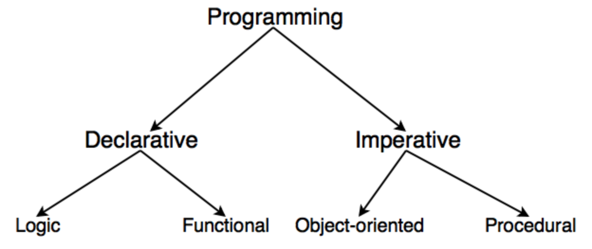

## 선언형 프로그래밍

- SQL, HTML, 프롤로그는 대표적인 선언형 프로그래밍 언어 입니다.
  - 명령적 언어 : C, C++, Java
  - 둘 다 가능한 언어 : Javascript, C#, Python
- 선언형 프로그래밍은 두 가지 뜻으로 통용되고 있습니다.
  - 첫번째 명령형 프로그램은 알고리즘을 명시하고 목표는 명시하지 않는 데 반해 선언형 프로그램은 `목표를 명시하고 알고리즘을 명시하지 않는 것`입니다.
  - 두번째 프로그램이 함수형 프로그래밍 언어, 논리형 프로그래밍 언어, 혹은 제한형 프로그래밍 언어로 쓰인 경우에 선언형이라고 합니다. 여기서 선언형 언어라는 것은 `명령형 언어와 대비`되는 이런 프로그래밍 언어들을 통칭하는 것입니다.

> 저는 첫번째 정의에 기준에 맞췄을 때 책임주도 설계를 할 때 선언형 프로그래밍과 많은 연관을 가지고 있다고 느꼈습니다. 하지만 두번째 정의로 객체지향 설계는 선언형 프로그래밍과 반대되는 개념에 있게 됩니다.

### 또다른 정의들

- 선언적 프로그래밍은 `기계의 동작을 모델로 하는 것이 아닌, 개발자의 두뇌(정신, 생각)를 모델로 본딴 언어를 가지고 프로그래밍 하는 것`입니다.
- 선언적 프로그래밍은 선언(선언적 문장, 선언문)들을 사용해서 프로그래밍하는 것입니다.
- 선언적 속성이란, 특정 모듈을 설명하는 문장 집합이 단 하나만 존재할 수 있다는 것을 의미합니다. 명령적 속성은 이중적이고, 이는 의미들의 구성에 일관성이 없고 여러 가지 문장 집합들로 표현될 수 있다는 것을 의미합니다.
- 선언적 언어는 컴퓨터의 내부 상태를 명시적으로 조작하는 명령형 언어, 또는 밟아야 하는 일련의 절차들을 명시적으로 지정하는 절차적 언어와 반대됩니다.
- CS에서 선언적 언어는 제어 흐름을 설명하지 않고, 계산 로직을 표현하는 패러다임(개념)입니다.
- 코드의 실행을 추적할 수 있는지 여부에 따라 선언형과 비선언형을 구분합니다. 정규표현식(Regex)은 패턴이 실행되는 동안 그것을 전혀 추적할 수 없기 때문에 100% 선언적이라고 할 수 있습니다.

### 선언형 프로그래밍 언어

- 선언형 프로그래밍 언어는 선언형 프로그래밍을 사용하여 해법을 정의하기보다는 문제를 설명하는 고급언어입니다. 명령형 프로그래밍 언어는 `어떤 방법`으로 할 것인지에 중점을 두는 반면에, 선언형 프로그래밍 언어는 `무엇`을 할 것인지에 중점을 두고 있습니다.
  - 이 용어는 `전체적으로 명확하지 않아서 때로 물의를 일으키기도 합니다`. 그래서 때로 유행어로 사용되기도 합니다.
- 선언형 프로그래밍 언어를 선언형이라고 하는 데에는 여러 의미가 있습니다.
  - 프롤로그는 프로그래머가 어떤 방법으로 답을 계산해야 하는지를 정의하지 않고 관계를 정하거나 서로의 관계를 묻는 질문을 하기 때문에 선언형입니다. 
  - 함수형 프로그래밍 언어는 어떤 연산도 정해진 순서로 계산되어야 한다는 것이 정의되지 않고 함수들의 입력과 출력이 서로 연결되어 있기 때문에 선언형입니다. 
  - 자료지향 프로그래밍 언어와 질의 언어는 질의문들이 어떤 방법으로 자료를 찾아야 하는지가 주어지지 않고 대신에 원하는 자료의 기준만 주어지기 때문입니다(ex. SQL).
- 가장 이상한 프로그래밍 언어의 예는 완전히 선언형이라는 것입니다. HTML은 순서대로 일어나는 사건이 없기 때문에 진정한 선언형입니다. 자바스크립트를 추가하면 순서대로 화면을 바꿀 수 있기 때문에 선언형의 순수함을 잃습니다. 인터페이스 기술 언어(IDL)은 계산법을 명시하지 않고 관계를 명시하기 때문에 주로 선언형입니다. 그러나 이 두 가지 예 모두 아무것도 계산하지 않기 때문에 실제 프로그래밍 언어인지는 전혀 분명하지 않습니다.
- 이런 구분은 명확하지 않습니다. 프롤로그는 재귀법과 cut 연산자를 이용하여 명시적으로 계산을 하는데 사용할 수 있습니다. 순수 함수형이 아니거나 모나드를 사용하는 함수들은 연속통과형이나 입출력을 통하여 분명히 확실한 순서대로 연산을 수행합니다. SQL의 INSERT와 DELETE 명령은 순서의 영향을 받습니다. 반면에 어셈블리어는 낮은 수준의 지시문을 순서대로 나열하는 것이 가능하지만 정적 메모리 할당과 매크로와 같은 선언적 특징도 있습니다.

## 그래서 명령적과 선언적은 어떻게 다른거라는 걸까요?

- 많은 선언적(Declarative) 접근 방식들의 기반에는 일종의 `명령적(Imperative) 추상화`가 존재합니다.
  - 실제로 그 일을 어떻게 수행할지 관한 명령적(절차적) 단계들을 알고 있다는 가정이 뒷받침 됩니다. 다시말해 `방법에 대한 구현`은 우리에게서 추상화되어 있습니다.

> 저는 `추상화`라는 부분에서 책임주도 설계에 의해 나오는 메소드가 선언형 프로그래밍과 닮았다는 생각을 했습니다.

> 여기까지만 고려하면 `가장 효율적인 선언적 프로그래밍 방법은 명령적으로 작성된 코드를 추상화하는 것`입니다. 선언적 프로그래밍은 `무엇을 해야할지만 알려줘, 세부 구현은 미리 해놨거든`이라고 말할 수 있는 흐름입니다. 흔히 함수 이름 형태에서 무엇을 해야할지를 요약하고, 세부구현을 가립니다.

### 선언형 프로그래밍을 할 때 고려하면 좋은 것들에는 어떤게 있을까요?

- 응집도: 하나의 목적을 가진 코드를 뭉치자.
- 단일책임: 함수가 한가지 기능을 하도록 하자.
- 추상화: 함수의 세부구현 단계를 일치시키자.

> 위 3가지는 책임주도 설계에서도 중요하게 여기는 점이니까 더욱 두 패러다임은 비슷하다고 볼 수 있을거 같습니다. 하지만...

### 명령형 프로그래밍에 대해 조금 집중해 보겠습니다.

- 명령형 프로그래밍(Imperative programming)은 어떤 방법(How)으로 할것인지에 가깝습니다. 알고리즘을 명시하지만 목표는 명시하지 않습니다. 명령형 프로그램은 컴퓨터가 수행할 명령들을 순서대로 써 놓은 것입니다. 또한, 프로그램의 제어 흐름을 설명하기 위해 제어문을 사용합니다.
  - 이들이 어떤 일을 어떻게 처리하는지에 관해 묘사하고 있습니다. 우리는 명시적으로 배열을 반복하거나(for 문), 원하는 기능을 수행하기 위한 단계들을 명시적으로 나열하고 있습니다.
  - 가독성이 떨어진다는 의견도 있습니다. 코드들을 한 번 슥 훑어보고 어떤 일이 일어나고 있는지 바로 알아채기는 쉽지 않을 것입니다. 우리의 뇌는 코드가 존재하는 맥락을 고려해가며, 해당 코드들을 인터프리터처럼 차근차근 살펴봐야 합니다.
  - 각각의 예시에서 `상태(state)의 일부를 변경`하고 있습니다.

> 여기서도 어떤 일을 묘시하는지, 반복문을 사용하는지, 수행단계를 명시하는데에만 집중했는데 `상태의 일부를 변경`한다는 점에 집중해 볼 필요가 있습니다.

### 명령형에서의 상태에 집중해서 선언형 프로그래밍을 다시 살펴본다면 어떻게 될까요?

- 그들은 무엇이 일어나는지에 관해 묘사해야 하고, `state를 변경해선 안되며`, 한 눈에 파악할 수 있어야 합니다(가독성이 좋아야 합니다).

### 선언형 프로그래밍의 또 다른 특징

- 선언적 프로그래밍의 또 다른, 덜 알려진 장점 중의 하나는 우리의 프로그램이 context-independent 해질 수 있다는 것입니다. 전체적인 맥락, 상황에 좀 더 독립적입니다.
- 선언적 코드들은 최종적인 목표가 무엇인지에 대해서만 관심이 있지, 해당 목표를 이루기 위한 세부적인 단계들(해당 목표에 의존적인 과정들)에는 관심이 없다는 것입니다. 그래서 동일한 코드들이 다른 프로그램에 쓰이더라도 정상적으로 동작할 수 있게 되어야 합니다. 우리가 만들고자 하는 어떤 프로그램에 갖다붙여도 정상적으로 동작합니다. 현재 어떤 프로그램에 속해있는가 하는 것에 전혀 구애받지 않아야 합니다.
- 명령형 코드들은 그렇지 못한 경우가 많은데, 그 이유는 대부분의 경우 명령형 코드들이 현재 상태의 `컨텍스트에 의존적`이기 때문입니다. 그래서 다른 곳에서 재사용하기가 어렵습니다.

## 프로그래밍 역사에 의한 분류를 살펴 보겠습니다.

- 명령형 프로그래밍: 프로그래밍의 상태, 상태를 변경시키는 구문의 관점에서 연산을 설명하는 방식
  - 절차지향 프로그래밍 : 수행되어야할 연속적인 계산 과정을 포함하는 방식
  - 객체지향 프로그래밍 : 객체들의 집합으로 프로그램의 상호작용을 표현
- 선언형 프로그래밍: 어떤 방법으로 해야하는지를 나타내기보다, 무엇과 같은지를 설명하는 방식
  - 함수형 프로그래밍: 순수 함수를 조합하고 소프트웨어를 만드는 방식

### 명령형 프로그래밍에 대해 다시 정의해 본다면

- 부수효과를 기반으로 하는 프로그래밍 방식입니다.
- 명령형 프로그래밍은 `상태를 변경시키는 연산들을 적절한 순서대로 나열`함으로써 프로그램을 작성합니다.
- 대부분의 객체지향 프로그래밍 언어들은 `메시지에 의한 객체의 상태 변경에 집중`하기 때문에 명령형 프로그래밍 언어로 분류됩니다.

### 명령과 쿼리

- 명령 : 프로시저, 객체의 상태를 수정하는 오퍼레이션
- 쿼리 : 함수, 객체와 관련된 정보를 반환하는 오퍼레이션
- 프로시저와 함수라고도 불리는 이 둘은 반대의 성격을 가지며 어떤 오퍼레이션도 명령인 동시에 쿼리여서는 안 됩니다. 명령과 쿼리를 분리하기 위해서는 다음의 두 가지 규칙을 준수해야 한다.
  - 객체의 상태를 변경하는 `명령은 반환값을 가질 수 없다`. 명령은 명령형 프로그래밍입니다.
  - 객체의 정보를 반환하는 `쿼리는 상태를 변경할 수 없다`. 쿼리는 선언형 프로그래밍입니다.

## 결론

- 상태를 변경한다는 것을 기준으로 볼 때 책임주도 설계(객체지향 설계)는 선언형 프로그래밍과 반대되는 개념입니다.

---

## 참고

- [선언형 프로그래밍](https://ko.wikipedia.org/wiki/%EC%84%A0%EC%96%B8%ED%98%95_%ED%94%84%EB%A1%9C%EA%B7%B8%EB%9E%98%EB%B0%8D)
- [선언형 프로그래밍 언어](https://ko.wikipedia.org/wiki/%EC%84%A0%EC%96%B8%ED%98%95_%ED%94%84%EB%A1%9C%EA%B7%B8%EB%9E%98%EB%B0%8D_%EC%96%B8%EC%96%B4?tableofcontents=0)
- [박스여우 - BoxFox](https://boxfoxs.tistory.com/430)
- [명령형 vs 선언형 프로그래밍](https://iborymagic.tistory.com/73)
- [김정혁 블로그](https://zereight.tistory.com/895)