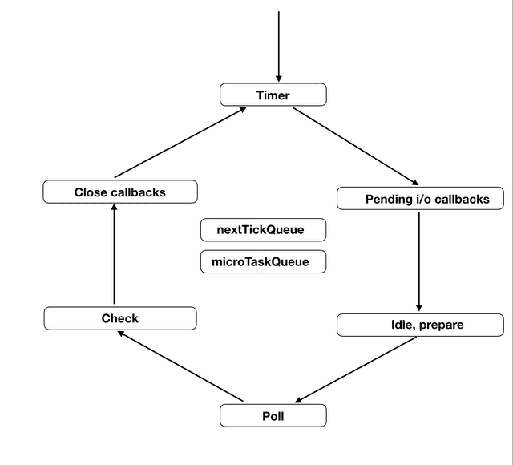

## 자바스크립트 이벤트 루프에 대해 알아보겠습니다.

---

## 자바스크립트는 싱글 스레드 프로그래밍 언어<br />(Single threaded programming language) 입니다.

- 자바스크립트는 기본적으로 싱글 스레드 프로그래밍 언어입니다. 여기서 싱글 스레드라는 것은 한 번에 하나의 작업만 할 수 있다는 뜻입니다.
  - 유저가 컨트롤 할 수 있는 스레드가 하나라는 뜻에서 싱글 스레드 프로그래밍 언어라고 부릅니다. 실제로는 백드라운드(C++로 구현되어 있는)가 존재합니다. 또한 web worker나 worker thread(node v14에서 나왔습니다)도 컨트롤 할 수 있게 되었습니다.

---

## 우선 call stack에 대해 알아보겠습니다.

- call stack은 프로그램 상에서 우리가 어떤 순서로 작업을 수행하는지 기록하는 작업 `스케쥴링과 관련된 자료 구조`입니다. 우리가 어떤 함수를 실행하게 되면 우리는 그 함수를 스택의 맨 위에 놓는데, 이것을 push라고 합니다. 만약에 함수가 어떤 값을 리턴하거나 실행을 종료하면 우리는 다시 그 함수를 스택 맨 위에서부터 꺼내는데 이것을 pop이라고 합니다.
- 함수가 호출되기 때문에 만약에 우리가 잘못해서 무한 호출되는 재귀 함수를 실행시키면 스택에 함수 호출이 계속해서 쌓이다가 `Maximum call stack size exceeded`라는 에러 메시지를 만나게 됩니다.

---

## 자바스크립트는 싱글 스레드 언어이기 때문에 비동기 콜백을 사용합니다.

- 자바스크립트는 싱글 스레드 언어이기 때문에 함수를 실행하면 함수 호출이 스택에 순차적으로 쌓이고 스택의 맨 위에서부터 차례대로 한 번에 하나의 함수만 처리할 수 있습니다. 간단한 프로그램이라면 상관없지만 만약에 우리가 아주 복잡한 프로그램을 구동한다면 시간이 매우 오래 걸리는 작업이 스택에 쌓이고 실행되면 그 다음 작업은 무한정 대기할 수밖에 없습니다. 이렇게 다른 작업을 실행하기 위해서 이 전 작업이 완료될 때까지 기다려야만 하는 상황을 `블로킹(blocking)`이라고 합니다. 왜 이것이 문제가 되냐면 어떤 작업이 실행되어 동작하고 있는 동안에는 브라우저가 다른 일을 전혀 할 수 없으므로 잠시 먹통이 되기 때문입니다. 이러한 점을 극복하기 위한 해결 방안이 바로 `Asynchronous Callbacks(비동기 콜백)`입니다.

---

## 비동기 콜백은 Web APIs와 callback queue를 활용하여 작동합니다.

- 자바스크립트가 싱글 스레드 언어임에도 불구하고 우리가 웹 사이트에서 끊김없이 여러 작업을 동시에 할 수 있는 것은 바로 브라우저가 Web APIs 같은 것들을 제공하여 비동기 작업을 가능하게 해주기 때문입니다.
- 함수를 동기 호출하게 되면 call stack에 차곡차곡 쌓여 순차적으로 실행됩니다. 이 때 만약에 우리가 AJAX나 setTimeout 혹은 DOM event 함수를 실행하면 자바스크립트 엔진은 call stack에서 Web APIs로 보내고 정해진 시간 혹은 이벤트가 발생한 순간에 순차적으로 callback queue에 적재합니다. callback queue에 줄을 선 함수들은 call stack에 쌓여있던 것들이 모두 제거되어 깨끗해지면 차례대로 스택에 쌓여서 실행되게 됩니다.

---

## 큐(Queue)란?

- 큐는 스택과 같이 자료 구조의 일종입니다. 한 쪽에서만 삽입과 삭제가 이루어졌던 스택과는 달리 한쪽에서는 삽입이 되고 다른 한쪽에서는 삭제 작업이 이루어지는 자료 구조입니다. 가장 먼저 삽입된 자료가 가장 먼저 삭제되는 구조이므로 `선입선출(FIFO: First In First Out)`이라고도 부릅니다.
- callback queue에서 Promise의 then/catch와 process.nextTick의 경우 큐의 다른 작업보다(timeout과 같은) 우선순위를 높게 가져갑니다.

---

## 자바스크립트 이벤트 루프에 대한 대표적인 잘못된 개념들을 살펴보겠습니다.

---

### 이벤트 루프는 자바스크립트 엔진 내부에 있다?

- 대표적인 잘못된 개념들 중 하나는 바로 이벤트 루프가 자바스크립트 엔진(V8, Spider Monkey 등)의 일부라는 것입니다. 하지만 이벤트 루프는 단지 자바스크립트 코드를 실행하기위해 자바스크립트 엔진을 이용하기만 할 뿐입니다.
- 실제로 V8 엔진에는 이벤트 루프를 관리하는 코드가 없습니다. `Node.js나 브라우저가 이벤트 루프를 담당`하는 것입니다.

---

### 이벤트 루프는 하나의 스택 또는 하나의 큐로만 작동한다?

- 이벤트 루프에 작업을 담아놓는 스택 같은 것은 존재하지 않습니다. 그리고 이벤트 루프가 작동하는 과정은 `여러 개의 큐를 사용하는 복잡한 과정`입니다. 그러나 대부분의 개발자들은 자바스크립트의 모든 콜백이 단 하나의 큐만 사용하여 수행된다고 알고 있는데, 이것은 완전히 잘못된 생각입니다.

---

### 이벤트 루프는 여러 개의 스레드에서 실행된다?

- Node.js 이벤트 루프의 잘못된 다이어그램들 때문에 우리는 한 개의 스레드가 자바스크립트의 실행을 담당하고 다른 한 개는 이벤트 루프를 담당하는, 총 두 개의 스레드가 있다고 생각하게 되었습니다. 그러나 실제로는 `단일 스레드로 이 모든 것을 처리`합니다.

---

## 이벤트 루프는 `단 하나의 스레드`를 사용하여 자바스크립트를 실행합니다!

- 이벤트 루프 자체에서 V8 또는 다른 엔진을 사용하여 자바스크립트를 실행하는 것이고 이때, 단 하나의 스레드를 사용하여 자바스크립트가 실행되는 것입니다. 실행 자체는 동기적이고, 현재 실행시킨 자바스크립트의 실행이 완료되지 않는다면 이벤트 루프 또한 진행되지 않습니다.

---

### setTimeout은 일부 비동기 OS API와 관련있다?

- setTimeout의 딜레이가 끝났을 때 콜백이 외부의 요인(OS나 커널 같은)으로 인해 어떤 작업 큐에 들어가게 된다고 생각하는 것입니다. 하지만 `이벤트 루프에 이런 외부의 요인 같은 건 없습니다`.

---

### setImmediate의 콜백은 작업 큐의 가장 첫번째에 위치한다?

- 보통 일반적인 이벤트 루프에 대한 설명들은 하나의 큐만 가지고 설명을 진행하기 때문에, 몇몇 개발자들은 setImmediate()가 콜백을 작업 큐의 가장 앞쪽에 배치하는 API라고 생각하게 됩니다. 하지만 이것은 완전히 틀린 생각이며, `모든 작업 큐들은 FIFO(First In First Out)로만 작동합니다`.

---

## 왜 우리는 setTimeout(fn, 0)가 있는데도 setImmediate를 사용해야 할까요?

- setTimeout(fn, 0)은 실질적으로 `0이 아닙니다. 이건 사실 1 입니다`. 타이머의 딜레이를 1ms보다 작거나 2147483647ms보다 크게 설정하면 딜레이는 자동으로 1로 세팅 됩니다. 그렇기 때문에 setTimeout의 딜레이를 0으로 설정하려고 한다면 이 딜레이는 자동으로 1이 되는 것입니다.
- setImmediate을 사용하면 타이머를 사용할 때처럼 `딜레이의 시간을 추가적으로 체크할 필요가 없어집니다`. 그래서 setImmediate은 빠른 것입니다. 또한 setImmediate의 체크 작업은 Poll phase 직후에 수행되기 때문에 HTTP 요청 콜백과 같은 곳에서 사용된 setImmediate의 콜백 함수는 바로 실행된다고 할 수 있습니다.

---

## 자바스크립트는 Block 될 수 있을까요?

- 네! 있습니다.
- nextTickQueue는 콜백 실행에 있어서 어떤 제한도 가지고 있지 않습니다. 그렇기 때문에 만약 process.nextTick()이 재귀 호출된다면, 여러분의 프로그램은 다른 페이즈들의 큐가 어떤 콜백을 가지고 있든간에 절대 그 작업에서 빠져나오지 못할 것입니다.

---

## 만약 Exit callback phase에서 setTimeout을 호출하면 어떻게 될까요?

- 타이머 자체는 시작될 수 있겠지만 `setTimeout의 콜백은 절대 호출되지 않을 것입니다`. 이미 Node.js가 Exit callbacks에 들어와 있다는 것은 이미 이벤트 루프에서 빠져나왔다는 것을 의미합니다.

---

## 중요한 점들을 정리하고 가겠습니다.

- 이벤트 루프는 작업 스택을 가지고 있지 않습니다.
- 이벤트 루프가 별도의 스레드에서 실행되고 자바스크립트 실행은 어떤 큐에서 하나씩 꺼내와서 다른 곳에서 하는 것이 아니라 자바스크립트의 실행 자체가 이벤트 루프 안에서 수행되는 것입니다.
- setImmediate는 콜백을 작업 큐의 앞 쪽에 밀어넣는 것이 아니라 setImmediate 만을 처리하기 위한 전용 페이즈와 큐가 존재합니다.
- setImmediate은 실질적으로 다음 페이즈 혹은 다음 이벤트 루프의 순회에서 실행되고, nextTick이 오히려 실질적으로 더 빠르게 실행됩니다.
- nextTickQueue에 담긴 작업이 재귀 호출을 수행하는 경우 Node.js의 작업 프로세스를 블록킹할 수 있습니다.

---

## 이벤트 루프 이미지를 보겠습니다.



---

## 이제 이벤트 루프의 구조에 대해 알아보겠습니다.

- 각각의 박스는 특정 작업을 수행하기 위한 페이즈들을 의미합니다.
- 각 페이즈는 각자 하나의 큐를 가지고 있으며, 자바스크립트의 실행은 이 페이즈들 중 Idle, prepare 페이즈를 제외한 어느 단계에서나 할 수 있습니다.
- `nextTickQueue`와 `microTaskQueue`는 이벤트 루프의 일부가 아니며, 이 큐들에 들어있는 작업 또한 어떤 페이즈에서든 실행될 수 있습니다. 또한 이 큐들에 들어있는 작업은 가장 높은 실행 우선 순위를 가지고 있습니다.

---

### 첫번째로 Timer phase 입니다.

- Timer phase는 이벤트 루프의 시작을 알리는 페이즈입니다.
- 이 페이즈가 가지고 있는 큐에는 setTimeout이나 setInterval 같은 `타이머들의 콜백을 저장`하게 됩니다. 이 페이즈에서 바로 타이머들의 콜백이 큐에 들어가는 것은 아니지만 타이머들을 min-heap으로 유지하고 있다가 실행할 때가 된 타이머들의 콜백을 큐에 넣고 실행하는 것입니다.

---

### Timer phase의 동작을 조금 더 상세히 살펴보겠습니다.

- 이벤트 루프가 Timer phase에 들어가게 되면 실행할 타이머 콜백 큐에 뭐가 있는지 확인부터 시작합니다.
- 타이머 스크립트는 오름차순으로 힙에 저장됩니다. 그래서 제일 먼저 저장된 타이머들을 하나씩 까서 `now - registeredTime === delta` 같은 조건을 통해 타이머의 콜백을 실행할 시간이 되었는지 검사하게 됩니다. 만약 조건에 해당된다면 이 타이머의 콜백을 실행하고 다음 타이머를 확인합니다. 만약 조건에 해당하지 않는 타이머를 만난다면, 탐색을 바로 종료하고 다음 페이즈로 이동합니다. `타이머는 힙 내부에 오름차순으로 정렬되어있기 때문에 그 이후로는 탐색을 해도 의미가 없습니다`.

---

### 두번째로 Pending i/o callback phase 입니다.

- 이 페이즈에서는 이벤트 루프의 pending_queue에 들어있는 콜백들을 실행합니다.
- 이 큐에 들어와있는 콜백들은 현재 돌고 있는 `루프 이전에 한 작업에서 이미 큐에 들어와있던 콜백`들입니다.
- 타임 페이즈가 종료된 후 이벤트 루프는 Pending i/o 페이즈에 진입하고, 가장 먼저 이전 작업들의 콜백이 실행 대기 중인지, 즉 pending_queue에 들어와 있는지를 체크하게 됩니다. 만약 실행 대기 중이라면 pending_queue가 비거나 시스템의 실행 한도 초과에 도달할 때까지 대기하고 있던 콜백들을 실행합니다. 이 과정이 종료되면 이벤트 루프는 Idle Handler Phase로 이동하게 된 후 내부 처리를 위한 Prepare phase를 거쳐 최종적으로 가장 중요한 단계인 Poll Phase에 도달하게 됩니다.

---

### 세번째는 Idle, Prepare phase 입니다.

- 이름은 Idle phase이지만 이 페이즈는 매 Tick마다 실행됩니다.
- Prepare phase 또한 매 폴링(Polling)때마다 실행됩니다.
- 이 두개의 페이즈는 이벤트 루프와 직접적인 관련이 있다기보다는 Node.js의 내부적인 관리를 위한 것입니다.

---

### 네번째는 Poll phase 입니다.

- 이 페이즈에서는 새로운 수신 커넥션(새로운 소켓 설정 등)과 데이터(파일 읽기 등)를 허용합니다.
- 이름에서 알 수 있듯이 이 페이즈는 폴링하는 단계입니다. 이벤트 루프가 Poll phase에 들어왔을 때 watcher_queue 내부에 파일 읽기의 응답 콜백, HTTP 응답 콜백 같이 수행해야 할 작업들이 있다면 이 작업들을 실행하게 됩니다. 이 과정 또한 watcher_queue가 비거나 시스템의 실행 한도 초과에 다다를 때까지 계속 됩니다.

---

### Poll phase의 동작에 대해 조금 더 자세히 알아보겠습니다.

- 일단 watch_queue가 비어있다면, Node.js는 곧바로 다음 페이즈로 넘어가는 것이 아니라 `약간 대기시간`을 가지게 됩니다. Node.js가 기다리는 시간은 여러 가지 요인에 따라 계산됩니다.
- 만약 더 이상 콜백들을 실행할 수 없는 상태가 된다면 만약 check_queue, pending_queue, closing_callbacks_queue에 해야할 작업이 있는지를 검사하고, 만약 해야할 작업이 있다면 바로 Poll phase가 종료되고 다음 페이즈로 넘어가게 됩니다. 하지만 특별히 해야할 작업이 더 이상 없는 경우 Poll phase는 `다음 페이즈로 넘어가지 않고 계속 대기`하게 됩니다.

---

### 다섯번째는 Check phase 입니다.

- Poll phase의 다음 페이즈는 바로 `setImmediate의 콜백`만을 위한 페이즈인 Check phase입니다.
- Poll phase가 지나면 이벤트 루프는 바로 setImmediate() API의 콜백과 관련이 있는 Check phase에 들어서게 됩니다. 이 페이즈에서는 다른 페이즈와 마찬가지로 큐가 비거나 시스템 실행 한도 초과에 도달할 때까지 계속 해서 setImmediate의 콜백들을 실행합니다.

---

### 여섯번째는 Close callbacks 입니다.

- socket.on('close', () => {})과 같은 close 이벤트 타입의 핸들러들은 여기서 처리됩니다.
- Check Phase가 종료된 후에, 이벤트 루프의 다음 목적지는 close나 destory 콜백 타입들을 관리하는 Close callback 입니다.
- 이벤트 루프가 Close callback들과 함께 종료되고나면 이벤트 루프는 다음에 돌아야할 루프가 있는지 다시 체크 하게 됩니다. 만약 아니라면 그대로 이벤트 루프는 종료됩니다. 하지만 만약 더 수행해야할 작업들이 남아 있다면 이벤트 루프는 다음 순회를 돌기 시작하고 다시 Timer Phase부터 시작하게 됩니다.

---

### 이벤트 루프에 포함되지 않았던 nextTickQueue와 microTaskQueue에 대해 알아보겠습니다.

- nextTickQueue는 process.nextTick() API의 콜백들을 가지고 있습니다.
- microTaskQueue는 Resolve된 프로미스의 콜백을 가지고 있습니다.
- 이 두개의 큐는 기술적으로 이벤트 루프의 일부가 아닙니다. 즉, libUV 라이브러리에 포함된 것이 아니라 Node.js에 포함된 기술이라는 것입니다. 이 친구들이 가지고 있는 작업들은 현재 실행되고 있는 작업이 끝나자마자 호출되어야합니다.

---

### nextTickQueue와 microTaskQueue의 특별한 점

- 이 두 큐의 콜백들은 어떤 페이즈에서 다음 페이즈로 넘어가기 전에 자신이 가지고 있는 콜백들을 최대한 빨리 실행해야하는 역할을 맡고 있습니다.
- 다른 페이즈들과는 다르게 이 두 큐는 시스템 `실행 한도 초과에 영향을 받지 않기 때문에` Node.js는 이 큐가 완전히 비워질 때까지 콜백들을 실행합니다. 그리고 nextTickQueue는 microTaskQueue보다는 높은 우선 순위를 가지고 있습니다.

---

## 비동기 작업의 핵심인 Thread-pool에 대해 알아보겠습니다.

- Node.js가 모든 비동기 명령을 관리하는 별도의 스레드풀을 가지고 있다는 오해가 있습니다. 그러나 이 스레드풀은 Node.js가 아니라 Node.js가 비동기 작업을 처리하기 위해 사용하는 라이브러리인 `libUV에 포함된 기능`입니다.
- 스레드풀은 이벤트 루프 매커니즘의 일부가 아닙니다.

---

## libUV 이외의 별도의 스레드풀도 필요합니다.

- libUV는 OS커널의 비동기 API만을 사용하여 이벤트 드리븐을 유도할 수 있을 만큼 충분히 훌륭합니다. 그러나 파일 읽기, DNS Lookup 등 OS 커널이 비동기 API를 지원하지 않는 작업들의 경우에는 별도의 스레드풀을 사용하게 되는데, 이때 기본 값으로 4개의 스레드를 사용하도록 설정되어있습니다. uv_threadpool 환경 변수를 사용하면 최대 128개까지 스레드 개수를 늘릴 수도 있습니다.

---

## Workflow에 대한 예제 입니다.

```javascript
setTimeout(() => {
	console.log('setTimeout');
}, 0);
setImmediate(() => {
	console.log('setImmediate');
});
```

- 무엇이 먼저 실행될지 예측할 수 없습니다.
- 메인 모듈이 실행되고나서 이벤트 루프가 Timer phase에 진입할 때 여러분의 타이머를 찾을 수도 있고 못 찾을 수도 있기 때문입니다.

---

### 이유

- 왜냐하면 타이머는 시스템의 시간과 사용자가 제공한 시간을 사용하여 등록되기 때문입니다. setTimeout이 호출된 순간, 타이머는 메모리에 이 타이머를 저장하게되는데, 그 순간 컴퓨터의 성능이나 Node.js가 아닌 외부 작업 때문에 약간의 딜레이가 발생할 수 있기 때문입니다. 또 다른 포인트는 Node.js가 Timer phase에 진입하기 전에 변수 now를 선언하고 그 변수 now를 현재 시간으로 간주한다는 점입니다. 그러므로 정확한 계산이라고 하기에는 약간의 노이즈가 껴있다는 것이고, 이게 바로 setTimeout이 반드시 먼저 실행될 것이라고 확신할 수 없는 불확실성의 이유가 됩니다.

---

### 명확히 실행 순서를 정하는 방법이 있습니다.

```javascript
fs.readFile('my-file-path.txt', () => {
	setTimeout(() => {
		console.log('setTimeout');
	}, 0);
	setImmediate(() => {
		console.log('setImmediate');
	});
});
```

- 코드를 I/O 사이클의 내부로 옮긴다면, 반드시 setTimeout보다 setImmediate가 먼저 실행되는 것을 보장할 수 있게 됩니다.

---

## setImmediate의 vs setTimeout

### setImmediate

```javascript
var i = 0;
var start = new Date();
function foo() {
	i++;
	if (i < 1000) {
		setImmediate(foo);
	} else {
		var end = new Date();
		console.log('Execution time: ', end - start);
	}
}
foo();
```

---

### setTimeout

```js
var i = 0;
var start = new Date();
function bar() {
	i++;
	if (i < 1000) {
		setTimeout(bar, 0);
	} else {
		var end = new Date();
		console.log('Execution time: ', end - start);
	}
}
bar();
```

---

### setImmediate가 더 좋습니다.

- Timer phase에서는 타이머를 실행할 시간이 되었는지, 콜백을 실행해야 하는지를 검사하기 위해 몇가지 작업을 거쳐야 하는데 이 과정을 매 이터레이션마다 하고 있으니 느려질 수 밖에 없습니다. 그러나 setImmediate의 경우 이런 과정이 필요없기 때문에 setTimeout보다 실행 속도가 빠릅니다.

---

## nextTick vs setTimeout

```javascript
var i = 0;
function foo() {
	i++;
	if (i > 20) {
		return;
	}
	console.log('foo', i);
	setTimeout(() => {
		console.log('setTimeout', i);
	}, 0);
	process.nextTick(foo);
}
setTimeout(foo, 2);
```

---

## 결과

```js
// foo 1
// foo 2
// foo 3
// foo 4
// foo 5
// foo 6
// foo 7
// foo 8
// foo 9
// foo 10
// foo 11
// foo 12
// foo 13
// foo 14
// foo 15
// foo 16
// foo 17
// foo 18
// foo 19
// foo 20
// Other setTimeout
// setTimeout 21
// setTimeout 21
// setTimeout 21
// setTimeout 21
// setTimeout 21
// setTimeout 21
// setTimeout 21
// setTimeout 21
// setTimeout 21
// setTimeout 21
// setTimeout 21
// setTimeout 21
// setTimeout 21
// setTimeout 21
// setTimeout 21
// setTimeout 21
// setTimeout 21
// setTimeout 21
// setTimeout 21
// setTimeout 21
```

## 참조

- [[JS/Event Loop] 자바스크립트, 이벤트 루프(Event Loop)와 동시성(concurrency)에 대하여](https://im-developer.tistory.com/113)
- [로우 레벨로 살펴보는 Node.js 이벤트 루프](https://evan-moon.github.io/2019/08/01/nodejs-event-loop-workflow/?fbclid=IwAR1QP82JVrNfICEK1UNYGIDnrIlmzzD70AYYcEPiAnW9QzMH26GDker1-B8)
