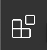
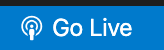

## 1. vscode 설치

- Terminal.app을 실행 시킵니다.
- brew를 통해 vscode를 설치하기 위해 brew를 설치 합니다.

```bash
  /bin/bash -c "$(curl -fsSL https://raw.githubusercontent.com/Homebrew/install/master/install.sh)"
```

- brew update를 진행합니다.

```bash
  brew update
```

- brew를 통해 vscode를 설치합니다.

```bash
  brew cask install visual-studio-code
```

## 2. 터미널로 vscode 열기

- Visual Studio Code 실행합니다.
- commend + shift + p를 입력합니다.
- Shell command 'code' successfully installed in PATH.를 선택합니다.
- 터미널에서 code 명령어를 사용합니다.

## 3. vscode에서 html 파일 만들기

- index.html 파일을 만듭니다.
- !(느낌표)를 입력하면 자동 완성 된 기본 html을 만들 수 있습니다.
- 기본 포맷은 다음과 같습니다.

```html
<!DOCTYPE html>
<html lang="en">
	<head>
		<meta charset="UTF-8" />
		<meta name="viewport" content="width=device-width, initial-scale=1.0" />
		<title>Document</title>
	</head>
	<body></body>
</html>
```

- html lang를 ko-KO로 바꿔줍니다.

  - 웹문서에 관련 언어를 지정하는 속성입니다.
  - 검색엔진 및 브라우저 지원을 목적으로 사용합니다.

    > lang 속성은 웹 접근성에 관한 내용입니다.

    > lang 속성에 명시된 값을 통해 스크린 리더가 인식 합니다. 스크린 리더는 시각장애인을 위한 보조공학입니다.

    > lang 설정과 접속자 크롬 브라우저의 언어 설정이 다른 경우, 크롬자동번역 인터페이스가 뜹니다.

  - 전역속성이라 모든 요소에 사용 가능합니다.
  - 언어 지정으 W3C 권장 사항입니다.
  - 각 언어는 2글자 및 3글자로 할당 합니다.

    > ISO 639-1 : 국제표준화기구 언어 약어 정의 규정을 따릅니다.

    > 언어 코드 : ko

    > 국가 코드 : KO

  - \<body> 태그 안 개별 요소에 다른 언어 사용 시 해당 요소에 별도로 적용합니다.

- \<meta charset="UTF-8" />은 문자 코드 세트를 저정하는 것입니다.
  - \<meta> 태그는 metadata 의 약자로 말 그대로 메타데이터 즉 다른데이터를 설명해 주는 데이터를 의미합니다. 현재의 html 문서를 부가설명해 주는 역할입니다.
  - 웹문서 파일이 웹브라우저에서 표시되는 과정에서 인코딩할때 지정된 문자코드로 인코딩하라는 뜻입니다.
  - 특별한 이유가 없는한 HTML5 문서에서는 대부분의 charset 속성의 값을 utf-8로 지정합니다.
  - 한국어, 영어, 일본어만 사용할 경우 euc-kr을 선언하기도 합니다. 하지만 국제화 시대에 다국어로 인코딩이 되게 하기 위해서는 utf-8로 지정하실 것을 권장합니다.
  - 이러한 문자코드 세트는 HTML파일이 시작하고 나서 512byte 이내에 위치할 것을 권장합니다.
- \<title>은 탑에 뜨는 이름을 지정합니다.
- \<body> 안에 태그들을 작성해 markup을 진행합니다.

## 4. 기본틀 만들기

- 다양한 태그가 있지만 \<div> 태그만을 이용해서 영역을 나누는 작업을 합니다.

```html
<!DOCTYPE html>
<html lang="ko-KO">
	<head>
		<meta charset="UTF-8" />
		<meta name="viewport" content="width=device-width, initial-scale=1.0" />
		<title>yuni-q</title>
	</head>
	<body>
		<div>
			<div>
				<div>
					yuni-q,
				</div>
				<div>
					Info, CV, Contact,
				</div>
				<div>
					Facebook, Instgram
				</div>
			</div>
			<div>
				주절주절주절주절주절주절주절주절주절주절주절주절주절주절주절주절주절주절주절주절주절주절주절주절주절주절주절주절주절주절주절주절주절주절주절주절주절주절주절주절주절주절주절주절주절주절주절주절주절주절주절주절주절주절주절주절주절주절주절주절주절주절주절주절주절주절주절주절주절주절주절주절주절주절주절주절주절주절주절주절주절주절주절주절주절주절주절주절주절주절주절주절주절주절주절주절주절주절주절주절주절주절주절주절주절주절주절주절주절주절주절주절주절주절주절주절주절주절주절주절주절주절주절주절주절주절주절주절주절주절주절주절주절주절주절주절주절주절주절주절주절주절주절주절주절주절주절주절주절주절주절주절주절주절주절주절주절주절주절주절주절주절주절주절주절주절주절주절주절주절주절주절주절주절주절주절주절주절주절주절주절주절주절주절주절주절주절주절주절주절주절주절주절주절주절주절주절주절주절주절주절주절주절주절주절주절주절주절주절주절주절주절주절주절주절주절주절주절주절주절주절주절주절주절주절주절주절주절주절주절주절주절주절주절주절주절주절주절주절주절주절주절주절주절주절주절주절주절주절주절주절주절주절주절주절주절주절주절주절주절주절주절주절주절
			</div>
		</div>

		<div>
			<div>
				<div>
					<div>img</div>
					<div>
						Title
					</div>
					<div>
						description
					</div>
				</div>
				<div>
					<div>
						img
					</div>
					<div>
						Title
					</div>
					<div>
						description
					</div>
				</div>
				<div>
					<div>
						img
					</div>
					<div>
						Title
					</div>
					<div>
						description
					</div>
				</div>
			</div>
			<div>
				<div>
					<div>
						img
					</div>
					<div>
						Title
					</div>
					<div>
						description
					</div>
				</div>
				<div>
					<div>
						img
					</div>
					<div>
						Title
					</div>
					<div>
						description
					</div>
				</div>
			</div>
			<div>
				<div>
					<div>
						img
					</div>
					<div>
						Title
					</div>
					<div>
						description
					</div>
				</div>
			</div>
			<div>
				<div>
					<div>
						img
					</div>
					<div>
						Title
					</div>
					<div>
						description
					</div>
				</div>
			</div>
		</div>
	</body>
</html>
```

## 5. 파일 실행하기

- html 파일을 더블클릭해서 사용할 수도 있지만 vscode의 plugin을 사용해서 좀 더 멋지게 웹사이트를 띄워보겠습니다.
- vscode 좌측 active bar에 있는 Extenstions 버튼을 누릅니다.
  - 
- Search Extendtions in Marketplace에 Live Server를 입력합니다.
- 라이브 서버를 설치 후 우측 하단에 Go Live 버튼을 누릅니다.
  - 
- http://127.0.0.1:5500에 index.html 파일이 실행됩니다.

## 6. 스타일 입히기

- style.css 파일을 만듭니다.
- 만들 css 파일을 연결 합니다.
  - head 안에 link 태그를 넣습니다.
  - \<link rel="stylesheet" href="./style.css" />
  - 현재 폴더를 .(점)으로 나타냅니다. 현재 폴더에 있는 style.css 파일을 읽어옵니다.
- style을 입히기 위해 div에 적절한 클래스를 줍니다.

```html
<!DOCTYPE html>
<html lang="ko-KO">
	<head>
		<meta charset="UTF-8" />
		<meta name="viewport" content="width=device-width, initial-scale=1.0" />
		<title>yuni-q</title>
		<link rel="stylesheet" href="./style.css" />
	</head>

	<body>
		<div class="header">
			<div class="info">
				<div>
					yuni-q,
				</div>
				<div>
					Info, CV, Contact,
				</div>
				<div>
					Facebook, Instgram
				</div>
			</div>
			<div class="menu">
				주절주절주절주절주절주절주절주절주절주절주절주절주절주절주절주절주절주절주절주절주절주절주절주절주절주절주절주절주절주절주절주절주절주절주절주절주절주절주절주절주절주절주절주절주절주절주절주절주절주절주절주절주절주절주절주절주절주절주절주절주절주절주절주절주절주절주절주절주절주절주절주절주절주절주절주절주절주절주절주절주절주절주절주절주절주절주절주절주절주절주절주절주절주절주절주절주절주절주절주절주절주절주절주절주절주절주절주절주절주절주절주절주절주절주절주절주절주절주절주절주절주절주절주절주절주절주절주절주절주절주절주절주절주절주절주절주절주절주절주절주절주절주절주절주절주절주절주절주절주절주절주절주절주절주절주절주절주절주절주절주절주절주절주절주절주절주절주절주절주절주절주절주절주절주절주절주절주절주절주절주절주절주절주절주절주절주절주절주절주절주절주절주절주절주절주절주절주절주절주절주절주절주절주절주절주절주절주절주절주절주절주절주절주절주절주절주절주절주절주절주절주절주절주절주절주절주절주절주절주절주절주절주절주절주절주절주절주절주절주절주절주절주절주절주절주절주절주절주절주절주절주절주절주절주절주절주절주절주절주절주절주절주절주절
			</div>
		</div>

		<div class="content">
			<div class="column">
				<div class="box">
					<div>
						img
					</div>
					<div>
						Title
					</div>
					<div>
						description
					</div>
				</div>
				<div class="box">
					<div>
						img
					</div>
					<div>
						Title
					</div>
					<div>
						description
					</div>
				</div>
				<div class="box">
					<div>
						img
					</div>
					<div>
						Title
					</div>
					<div>
						description
					</div>
				</div>
			</div>
			<div class="column">
				<div class="box">
					<div>
						img
					</div>
					<div>
						Title
					</div>
					<div>
						description
					</div>
				</div>
				<div class="box">
					<div>
						img
					</div>
					<div>
						Title
					</div>
					<div>
						description
					</div>
				</div>
			</div>
			<div class="column">
				<div class="box">
					<div>
						img
					</div>
					<div>
						Title
					</div>
					<div>
						description
					</div>
				</div>
			</div>
			<div class="column">
				<div class="box">
					<div>
						img
					</div>
					<div>
						Title
					</div>
					<div>
						description
					</div>
				</div>
			</div>
		</div>
	</body>
</html>
```

- style 파일을 작성합니다.

```css
/* 
*	브라우저 기본 스타일이 많이 있습니다. 
*	그 중에 margin과 padding을 제거해 줍니다.
*/
/* 
* *은 모든 element에 적용됩니다.
*/
* {
	margin: 0;
	padding: 0;
}

/* 
* 간격을 설정하는 방법은 px vw %가 있습니다.
* px을 정적인 사이즈 입니다.
* vw / vh은 뷰의 너비와 높이의 상대값입니다.
* %는 부모나 자식의 값의 상대값입니다.
*/
/* 
* display에는 block, inline, inline-block, flex를 기본으로 table 등 다양하게 있습니다.
* div는 기본적으로 block 입니다.
* 가로 배치를 쉽게 하기 위해 flex를 사용하겠습니다.
*/
/* 
* margin은 margin-top, margin-right, margin-bottom, margin-left가 있습니다. 
* 이를 단축 속성으로 사용할 수 있습니다. margin : top right bottom left 순 입니다.
* 생략 시 대칭 값을 따라 갑니다.
*/
/* 
* .(점)은 class를 선택합니다.
* #(샵)을 이용해서 id를 선택 할 수 있습니다. 하지만 스타일을 위해 id를 사용하는 것은 권장하지 않습니다.
*/
.header {
	margin: 16px 10vw;
	display: flex;
}

/* 
* 가로의 길이를 width로 지정합니다.
*/
/* 
* max-width로 최대 크기를 지정 할 수 있습니다.
*/
/* 
* font-size, color, font-family 등으로 font를 조정합니다.
*/
.info {
	width: 30vw;
	font-size: 200px;
	color: antiquewhite;
	font-family: 'Segoe UI', Tahoma, Geneva, Verdana, sans-serif;
}

.menu {
	width: 50vw;
}

.content {
	display: flex;
	margin: 0 10vw;
}

/* 
* 텍스트 정렬을 위해 text-align을 사용합니다.
*/
.column {
	width: 20vw;
	text-align: center;
}

.box {
	margin-bottom: 16px;
}

/* 
* 태그 이름은 아무런 prefix 없이 사용합니다.
*/
img {
	width: 80%;
}
```

- 스타일은 뒤에 오는 것이 높은 우선순위를 가집니다.
- 스타일 순서 보다 선택 하는 방법에 따라 높은 우선순위를 가지기도 합니다.
  - id > class > tag
- !important를 사용하면 다른 우선순위를 무시하고 가장 높은 우선순위를 가집니다.

## 7. img 태그 사용하기

- img 대신 img 태그를 사용해 이미지를 띄웁니다.

```html

```

- src에 이미지 주소를 입력합니다.
  - 상대 주소로 컴퓨터에 있는 이미지를 첨부할 수도 있습니다.
- alt는 이미지가 로딩되지 않을 때 대체 텍스트를 제공합니다. 또한 스크린 로더에게 이미지에 대한 정보를 제공합니다.

## 8. a 태그 사용하기

- a 태그를 이용해서 페이지를 이동하거나 새로 띄울 수 있습니다.

```html
<a href="https://github.com/Yuni-Q" target="_blank" rel="noopener noreferrer"
	>Github</a
>
```

- href에 원하는 주소를 입력합니다.
- target="\_blank"를 주면 새 창으로 뜹니다.
- 보안을 위해서 rel="noopener noreferrer"를 입력 할 것을 권장합니다.
