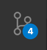

## github 활용하기

### github 가입

- [github](https://github.com/)에 가입합니다.
- 우측 상단에 동그라미를 눌러 Your repositories
- 우측 상단에 New라는 녹색 버튼을 클릭합니다.
- Repository name에 자신의 계정이름 + github.io로 repository를 생성합니다. - 저는 Yuni-Q.github.io 입니다.
- 이곳에 파일을 넣으면 github애서 정적 파일을 호스팅해 줍니다.

### git 사용하기

- vscode에서 control + `을 통해 터미널을 열어줍니다.
  - `(백티)은 영어 일 때만 입력이 되고 한글 일 경우 ₩이 입력이 됩니다.
- git을 사용하고자 하는 폴더에서 'git init'을 합니다. 그러면 .git 폴더가 만들어집니다.
- 'git remote add \[별칭] \[repository 주소]'을 통해 원격 저장소를 연결합니다.
  - 별칭은 origin을 많이 사용합니다.
  - 저는 'git remote add origin https://github.com/Yuni-Q/Yuni-Q.github.io' 입니다.
- git add \[파일명]을 통해 파일을 STAGED CHANGE 상태로 만듭니다. git에 저장할 파일들을 고르는 상태입니다.
  - 'git add .' 을 통해 현재 폴더의 모든 파일을 저장 할 수 있습니다.
- 'git commit -m '\[메시지]''를 통해 git에 저장합니다.
  - -m은 메시지를 작성하겠다는 옵션입니다. 이를 작성하지 않을 경우 vim과 같은 에디터로 작성해야 해서 어려움이 있을 수 있습니다.
- 'git push \[별칭] \[브랜치명]'을 통해 원격 저장소로 현재 git 상태를 올립니다.
  - 브랜치명은 기본적으로 master가 생성 됩니다.
  - 저는 'git push origin master'입니다.
  - -u 옵션을 사용하면 이 후부터는 'git push'만 작성해도 됩니다.

### vscode 기능 사용하기

- vscode 좌측 active bar에 있는 Source Control 버튼을 누릅니다.
  - 
- CHANGES에 있는 파일들에 +(플러스) 버튼을 눌러 STAGED CHANGES로 옮깁니다.
  - git add와 같은 행위입니다.
- 파일 상단에 Message라는 곳에 메시지를 입력후 command + enter 키를 누릅니다.
  - git commit -m와 같은 행위입니다.
- 그 위에 ... 버튼을 클릭 후 push를 클릭합니다.
  - git push와 같은 행위입니다.
- vscode를 활용해서 터미널 없이도 git을 사용할 수 있습니다.

## a 태그 스타일

### 텍스트 색

- href 속성이 없는 단순한 a 태그의 색

```css
a {
	color: red;
}
```

- href 속성이 있고 아직 클릭하지 않은 a 태그의 색

```css
a:link {
	color: red;
}
```

- href 속성이 없는 단순한 a 태그의 색

```css
a:visited {
	color: red;
}
```

### 밑줄

#### 기본적인 밑줄

- underline
- underline wavy
- underline double

```css
a:link {
	text-decoration: underline;
}
```

#### box-shadow를 이용한 밑줄

```css
a:link {
	text-decoration: none;
	box-shadow: 0 -6px rgba(75, 112, 253, 0.3) inset;
}
a {
	display: inline;
}s
```

- 하지만 가상 선택자(visited)에 대해서 다른 속성을 줄 수 없습니다. 대부분의 스타일이 visited 가상 선택에 사용할 수 없습니다.
- currentColor을 사용할 수 있지만 투명도를 조정할 수 없습니다.

#### border를 이용한 밑줄

```css
a:link {
	text-decoration: none;
	border: rgba(75, 112, 253, 0.3) solid;
	border-width: 0 0 6px 0;
}

a:linkl:visited {
	text-decoration: none;
	border: rgba(140, 89, 185, 0.3) solid;
	border-width: 0 0 6px 0;
}
a {
	display: inline;
}
```

- border를 이용하면 밑줄은 방문한 링크의 색을 다르게 지정할 수 있지만 텍스트와 겹치게 만들 수 없습니다.

#### :befor 의사 클래스를 이용한 밑줄

```css
a {
	text-decoration: none;
	position: relative;
}
a:link:before {
	content: '';
	position: absolute;
	width: 100%;
	top: 1em;
	border: rgba(75, 112, 253, 0.3) solid;
	border-width: 0 0 6px 0;
}
a:visited:before {
	content: '';
	position: absolute;
	width: 100%;
	top: 1em;
	border: rgba(140, 89, 185, 0.3) solid;
	border-width: 0 0 6px 0;
}
```

- :before 의사 클래스를 이용해서 밑줄을 만드는 방법은 밑줄과 텍스트를 겹치게 만들 수도 있고 방문한 링크와 그렇지 않은 링크의 밑줄 색을 다르게 할 수도 있습니다.
- 하지만 줄 바꿈이 될 경우 올바르게 나타지 않습니다.

#### 백그라운드-이미지를 이용한 밑줄

```css
a:link {
	background-image: linear-gradient(rgba(0, 195, 6, 0.2) 100% transparent 0);
	background-position: 0 0.85em;
	background-repeat: repeat-x;
	background-size: 1px 0.5em;
}
```

- background-image를 이용한 밑줄은 위치 조정이 가능하고 줄 바꿈 시 밑줄이 유지됩니다.
- 단점은 링크 상태가 visited일 때는 적용되지 않아 visited 링크의 색상을 다르게 지정할 수 없다는 것입니다.

#### 밑줄 대신 그림자가 생기게 하는 방법

```css
a:link {
	text-decoration: none;
	text-shadow: 0 0 24px;
}
a:visited {
	text-decoration: none;
	text-shadow: 0 0 24px;
}
```

- text-shadow 속성 역시 :visited 클래스에 적용할 수 없지만 그림자 색을 지정하지 않으면 기본적으로 텍스트 자신의 색을 따르므로 적용되는 것처럼 보입니다.

## line-height

- line-height는 줄 높이를 정하는 속성입니다.
  - 기본값 : normal
  - 상속 : Yes
  - 애니메이션 : Yes
  - 버전 : CSS Level 1

### 문법

- line-height: normal | length | number | percentage | initial | inherit
  - normal : 웹브라우저에서 정한 기본값입니다. 보통 1.2입니다.
  - length : 길이로 줄 높이를 정합니다.
  - number : 글자 크기의 몇 배인지로 줄 높이를 정합니다.
  - percentage : 글자 크기의 몇 %로 줄 높이로 정합니다.
  - initial : 기본값으로 설정합니다.
  - inherit : 부모 요소의 속성값을 상속받습니다.
- 예를 들어 글자크기가 40px일 때 line-height의 값을 1.5로 하면, 줄 높이는 40의 1.5배인 60px가 됩니다. 줄 높이는 60px인데 글자 크기는 40px이므로, 글자 위와 아래에 각각 10px의 여백이 생깁니다. 줄 높이가 글자 크기보다 작으면 세로 방향으로 글자가 겹치게 됩니다.
- 숫자(number)와 숫자 이외의 값은 상속에서 차이가 납니다. 부모 요소의 line-height 값이 숫자라면 자식 요소의 줄 높이는 자식 요소의 글자 크기에 비례해서 높이가 조정됩니다.
  - 부모 요소의 line-height 값이 1.5, 글자 크기가 30px, 자식 요소의 글자 크기가 20px라면 부모 요소의 줄 높이는 30의 1.5배인 45px 자식 요소의 줄 높이는 20의 1.5배인 30px가 됩니다.
  - 부모 요소의 line-height 값이 150%라면 부모 요소의 줄 높이는 30의 150%인 45px 자식 요소의 줄 높이는 부모 요소의 값을 상속 받아 45px가 됩니다.
  - 부모 요소와 자식 요소 간 글자 크기의 차이가 크다면 숫자를 속성값으로 하는 것이 좋습니다.

## 참고

- [[CSS] A태그를 스타일링하는 네 가지 방법.](https://bssow.tistory.com/242)
- [CSS / line-height / 줄 높이 정하는 속성](https://www.codingfactory.net/10639)
