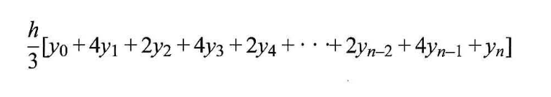
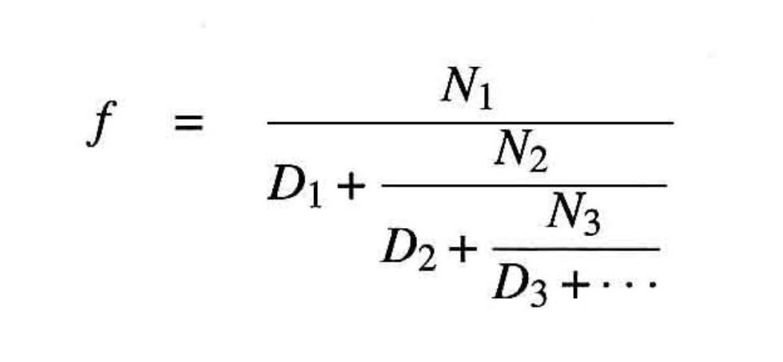
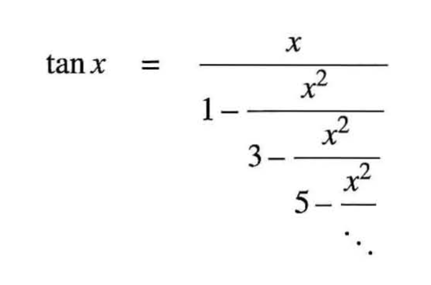

## 단순 관념 (simple idea)에 그 힘을 행사하는 지성의 행위는 주로 다음 세 가지입니다.

1. 다수의 단순 관념을 하나의 복합(compound) 관념으로 조합한다. 복잡한 (complex) 관념들은 모두 이런 식으로 만들어집니다.
2. 두 관념(단순 관념이든 복합 관념이든)을 가져와 또 다른 관념으로 설정함으로써 그 둘을 하나의 관념으로 통합하지 않고도 두 관념을 한 번에 볼 수 있게 만드는 것입니다. 관계에 관한 관념은 모두 이런 식으로 만들어집니다.
3. 하나의 관념을 그 실제 존재에 수반하는 다른 모든 관념으로부터 분리하는 것입니다. 이를 추상화라고 부르며, 일반적인 관념은 모두 이런 식으로 만들어집니다.

## 자바스크립트 프로그램

- 자바스크립트는 프로그래밍 언어 스킴과 셀프의 핵심 기능들을 물려받았다. 스킴은 리스프의 한 방언으로, 이 책의 원판에서 예제를 위한 프로그래밍 언어로 쓰였다. 어휘순 범위(lexically scoped) 일급 함수나 동적 형식 적용 같은 자바스크립트의 가장 근본적인 설계 원칙들은 스킴에서 물려받은 것이다.
- 어휘순 범위 일급 함수를 람다 표현식을 통해 문법적으로 지원하는 덕분에 함수적 추상들에 직접적으로 간결하게 접근할 수 있으며, 동적 형식 적용 덕분에 이 책을 스킴을 이용한 원판 SICP와 최대한 가깝게 유지할 수 있다.

## 1.1 프로그래밍의 기본요소

### 모든 강력한 언어는 이를 위해 다음 세 가지 메커니즘을 제공한다.

- 원시 표현식(primitive expression): 언어와 관련한 가장단순한 개체(entity)를 나타낸다.
- 조합(combination) 수단: 단순한 요소들로부터 복합적인 요소를 만드는 데 쓰인다.
- 추상화(abstraction) 수단: 복합적인 요소들에 이름을 붙여서 하나의 단위로 다루는 데 쓰인다.

### 프로그래밍에서 우리가 다루는 요소(element)들은 크게 함수와 데이터로 나쥔다.

- 나중에 이 둘이 사실 아주 명백하게 구분되지는 않는다는 점을 알게 될 것이다.
- 거칠게 비유 하자면 데이터는 우리가 조작하고자 하는 `재료`이고, 함수는 `데이터를 다루는 규칙들을 서술(description)`한 것이다. 따라서 모든 강력한 프로그래밍 언어는 반드시 원시 데이터(primitive data)와 원시 함수(primitive function)를 서술히는 기능이 있어야 하고, 그런 함수들과 데이터를 조합하고 추상화하는 수단들도 제공해야 한다.

## 1.1.1 표현식

- 사람과 해석기의 전형적인 상호작용 방식이란, 사람이 해석기의 프롬프트에서 하나의 문장(statement)을 입력하고, 해석기가 그 문장을 평가(evaluation)해서 그 결과를 화면에 표시하는 것이다.
- 다른 표현식을 구성요소로 담고 있는 표현식을 가리켜 조합(combination)이라고 부른다.
  - 가운데에 연산자(operator)가 있고 그 왼쪽과 오른쪽에 피연산자(operand) 표현식들이 있는 형태의 조합을 연산자 조합(operator combination)이라고 부른다. 연산자 조합의 값은 연산자로 지정된 함수를 인수(argument)들, 즉 피연산자 값들에 적용해서구한다.
- 연산자를 두 피연산자 사에에 배치하는 관례를 중위 표기법(infix notation)이라고 부른다.
  - 중위 표기법은 학교와 일상 생활에서 익숙한 수학 표기법과 동일하다.
- 복잡한 표현석 문장이 주어져도 해석기는 항상 통일한 기본 주기(cycle)로 작통한다. 해석 기는 사용자가 입력한 문장을 읽고(read), 그 문장을 평가하고(evaluate), 결과를 출력한다(print). 이러한 주기를 반복하는 것을 가리켜 REPL(read-evaluate-print loop)라고 부른다.

## 1.1.2 이름 붙이기와 환경

- 계산적 객체(computational object)에 이름(name)을 붙여서 이름으로 그 객체를 지칭하는 수단들은 프로그래밍 언어의 필수 기능에 해당한다. 그런 수단으로 가장 먼저 살펴볼 것은 상수(constant)이다. 상수의 이름은 해당 객체의 값(value)을 지칭히는 용도로 쓰인다.
- 복합적인 연산의 결괴를 간단한 이름으로 지칭할 수 있다는 점에서, 상수 선언은 우리의 언어에서 가장 단순한 추상화 수단이다.
- 해석기를 이용히면 이름-객체 연관 관계를 일련의 상호작용을 통해서 점진적으로 만들어 나갈 수 있으므로 이처럼 프로그램을 단계적으로 구축 하기가 특히나 편하다.

## 1.1.3 연산자 조합의 평가

### 주어진 연산자 조합을 펑가하기 위해 다음을 수행한다

1. 조합의 피연산자 표현식들을 명가한다.
2. 연산자가 나타내는 함수를 인수(피연산자들의 값)들에 적용한다.

### 단순하긴 하지만, 위 규칙은 계산적인 과정에 관해 일반적으로 중요한 사항 몇 가지를 잘 보여 준다.

- 재귀라는 개념 덕분에 깊게 중첩된 조합의 평가 규칙도 아주 간결하게 표현할 수 있습니다. 만일 재귀가 없었다면 평가 과정을 상당히 복잡하게 서술해야 합니다.
- 평가가 일어나는 문맥을 제공하는 환경이라는 일반적인 개념은 우리가 프로그램의 실행을 이해할 때 중요한 역할을 한다.
- 평가 규칙이 선언에는 적용되지 않습니다.
- 키워드를 포함한 문장을 구문형(syntactic form)이 라고부르는데, 각각의 구문형마다 고유한 평가 규칙이 있다. 다양한 종류의 문장들과 표현식들(각자 나름의 평가 규칙을 가진)은 프로그래밍 언어의 구문론(syntax)을 형성한다.

## 1.1.4 복합함수

### 자바스크립트 프로그래밍의 원시 요소들(강력한 프로그래밍 언어라면 반드시 갖추어야 할)

- 수치와 산술 연산은 원시 데이터와 원시 함수에 해당한다.
- 조합의 중첩은 연산들을 조합하는 수단을 제공한다.
- 이름과 값을 연관시키는 상수 선언은 제한적이나마 추상화의 수단을 제공한다.

### 함수 선언(function declaration)을 살펴본다.

- 복합 연산(compound operation)에 이름을 붙여서 그 연산을 하나의 단위로 지칭하게 하는 함수 선언은 상수 선언 보다 훨씬 강력한 추상화 기법이다.
- `function 이름 (매개변수들) { return 표현식 }`
  - 이름은 환경 안에서 함수 정의와 연관시킬 기호이다.
  - 매개변수들은 함수의 본문 안에서 함수의 인수들을 지칭히는 데 사용할 지역 이름들이다.
  - 함수 선언에서 함수의 본문(body)은 반환문(return statement) 하나로만 구성되는데 반환문은 키워드 return 다음에 반환표현식(return expression)이 오는 형태이다. 반환 표현식은 함수 적용(function application)의 값을 산출한다.
- `함수-표현식(인수 표현식들)`
  1. 적용의 부분식들, 즉 함수 표현식과 인수 표현식들을 각각 평가한다.
  2. 함수, 즉 함수 표현식의 값을 인수 표현식 값들에 적용한다.
- 함수 적용 표현식을 다른 함수 적용의 인수 표현식으로 시용하는 것도 당연히 가능하다.

## 1.1.5 함수 적용의 치환모형

- 해석기는 먼저 함수 적용의 요소들을 평가한 후 함수(함수 적용 중 함수 표현식의 값)를 인수들(함수 적용 중 인수표현식들의 값들)에 적용한다.
- 치환모형(substitution model; 또는대입 모형)은 함수 적용의 '의미'를 결정하는 모형으로 보아도 된다.
- 치환 모형은 함수 적용을 이해하는 데 도움을 주기 위한 것일 뿐, 해석기가 반드시 이런 식으로 작동한다는 뜻은 아니다. 전형적인 해석기들이 함수 본문 텍스트의 매개 변수들을 치환하는 식으로 함수 적용을 평가하지는 않는다. 실제 해석기들은 매개변수들에 대한 지역 환경을 이용해서 '치환'을 처리한다.

### 인수 우선 평가 대 정상 순서 평가

- '먼저 완전히 전개한 후 축약'하는 평가 방법을 `정상 순서 평가(normal-order evaluation; 또는 표준 순서 평가)`라고 부른다.
- '먼저 인수들을 평가한 후 적용'하는 명가 방법(해석기가 실제로 시용하는)은 `인수 우선 평가` 또는 `적용적 순서 평가 (applicative-order evaluation)`라고 부른다.
- 자바스크립트는 인수우선 평가 방식을 사용하는데 표현식이 여러 번 평가되어서 생기는 비효율성을 피히는 것도 이유이긴 하지만, 좀 더 중요한 이유는 치환 모형을 벗어난 함수들에 대해서는 정상 순서 평가가 훨씬 복잡하다는 점이다.

## 1.1.6 조건부 표현식과 술어

- `술어 ? 귀결-표현식 : 대안-표현식`
- 하나의 사례 분석 구조는 일련의 절들 끝에 하나의 최종 대안 표현식이 있는 형태라고 할 수 있다.

### 복합 술어(compound predicate)를 구축하는 데 사용할 수 있는 논리 조합 연산들도 있다.

- `표현식1 && 표현식2`
  - 이 연산은 논리곱(logical conjunction)에 해당한다. 의미는 영단어 `and`와 대략 같다.
  - 이 구문형은 `표현식1 ? 표현식2 : false`의 문법적 설탕(편의 구문)이다.
- `표현식1 || 표현식2`
  - 이 연산은 논리합(logical disjunction)에 해당한다. 의미는 영단어 `or`와 대략 비슷하다.
  - 이 구문형은 `표현식1 ? true : 표현식2`의 문법적 설탕이다.
- `!표현식`
  - 이 연산은 논리 부정(logical negation; 줄여서 부정)에 해당한다. 의미는 영단어 `not`과 대략 비슷하다.
  - 논리 부정 표현식의 값은 표현식이 거짓으로 평가되면 참이고 참으로 평가 되면 거짓이다.
- `&&`와 `||`는 연산자가 아니라 `구문형`임을 주의하자. 이들의 우변에 오는 표현식이 항상 평가 되지는 않는다. 반면에 `!`는 연산자이며 1.1.3 평가 규칙을 따른다.
- 다른 연산 자들은 인수를 두 개 받는 이항(binary) 연산자이지만, 이 `!`는 인수 하나만 받는 단항(unary) 연산자이다.
- 연산자 `!`를 인수 앞에 둔다는 점도 주목하자. 이런 방식의 연산지를 전위 연산자 (prefix operator)라고 부른다.
- 구문형 `&&`는 우선순위가 비교 연산자 `>`보다 낮다. 그리고 조건부 표현식 구문형 `...? ... : ...`의 우선순위는 지금까지 배운 모든 연산자보다 낮다.
  - 조건부 표현식 구문형의 우선 순위가 산술연산자 `+`와 `*`보다 낮다.

#### 연습문제 1.1

- 다음은 일련의 문장들이다. 각 문장에 대해 해석기가 출력하는 결과는 무엇인가? 해석기가 문장들을 차례로(위에서 아래로) 평가한다고 가정할 것.

```js
10;
// 10
5 + 3 + 4;
// 12
9 - 1;
// 8
6 / 2;
// 3
2 * 4 + (4 - 6);
// 6
const a = 3;
// undefined
const b = a + 1;
// undefined
a + b + a * b;
// 19
a === b;
//  false
b > a && b < a * b ? b : a;
// 4
a === 4 ? 6 : b === 4 ? 6 + 7 + a : 25;
// 16
2 + (6 > a ? b : a);
// 6
(a > b ? a : a < b ? b : -1) * (a + 1);
// 16
```

#### 연습문제 1.2

- 다음 수석을 자바스크립트 표현식으로 옮겨라.

```js
(5 + 4(2 - (3 - (6 + 4 / 5)))) / 3(6 - 2)(2 - 7);
```

#### 연습문제 1.3

- 세 개의 수를 받고 셋 중 가장 작은 것을 제외한 두 수의 제곱들을 합한 결괴를 돌려주는 함수를 선언하라.

```js
const square = (x) => x * x;
const squareSum = (x, y) => square(x) + square(y);
const fn = (a, b, c) =>
  a > c && b > c
    ? squareSum(a, b)
    : a > c && c > b
    ? squareSum(a, c)
    : squareSum(b, c);
```

#### 연습문제 1.4

- 앞에서 본 함수 적용 평가 모형은 함수표현식이 복합 표현식인 경우도 허용한다. 이 점을 고려해서 a_plus_abs_b 함수의 작동 방식을 서술하라.

```js
// 더하기
function plus(a, b) {
  return a + b;
}
// 빼기
function minus(a, b) {
  return a - b;
}
// b를 절대값으로 치환하여 더하기
function a_plus_abs_b(a, b) {
  return (b >= 0 ? plus : minus)(a, b);
}
```

#### 연습문제 1.5

- 벤 빗디들은 주어진 해석기가 인수 우선 평가를 사용하는지 정상 순서 평가를 사용히는지 파악하는 방법을 고안했다. 이를 위해 벤은 다음 두 함수를 선언했다.

```js
function p() {
  return p();
}
function test(x, y) {
  return x === 0 ? 0 : y;
}
```

- 이제 다음과 같은 문장을 펑가하면 해석기의 평가 방식을 파약할 수 있다.

```js
test(0, p());
```

- 해석기가 인수 우선 평가를 사용할 때와 정상 순서 평가를 사용할 때 이 문장이 어떤 식으로 평가 되는지를 각각 서술하라. (해석기가 정상 순서이든 인수 우선이든 조건부 표현식의 평가 규칙은 동일하다고 가정할 것. 즉, 어떤 경우이든 술어 표현식이 제일 먼저 평가되고, 그 결과에 따라 귀결표현식 또는 대안표현식이 평가된다.)

#### 답

- 인수 우선 평가: RangeError: Maximum call stack size exceeded.
- 정상 순서 평가: 0

## 1.1.7 예제: 뉴턴 방법으로 제곱근 구하기

- 수학 함수와 컴퓨터 함수의 중요한 차이점은 컴퓨터의 함수는 반드시 효과적(effective)이어야 한다는 점이다.
  - '효율적(efficient)'이 아님을 주의하자. 여기서 `효과적`은 예상한 대로의 효과나 결과를 산출한다는 뜻으로, `실 효성이 있다`라고 이해해도 될 것이다.
- 수학에서는 주로 선언적 서술(이것은무엇인가?)에 관심을 두지만 컴퓨터 과학에서는 주로 명령적 서술(어떻게 하는가?)에 관심을 둔다.
  - 프로그래머가 자신이 원하는 일을 서솔하기만 하면 그 일을 실행하는 방법을 생성할 정도로 정교한 해석기를 만들려고 했다. 일반적으로 이는 불가능한 일이지만 몇몇 주요분야에서 성과가 있긴 했다.
- sqrt_iter 함수는 특별한 반복 구조(루프문) 없이 그냥 함수를 호출하는 평범한 능력만으로도 반복을 구현할 수 있음을 보여준다.

#### 연습문제 1.6

- 문자 `?`와 `:`가 관여하는 조건부 표현식 문법이 마음에 들지 않은 알리사 P. 해커는 '그냥 조건부 표현식처럼 작동하는 보통의 조건부 함수를 선언해서 사용하면 안 될까?'라고 물었다. 알리사의 동료 에바 루 에이터는 실제로 그런 함수를 만드는 것이 가능하다고 주장하고, 다음과 같은 conditional 함수를 선언했다.

```js
function conditional(predicate, then_clause, else_clause) {
  return predicate ? then_clause : else_clause;
}
```

- 그러고는 아래와 같이 이 함수의 사용법을 알리사에게 시연했다.

```js
conditional(2 === 3, 0, 5);
// 5
conditional(1 === 1, 0, 5);
// 0
```

- 이를 반긴 알리사는 conditional을 이용해서 다음과 같은 제곱근 계산 함수를 작성했다.

```js
function sqrt_iter(guess, x) {
  return conditional(
    is_good_enough(guess, x),
    guess,
    sqrt_iter(improve(guess, x), x),
  );
}
```

- 이 함수로 제곱근을 계산하면 어떤 일이 생기는지 설명하라.

#### 답

- RangeError: Maximum call stack size exceeded.

#### 연습문제 1.7

- 제곱근 계산에 쓰인 is_good_enough 술어의 판정 방식은 아주 작은 수의 제곱근을 구할 때는 그리 효과적이지 않다. 그리고 실제 컴퓨터에서 산술 연산은 거의 항상 정밀도(유효자릿수)가 제한된 상태로 수행되기 때문에, is_good_enough의 판정 방식은 아주 큰 수의 제곱근 계산에도 부적합하다. 이러한 점을 좀 더 자세히 설명하고 작은수와 큰수에 대해 판정이 실패 하는 사례들을 제시하라. is_good_enough를 구현하는 또 다른 전략은 반복 과정에서 guess의 변화랑을 추적하면서 변화량이 guess의 아주 작은 비율보다 작으면 충분히 좋은 추측값이 라고 판정하는 것이다. 이런 종류의 반복 종료 판정 방식을 사용하는 제곱근 함수를 설계하라. 작은 수와 큰 수에 대해 그 함수가 본문의 함수보다 더 잘 작동하는가?

#### 답

- 숫자가 크면 대부분의 경우 계산이 완료되지 않습니다.
- 작은 숫자를 사용하면 결과가 매우 부정확할 수 있습니다.
  - 부동 소수점 숫자 문제로 값이 제대로 나오지 못합니다.
    - 대부분의 경우 부동 소수점 숫자는 실수의 근사치입니다. 이로 인해 반올림 문제가 발생합니다.

```js
const improve = (guess, x) => average(guess, x / guess);
const square = (x) => x * x;
const goodEnough = (previousGuess, guess) =>
  Math.abs((guess - previousGuess) / guess) > 0.00000000001;
const sqrtIter = (guess, x) =>
  goodEnough(guess, improve(guess, x)) ? guess : sqrtIter(improve(guess, x), x);
const average = (x, y) => (x + y) / 2;
const sqrt = (x) => sqrtIter(1.0, x);
```

#### 연습문제 1.8

- 세제곱근을 위한 뉴턴 방법에서는, y가 x의 세제곱근을 근사하는 값이라고 할 때 다음 공식으로 더 나은 근삿값을 구한다.
- 공식
- 이 공식을 이용해서 제곱근 함수와 비슷한 형태의 세제곱근 함수를 구현하라. (1.3.4에서는 이 제곱근 함수와 세제곱근 함수를 추상화한 것에 해당하는 일반적인 뉴턴 방법의 구현을 이야기한다.)

```js
const improve = (guess, x) => (x / (guess * guess) + 2 * guess) / 3;
const cube = (x = x * x * x);
const goodEnough = (previousGuess, guess) =>
  Math.abs((guess - previousGuess) / guess) > 0.00000000001;
const cubeRootIter = (guess, x) =>
  goodEnough(improve(guess, x), guess)
    ? guess
    : cubeRootIter(improve(guess, x), x);
const cubeRoot = (x) => cubeRootIter(1.0, x);
```

## 1.1.8 블랙박스 추상으로서의 함수

- 프로그램은 문제를 부분문제들로 분해한 것에 대응되는 함수들의 군집(cluster)이라고 할 수 있다.
  - 세부사항을 나중으로 미루어도 된다(합수적 추상).
- 함수는 세부사항을 숨길 수 있어야 한다.
- 함수의 의미가 함수 작성자가 정한 매개변수 이름과는 독립적이어야 한다는 원칙이 당연하게 느껴지겠지만, 이 원칙은 함수의 작성과 사용에 심오한 영향을 미친다. 가장 간단한 영향은 함수 매개변수 이름이 반드시 함수 본문 안에서만 유효한 지역 이름(local name)이어야 한다는 것이다.
- 함수 선언은 자신의 매개변수들을 자신에게 묶는다. 묶인 이름들을 함수 선언 전체에서 일관되게 다른 이름으로 바꾼다면 함수 선언의 의미는 변하지 않는다.
  - 함수 선언에서, 함수의 매개변수로 선언된 묶인 이름들의 범위는 함수의 본문 전체이다.

### 내부 선언과 블록 구조

- 블록 안에서 선언된 이름들은 그 블록 내부로만 한정된다.
- lexical은 해석기 또는 컴파일러가 어휘 분석(lexical analysis) 과정에서 소스 코드의 토큰들을 인식하 는 순서(이주 간단히 말하면 위에서 아래， 왼쪽에서 오른쪽)와 관련되며, 그래서 이 번역서에서는 '어휘순'이라는 용어를 사용한다 '동적 범위 (dynamic scope)'와는 대조되는 범위라는 점에서 어휘순 범위를 `정적 범위 (static scope)`라고 부르 기도한다.
  - 어휘순 범위 적용에서는 주어진 험수의 자유 이름들이 그 함수를 감싸는 함수 선언의 바인딩들을 참조한다. 다른 말로 하면, 자유 이름의 값은 그 함수가 선언된 환경에서 조회된다.

## 1.2 함수와 과정(함수가 생성하는)

- 프로그래밍에서 우리는 하나의 계산적 과정이 취할 일련의 동작 틀을 계획하며, 그러한 과정을 프로그램의 요소들로 제어한다. 전문적인 프로그래머가 되려면 다양한 종류의 함수가 생성하는 과정들을 시각화 할 수 있어야 한다. 원하는 행동을 보이는 프로그램을 안정적으로 구축하는 방법은 그런 능력을 갖추고 나서야 비로소 배울 수 있다.
- 함수는 계산적 과정의 국소 전개(local evolution; 지역적 전개)에 관한 패턴이다. 함수는 과정의 각 단계 (stage)가 그 이전 단계를 기반으로 어떻게 구축되는지를 명시한다. 주어진 계산적 과정의 국소적인 전개 방식을 함수로 명시하는 것에서 머무르지 않고 그러한 과정의 전반적인 행동 방식, 즉 전역 행동 방식(global behavior)도 프로그램으로 명시할 수 있으면 좋을 것이다. 일반적으로 이는 아주 어려운 일이지만, 적어도 과정의 전형적인 전개 패턴 몇 가지는 서술을 시도해 보아야 할 것이다.

### 1.2.1 선형 재귀와 반복

#### 재귀

- 전개는 계산적 과정이 지연된 연산(deferred operation)들의 사슬(chain; 연쇄)을 구축함에 따라 일어나고, 축약은 그런 지연된 연산들이 실제로 수행됨에 따라 일어난다. 이처럼 지연된 연산들의 사슬을 특징으로 하는 과정을 가리켜 `재귀적 과정(recursive process)`이라고 부른다. 이런 과정을 수행하려면 해석기는 나중에 수행할 연산들을 기억해야 한다. n!을 계산할 때 지연 된 곱셈 사슬의 길이는(따라서 해석기가 기억해야 할 정보의 양도) n에 선형(linear; 일차)으로 비례한다. 그래서 이런 재귀적 과정을 `선형 재귀적 과정(linear recursive process)`이라고 부른다.

#### 반복

- 일반적으로 반복적 과정은 과정의 상태를 고정된 개수의 상태 변수(state variable)들과 과정이 한 상태에서 다른 상태로 이동할 때 상태 변수들을 갱신히는 고정된 규칙, 그리고 과정을 종료해야 하는 조건을 명시하는 종료 판정 규칙으로 규정된다(과정에 따라서는 종료 판정 규칙이 필요하지 않을 수도 있다). n!을 계산하는 반복적 과정에서는 필요한 단계 수가 n에 선형으로 증가한다. 이런 과정을 `선형 반복적 과정(linear iterative process)`이라고 부른다.

#### 차이

<!-- p.84 -->

- 반복적 과정에서 상태 변수들은 임의의 시점에서 과정의 상태를 완전하게 서술한다. 특정 단계를 마친 후 해석기를 멈추었다고 할 때, 상태 변수 세 개만 기억해 두면 언제라도 멈춘 지점부터 과정을 진행할 수 있다. 그러나 재귀적 과정에서는 그럴 수 없다.
- 재귀적 과정에는 해석기가 관리하며 상태 변수들에는 들어 있지 않은 어떤 '숨겨진' 정보가 존재한다. 그 정보는 지연된 연산들의 사슬을 처리할 때 `과정이 현재 어디에 있는지`를 나타낸다. 사슬이 길수록 해석기는 더 많은 정보를 관리해야 한다. 재귀적 과정을 구현하려면 흔히 스택이라고 부르는 보조 자료구조가 컴퓨터에 있어야한다.

<!-- p.85 -->

- 반복과 재귀를 비교할 때는 재귀적 과정이라는 개념을 재귀 함수라는 개념과 혼동하지 말아야 한다.
  - 함수가 재귀적이라는 것은 함수 선언에서 함수가 함수 자신을(직접적으로든 간접적 으로든) 참조한다는 구문상의 사실을 말하는 것이다.
  - 반복적 과정은 그 과정의 상태는 전적으로 세 개의 상태 변수로 서술되며, 그 세 이름만 기억하면 해석기는 언제라도 과정을 재개할 수 있다.
- 반복적 과정을 고정된 크기의 공간에서 실행한다. 이는 그 반복적 과정이 재귀적 함수로 서술된다고 해도 마찬가지이다. 이런 성질을 가진 구현을 가리켜 꼬리 재귀적(tail-recursive) 구현이라고 부른다. 꼬리 재귀적 구현에서는 반복을 통상적인 호출 메커니즘으로 표현할 수 있으므로, 특별한 반복 구조는 오직 편의 구문(문법적 설탕)으로만 쓰일 뿐이다.
  - 자바스크립트에 대한 ECMA 표준도 결국 ECMAScript 2015에서 이 선례를 따랐다. 그렇지만 이 책을 쓰는 현재(2021년) 대부분의 자바스크립트 구현은 꼬리 재귀와 관련해서 이 표준을 준수하지 않는다.

#### 연습문제 1.9

- 다음 두 함수는 주어진 인수를 1 증가하는 힘수 inc와 1 감소하는 힘수 dec를 이용해서 두 양의 정수의 덧셈을 구현한다.
- plus(4, 5);를 평가할 때 각 함수가 생성히는 과정을 치환 모형으로 표현하라. 이 과정들은 반복적인가, 아니면 재귀적인가?

```js
function plus(a, b) {
  return a === 0 ? b : inc(plus(dec(a), b));
  // inc(inc(inc(inc( 0 === 0 ? 5 : inc(plus(dec(0), 5))))))
  // 재귀
}

function plus(a, b) {
  return a === 0 ? b : plus(dec(a), inc(b));
  // 0 === 0 ? 9 : plus(dec(0), inc(9))
  // 반복
}
```

#### 연습문제 1.10

- 다음 함수는 애커만 힘수(Ackermann’s function)라고 부르는 수학 함수를 계산한다.

```js
function A(x, y) {
  return y === 0 ? 0 : x === 0 ? 2 * y : y === 1 ? 2 : A(x - 1, A(x, y - 1));
}
```

- 다음 문장들은 각각 어떤 값으로 평가되는가?

```js
A(1, 10);
A(2, 4);
A(3, 3);
```

- 위의 함수 A를 이용해서 선언된 다음 함수들이 있다.

```js
/**
 * n을 2배
 */
function f(n) {
  return A(0, n);
}

/**
 * n에서 2^n
 */
function g(n) {
  return A(1, n);
}

/**
 * the number of 2s in the chain of exponentiation is n
 */
function h(n) {
  return A(2, n);
}
/**
 * 5n^2
 */
function k(n) {
  return 5 * n * n;
}
```

- 양의 정수 n에 대해 함수 f, g, h가 계산하는 함수를 각각 간결한 수식으로 표현하라. 예를 들어 k(n)은 5n^2을 계산한다.

### 1.2.2 트리 재귀

- 수치가 아니라 위계 구조로 된 데이터를 다루는 과정에서는 트리 재귀가 강력하고 자연스럽다. 그리고 수치 연산에서도 트리 재귀가 프로그램의 이해와 설계에 도움이 되기도 한다.
- 재귀적 계산을 세 상태 변수의 변환 반복으로 변형할 수 있다는 점에 주목한 덕분에 이를 반복적 알고리즘으로 정식화할 수 있다.

#### 연습문제 1.11

- 만일 n<3이면 `f(n)=n`이고 만일 n>=3이면 `f(n)=f(n-1)+2f(n-2)+3f(n-3)`으로 정의되는 힘수 f가 있다. 재귀적 과정으로 f를 계산하는 자바스크립트 함수를 작성하랴. 반복적 과정으로 f를 계산하는 자바스크립트 함수를 작성하라.

```js
function f_recursive(n) {
  return n < 3
    ? n
    : f_recursive(n - 1) + 2 * f_recursive(n - 2) + 3 * f_recursive(n - 3);
}

f_recursive(1); // 1
f_recursive(2); // 2
f_recursive(3); // 1 * 2 + 2 * 1 + 3 * 0 = 4
f_recursive(4); // 1 * f(3) + 2 * 2 * 3 * 1 = 1 * 4 + 2 * 2 * 3 * 1 = 11
f_recursive(5); // 1 * f(4) + 2 * f(3) * 3 * 2 = 1 * 11 + 2 * 4 * 3 * 2 = 25
```

```js
function f_iterative(n) {
  return n < 3 ? n : f_iterative_impl(2, 1, 0, n - 2);
}
function f_iterative_impl(a, b, c, count) {
  return count === 0 ? a : f_iterative_impl(a + 2 * b + 3 * c, a, b, count - 1);
}
```

#### 연습문제 1.12

- 디음과 같은 패턴으로 배치된 수들을 따스칼의 삼각형(Pascals triangle)이라고 부른다.

```js
//         1
//       1  1
//     1   2  1
//   1   3   3   1
// 1   4   6   4   1
```

- 이 삼각형의 두 빗변(양쪽가장자리)에 해당하는성분들은모두 1이고 그 안쪽수들은 각각 그 윗 행에 있는 두 수의 합이다. 파스칼의 심각형의 성분들을 재귀적 과정으로 계산하는 함수를 작성하라.

```js
function pascal_triangle(row, index) {
  return index > row
    ? false
    : index === 1 || index === row
    ? 1
    : pascal_triangle(row - 1, index - 1) + pascal_triangle(row - 1, index);
}

pascal_triangle(5, 4);
```

#### 연습문제 1.13

- Fib(n)이 f^n \* sqrt(5)에 가장 가까운 정수임을 증명하라.
  - 여기서 f=(1 + sqrt(5))/2이다. 힌트: 귀납법과 펴보나치 수열의 정의를 이용해서 Fib(n)=(f^n - g^n)/sqrt(5)임을(여기서 g=(1 - sqrt(5))/2) 증명 해 볼 것.
- [참고](https://sourceacademy.org/sicpjs/1.2.2)

### 1.2.3 증가 차수

- 계산적 과정의 종류나 성격에 따라 과정이 계산 자원을 소비하는 속도가 크게 다를 수 있다. 이러한 차이를 서술할 때 편리한 것이 바로 증가 차수(order of growth; 또는 증가 규모)라는 개념이다. 증가 차수는 입력이 커짐에 따라 과정이 요구하는 자원의 양을 대략 측정한 것이다.
- 계승 계산을 위한 선형 재귀적 과정이 수행히는 단계의 수는 입력 n에 정비례 한다. 따라서 이 과정에 필요한 단계 수의 증가차수는 O(n)이다. 과정에 펼요한 공간 역시 O(n)의 차수로 증가함을 알 수 있다. 반복적 계승 계산 과정의 단계 수는 여전히 O(n)이지만 공간은 O(1), 즉 상수이다.
- n^2개의 단계가 필요한 과정과 1000n^2개의 단계가 필요한 과정, 그리고 3n^2 +10n +17개의 단계가 필요한 과정의 증가 차수는 모두 `O(n^2)으로 동일`하다.

#### 연습문제 1.14

- 잔돈 11센트를 만드는 문제에 대해 1.2.2의 count_change 힘수가 생성히는 과정을 트리 형태로 표시하라. 잔돈 금액의 증가에 따른 공간 및 단계 수의 증가 차수는 무엇인가?

```js
function count_change(amount) {
  return cc(amount, 5);
}

function cc(amount, kinds_of_coins) {
  return amount === 0
    ? 1
    : (amount < 0 || kinds_of_coins) === 0
    ? 0
    : cc(amount, kinds_of_coins - 1) +
      cc(amount - first_denomination(kinds_of_coins), kinds_of_coins);
}

function first_denomination(kinds_of_coins) {
  return kinds_of_coins === 1
    ? 1
    : kinds_of_coins === 2
    ? 5
    : kinds_of_coins === 3
    ? 10
    : kinds_of_coins === 4
    ? 25
    : kinds_of_coins === 5
    ? 50
    : 0;
}
```

- 공간 차수: O(n+k)
- 시간 차수: O(n^k)

#### 연습문제 1.15

- 주어진 각도(라디안 단위)의 사인값을 계산한다고 하자. 한 가지 방법은, 만일 x가 충분히 작 다면근사적으로 sin(x) ~~ x라는 점과 다음과 같은 삼각함수 항등식을 이용해서 사인의 인수 x의 크기를 줄일 수 있다는 점을 이용히는 것이다.
- `sin(x) = 3 * sin(x/3) - 4 * sin^3(x/3)`
- (이 연습문제의 목적에서는, 각도의 크기(절댓값)가 0.1라디안보다 크지 않다면 "충분히 작은" 것으로 간주한다.) 다음은 이러한 착안을 그대로 옮긴 자바스크립트 함수들이다.

```js
function cube(x) {
  return x * x * x;
}

function p(x) {
  return 3 * x - 4 * cube(x);
}

function sine(angle) {
  return !(abs(angle) > 0.1) ? angle : p(sine(angle / 3));
}
```

- a. sine(12. 15)를 평가할 때 힘수 p가 몇 번이나 적용되는가?
  - 5번.12.15, 4.05, 1.35, 0.45, 0.15, 0.05
- b. sine(a)를 평가할 때 sine 함수가 생성히는 과정에 쓰이는 공간과 단계 수의 증가 치수(a의 함수로서의)는 무엇인가?
  - O(log a)

### 1.2.4 거듭제곱

- 연속제곱 기법을 이용해서 단계 수가 로그(log)인 반복적 거듭제곱 알고리즘을 고안하는 것도 가능하다.
- 그렇지만 다른 여러 반복적 알고리즘처럼, 그런 반복적 거듭제곱 알고리즘은 재귀적 알고리즘보다 서술하기 어렵다.

#### 연습문제 1.16

- fast_expt처럼 연속제곱을 이용하는, 그리고 단계 수가 로그인 '반복적' 거듭제곱 과정을 전개히는 함수를 설계하라. (힌트: (b^(n/2) )^2 = (b^2)^(n/2)이라는 점에 주목하고, 지수 n과 밑 b 외에 또 다른 상태 변수 a를 두되 한 상태에서 다음 상태로 넘어가도 곱 (ab)^n은 변하지 않도록 상태를 변환하는 공식을 고안할 것. 과정의 시작에서 a가 1로 출발한다면, 과정이 끝났을 때 a의 값이 곧 최종적인 거듭제곱 답이다. 일반적으로, 반복적 알고리즘의 설계를 고민할 때는 상태가 바뀌어도 변하지 않는 불변량(invariant quantity)을 정의하는 기법이 크게 도웅이 된다.)

```js
function is_even(n) {
  return n % 2 === 0;
}

function fast_expt_iter(a, b, n) {
  return n === 0
    ? a
    : is_even(n)
    ? fast_expt_iter(a, b * b, n / 2)
    : fast_expt_iter(a * b, b, n - 1);
}
function fast_expt(b, n) {
  return fast_expt_iter(1, b, n);
}

fast_expt(2, 3);
```

#### 연습문제 1.17

- 이번 절의 거듭제곱 알고리즘은 곱셈을 되풀이해서 거듭제곱을 계산한다. 이와 비슷하게, 덧셈을 되풀이해서 정수 곱셈을 수행할 수 있다. 다음은 expt와 비슷한 방식으로 정의한 곱셈 함수 이다(우리의 언어가 덧셈만 지원하고 곱셈은 지원하지 않는다고 가정한 것이다).

```js
function times(a, b) {
  return b === 0 ? 0 : a + times(a, b - 1);
}
```

- 이 알고리즘의 단계 수는 b에 정비례한다(선형). 이 함수 외에, 주어진 정수를 두 배로 만드는 double 함수와 주어진 짝수 정수를 2로 나누는 halve 힘수가 있다고 하자. 이 함수들을 이용해서, fast_expt처럼 단계 수가 로그인 곱셈 함수를 설계하라.

```js
function double(x) {
  return x + x;
}

function halve(x) {
  return x / 2;
}

function fast_times(a, b) {
  return b === 1
    ? a
    : a === 0 || b === 0
    ? 0
    : is_even(b)
    ? double(fast_times(a, halve(b)))
    : a + fast_times(a, b - 1);
}

fast_times(3, 4);
```

#### 연습문제 1.18

- 연습문제 1.16과 연습문제 1.17의 결과를 이용해서, 두 정수를 덧셈 · 두 배 · 절반 연산으로 곱하되 단계 수가 로그인 반복적 과정을 생성히는 힘수를 고안하라.

```js
function is_even(n) {
  return n % 2 === 0;
}

function double(x) {
  return x + x;
}

function half(x) {
  return x / 2;
}

function fast_times_iter(total, a, b) {
  return b === 1
    ? total + a
    : a === 0 || b === 0
    ? 0
    : is_even(b)
    ? fast_times_iter(total, double(a), half(b))
    : fast_times_iter(total + a, a, b - 1);
}

function times(a, b) {
  return fast_times_iter(0, a, b);
}

times(3, 4);
```

#### 연습문제 1.19

- 피보나치 수를 로그 단계 수로 계산하는 똑똑한 알고리즘이 있다. 1.2.2의 fib_iter 과정에서 상태 변수 a와 b를 `a <- a+b`와 `b <- a`로 변환했음을 기억할 것이다. 이 변환을 T라 고 할 때, `a=1`과 `b=0`에서 출발해서 T를 n번 거듭 적용하면 `Fib(n+1)`과 `Fib(n)`이 나온다. 다른 말로 하면, 쌍 (1, 0)에서 출발해서 T를 n번 적용한 `변환 거듭제곱(power of transformation)` T^n은 피보나치 수열을 산출한다. 이제 T가 좀 더 일반적인 변환들의 모임(family) Tv(pq)에서 p=O이고 q=1인 특수 사례라고 생각해 보자. 여기서 Tv(pq)는 쌍 (a, b)를 `a <- bq+aq+ap`와 `b <- bp+aq`에 따라 변환한다. 그러한 변환 Tv(pq)를 두 번 적용한 것이 같은 형태의 변환 Tv(p'q')를 한 번 적용한 것과 동일한 효과를 낼 수 있음을 증명하고, 그러한 조건을 만족하는 p’와 q’를 p와 q로 표현하라. 이 문제를 풀면 이런 변환을 제곱(2제곱)하는 양함수 형태의 공식을 얻을 수 있으며, 그러면 fast_expt 함수에서처럼 연속제곱을 이용해서 T^n 을 계산할 수 있게 된다. 마지막으로, 이 모든 것을 모아서 다음과 같이 단계 수가 로그인 피보나치 수 계산 힘수를 완성하라.

```js
function fib(n) {
  return fib_iter(1, 0, 0, 1, n);
}

function is_even(a) {
  return a % 2 === 0;
}

function fib_iter(a, b, p, q, count) {
  if (count === 0) {
    return b;
  } else {
    if (is_even(count)) {
      // p <- p * p + q * q
      // q <- 2 * p * q + q * q
      console.log(
        `복수: ${a}, ${b}, ${p * p + q * q}, ${2 * p * q + q * q}, ${
          count / 2
        }`,
      );
      return fib_iter(a, b, p * p + q * q, 2 * p * q + q * q, count / 2);
    } else {
      // a <- bq+aq+ap ... a <- a+b -> a(p+q) + bq
      // b <- bp+aq ... b <- a
      console.log(
        `단수: ${b * q + a * q + a * p}, ${b * p + a * q}, ${p}, ${q}, ${
          count - 1
        }`,
      );
      return fib_iter(b * q + a * q + a * p, b * p + a * q, p, q, count - 1);
    }
  }
}

fib(5);

// const a = b * q + a * q + a * p
// b에 p를 대입 a에 q를 대입
// const a = p * q + q * q + q * p = q * q + 2(p * q);

// const b = b * p + a * q = p * p + q * q;
// b에 p를 대입 a에 q를 대입
// const b = p * p + q * q;

fib(1);
// 단수1: 1, 1, 0, 1, 0
fib(2);
// 복수2: 1, 0, 1, 1, 1
// 단수1: 2, 1, 1, 1, 0
fib(3);
// 단수3: 1, 1, 0, 1, 2
// 복수2: 1, 1, 1, 1, 1
// 단수1: 3, 2, 1, 1, 0
fib(4);
// 복수4: 1, 0, 1, 1, 2
// 복수2: 1, 0, 2, 3, 1
// 단수1: 5, 3, 2, 3, 0
fib(5);
// 단수5: 1, 1, 0, 1, 4
// 복수4: 1, 1, 1, 1, 2
// 복수2: 1, 1, 2, 3, 1
// 단수1: 8, 5, 2, 3, 0

// a2=b1q+a1q+a1p
// b2=b1p+a1q

// a3
// = b2q+a2q+a2p
// = (b1p + a1q)q + (b1q + a1q + a1p)q + (b1q + a1q + a1p)p

// b3
// = b2p+a2q
// = (b1p + a1q)p + (b1q + a1q + a1p)q
```


- [참고](https://levelup.gitconnected.com/how-to-calculate-the-fibonacci-sequence-in-logarithmic-time-abde842f5a39)
- 이 알고리즘은 행렬 곱셈을 이용하여 피보나치 수열을 계산합니다. 피보나치 수열의 n번째 항은 다음과 같은 행렬의 n-1승을 계산하여 구할 수 있습니다.


- 이 알고리즘은 이러한 행렬의 거듭제곱을 빠르게 계산하기 위해 분할 정복(divide and conquer) 방식을 사용합니다. 즉, n이 짝수일 경우 행렬의 n/2승을 계산한 후 제곱하여 n승을 구하고, n이 홀수일 경우 행렬의 (n-1)승을 계산한 후 원래의 행렬을 곱하여 n승을 구합니다. 이러한 방식으로 행렬의 거듭제곱을 로그 시간 복잡도로 계산할 수 있습니다.
- 코드에서 fib_iter 함수는 이러한 분할 정복 방식으로 행렬의 거듭제곱을 계산하는 함수입니다. a, b, p, q는 각각 행렬의 원소를 나타내며, count는 거듭제곱할 횟수를 나타냅니다. 함수는 count가 0이 될 때까지 재귀적으로 호출되며, 최종적으로 b의 값, 즉 피보나치 수열의 n번째 항이 반환됩니다.
- fib_iter 함수가 count가 짝수일 경우 호출되는 부분입니다. 이 경우, 행렬의 n/2승을 계산한 후 제곱하여 n승을 구하는 방식을 사용합니다.


- 따라서, 이 부분은 행렬의 n/2승을 계산한 후 제곱하여 n승을 구하는 과셈을 수행하고, count를 2로 나누어 다음 재귀 호출에 전달하는 부분입니다.

### 1.2.5 최대공약수

```js
function gcd(a, b) {
  return b === 0 ? a : gcd(b, a % b);
}
```

- 증가 차수는 O(log n)이다.

### 연습문제1.20

- 함수가 생성하는 과정은 당연히 해석기에 쓰이는 규칙들에 의존한다. 한 예로, 앞에 나온 반복적 gcd 함수를 생각해 보자. 이 함수를 정상 순서 평가(1.1.5)로 해석한다고 가정한다. (조건부 표현식의 정상 순서 평가 규칙은 연습문제 1.5에서 설명했다.) gcd(206, 40)의 평가로 생성되는 과정을 치환 모형(정상 순서에 대한)을 이용해서 묘사하되, 실제로 수행된 remainder 연산들을 표시하라. gcd(206, 40)의 정상 순서 평가에서 remainder(나머지) 연산이 실제로 몇번이나 수행되는가? 적용적 순서 펑가(인수 우선 평가)에서는 몇 번인가?

```js
// 정상 순서 18번
gcd(206, 40)
40 === 0 ? 206 : gcd(40, 206 % 40)
gcd(40, 206 % 40)
206 % 40 === 0 ? 40 : gcd(206 % 40,
                          40 % (206 % 40))
// remainder operation (1)
// 206 % 40
6 === 0 ? 40 : gcd(206 % 40,
                   40 % (206 % 40))
gcd(206 % 40, 40 % (206 % 40)) // 3
40 % (206 % 40) === 0
    ? 206 % 40
    : gcd(40 % (206 % 40),
          (206 % 40) % (40 % (206 % 40)))
// remainder operations (2) and (3)
// 40 % (206 % 40)
4 === 0
    ? 206 % 40
    : gcd(40 % (206 % 40),
          (206 % 40) % (40 % (206 % 40)))
gcd(40 % (206 % 40), (206 % 40) % (40 % (206 % 40)))
(206 % 40) % (40 % (206 % 40)) === 0
    ? 40 % (206 % 40)
    : gcd((206 % 40) % (40 % (206 % 40)),
          (40 % (206 % 40)) % ((206 % 40) % (40 % (206 % 40)))
// remainder operations (4), (5), (6), (7)
// (206 % 40) % (40 % (206 % 40)))
2 === 0
    ? 40 % (206 % 40)
    : gcd((206 % 40) % (40 % (206 % 40)),
          (40 % (206 % 40)) % ((206 % 40) % (40 %
                                             (206 % 40))))
gcd((206 % 40) % (40 % (206 % 40)),
    (40 % (206 % 40)) % ((206 % 40) % (40 % (206 % 40)))
(40 % (206 % 40)) % ((206 % 40) % (40 % (206 % 40))) === 0
    ? (206 % 40) % (40 % (206 % 40))
    : gcd((40 % (206 % 40)) % ((206 % 40) % (40 %
                                             (206 % 40)),
          ((206 % 40) % (40 % (206 % 40))) %
          ((40 % (206 % 40)) % ((206 % 40) % (40 %
                                             (206 % 40))))
// remainder operations (8), (9), (10), (11), (12), (13), (14)
// (40 % (206 % 40)) % ((206 % 40) % (40 % (206 % 40)))
0 === 0
    ? (206 % 40) % (40 % (206 % 40))
    : gcd((40 % (206 % 40)) % ((206 % 40) % (40 %
                                             (206 % 40)),
          ((206 % 40) % (40 % (206 % 40))) %
          ((40 % (206 % 40)) % ((206 % 40) % (40 %
                                             (206 % 40))))
(206 % 40) % (40 % (206 % 40))
// remainder operations (15), (16), (17), (18)
// (206 % 40) % (40 % (206 % 40))
2

```

```js
// 인수 우선 4번
gcd(206, 40);
40 === 0 ? 206 : gcd(40, 206 % 40);
gcd(40, 206 % 40);
// remainder operation (1)
// 206 % 40
gcd(40, 6);
6 === 0 ? 40 : gcd(6, 40 % 6);
gcd(6, 40 % 6);
// remainder operation (2)
// 40 % 6
gcd(6, 4);
4 === 0 ? 6 : gcd(4, 6 % 4);
gcd(4, 6 % 4);
// remainder operation (3)
// 6 % 4
gcd(4, 2);
2 === 0 ? 4 : gcd(2, 4 % 2);
gcd(2, 4 % 2);
// remainder operation (4)
// 4 % 2
gcd(2, 0);
0 === 0 ? 2 : gcd(0, 2 % 0);
2;
```

### 1.2.6 예제: 소수 판정

- 오류 확률을 얼마든지 낮출 수 있음이 증명 가능한 판정법이 존재한다는 점이 알려지면서 이런 종류의 알고리즘에 관한 관심이 크게 일어났다. 이런 종류의 알고리즘을 이제는 확률적 알고리즘(probabilistic algorithms)이라고 부른다.

#### 연습문제 1.21

- smallest_divisor 함수를 이용해서 199, 1999, 19999의 최소 약수를 각각 구하라.

```js
function smallest_divisor(n) {
  return find_divisor(n, 2);
}
function find_divisor(n, test_divisor) {
  return square(test_divisor) > n
    ? n
    : divides(test_divisor, n)
    ? test_divisor
    : find_divisor(n, test_divisor + 1);
}
function divides(a, b) {
  return b % a === 0;
}

function square(x) {
  return x * x;
}

smallest_divisor(199); // 199
smallest_divisor(1999); // 1999
smallest_divisor(19999); // 7
```

#### 연습문제 1.22

- 원시 함수 get_time은 아무 인수도 받지 않고 UTC 기준으로 1970년 1월 1일 00시 00분 00 초로부터 흐른 밀리초의 개수를 돌려준다. 다음 timed_prime_test는 인수로 주어진 정수 n을 화면에 출력한 후 그것이 소수인지 판정한다. 만일 n이 소수이면 이 함수는 별표 세 개와 판정에 걸린 시간을 출력한다.

```js
function timed_prime_test(n) {
  display(n);
  return start_prime_test(n, get_time());
}
function start_prime_test(n, start_time) {
  return is_prime(n) ? report_prime(get_time() - start_time) : true;
}
function report_prime(elapsed_time) {
  display(' *** ');
  display(elapsed_time);
}
function display(x) {
  console.log(x);
}
```

- 이 함수를 이용해서, 주어진 구간의 연속된 홀수들의 소수성을 판정하는 함수 search_for\_ primes를 작성하라. 그리고 그 함수를 이용해서 1,000보다 큰 최소 소수 세 개와 10,000보 다 큰 최소 소수 세 개, 100,000보다 큰 최소 소수 세 개, 1,000,000보다 큰 최소 소수 세 개 를 구하라. 그 과정에서 각 소수판정에 걸린 시간도 눈여겨보기 바란다. 판정 알고리즘의 증가 차수가 O(루트 n)이므로, 10,000 부근의 소수를 판정하는 데 걸리는 시간은 1,000 부근의 소수 를 판정하는는 데 걸린 시간의 루트 10배 정도이어야 한다. 여러분의 결과가 실제로 그런 특성을 보 이는가? 100,000과 1,000,000에 대한 시간 측정치들이 루트 n 예측과 부합하는가? 여러분의 결 과가, 프로그램이 실행되는 시간은 계산에 필요한 단계 수에 비례한다는 개념과 부합하는가?

```js
function square(x) {
  return x * x;
}

function smallest_divisor(n) {
  return find_divisor(n, 2);
}
function find_divisor(n, test_divisor) {
  return square(test_divisor) > n
    ? n
    : divides(test_divisor, n)
    ? test_divisor
    : find_divisor(n, test_divisor + 1);
}
function divides(a, b) {
  return b % a === 0;
}

function is_prime(n) {
  return n === smallest_divisor(n);
}

function timed_prime_test(n) {
  display(n);
  return start_prime_test(n, get_time());
}

function start_prime_test(n, start_time) {
  return is_prime(n) ? report_prime(get_time() - start_time) : true;
}

function report_prime(elapsed_time) {
  display(' *** ');
  display(elapsed_time);
}

function search_for_primes(start, times) {
  return times === 0
    ? true
    : start > 2 && start % 2 === 0
    ? search_for_primes(start + 1, times)
    : // if we get undefined -> its a prime
    is_undefined(timed_prime_test(start))
    ? search_for_primes(start + 2, times - 1)
    : search_for_primes(start + 2, times);
}

function is_undefined(x) {
  return !x;
}

function display(x) {
  console.log(x);
}

function get_time() {
  return new Date().getTime();
}

search_for_primes(10000, 3);
// search_for_primes(100000, 3);
// search_for_primes(1000000, 3);
```

- 타이밍 데이터는 다음을 매우 명확하게 지원합니다. 100,000 및 1,000,000과 같이 충분히 큰 예측의 경우 root n입니다.

#### 연습문제 1.23

- 이번 절 도입부에 나온 smallest_divisor 함수는 필요 없는 판정을 많이 수행한다. 주어진 수가 2로 나누어 떨어짐을 알게 되었다면, 2보다 큰 짝수로 나누어 떨어지는지는 굳이 판정할 필요가 없다. 따라서 test_divisor는 2, 3, 4, 5, 6, ...이 아니라 2, 3, 5, 7, 9, ...를 판정에 시용해야 마땅하다. 이 점을 반영하기 위해 입력이 2와 같으면 3을 돌려주고 그렇지 않으면 입력에 2를 더한 값을 돌려주는 next라는 함수를 선언하라. 그리고 test_divisor + 1 대신 next(test_divisor)를 사용하도록 smallest_divisor를 수정하라. timed_prime_test와 수정된 smallest_divisor를 이용해서 [연습문제 1.22]에서 말한 열두 소수를 구하라. 수정 덕분에 판정을 위한 단계 수가 절반으로 줄어들었으므로 프로그램이 이전보다 약 두 배 빠르게 실행될 것이다. 실제로 그런게 아니라면, 두 알고리즘의 속도 비(ratio)를 구체적으로 계산해 보고, 그것이 2가 아닌 이유를 설명하라.

```js
function square(x) {
  return x * x;
}
function smallest_divisor(n) {
  return find_divisor(n, 2);
}
function divides(a, b) {
  return b % a === 0;
}
function is_prime(n) {
  return n === smallest_divisor(n);
}
function timed_prime_test(n) {
  display(n);
  return start_prime_test(n, get_time());
}
function start_prime_test(n, start_time) {
  return is_prime(n) ? report_prime(get_time() - start_time) : true;
}
function report_prime(elapsed_time) {
  display(' *** ');
  display(elapsed_time);
}
function next(input) {
  return input === 2 ? 3 : input + 2;
}
function find_divisor(n, test_divisor) {
  return square(test_divisor) > n
    ? n
    : divides(test_divisor, n)
    ? test_divisor
    : find_divisor(n, next(test_divisor));
}

timed_prime_test(43);
```

- 두 알고리즘의 속도 비율은 정확히 2가 아니지만 하드웨어/네트워크 문제 때문일 수 있습니다. 이전 솔루션에 비해 약 1.5배 더 빠릅니다.

#### 연습문제 1.24

- [연습문제 1.22]의 timed_prime_test를 fast_is_prime(페르마 판정법)을 사용하도록 수정해서 [연습문제 1.22]의 열두 소수를 구하라. 파르마판 정법의 증가치수는 O(log n)이므로, 1,000,000 부근의 소수들을 판정하는 데 걸리는 시간 1000 부근의 소수들을 판정하는 데 걸리는 시간보다 아주 길지는 않을 것이다. 여러분의 결과가 실제로 그런가? 그렇지 않다면 그 이유는 무엇인지 설명할 수 있는가?

```js
function timed_prime_test(n) {
  display(n);
  return start_prime_test(n, get_time());
}
function start_prime_test(n, start_time) {
  return fast_is_prime(n, math_floor(math_log(n)))
    ? report_prime(get_time() - start_time)
    : true;
}
function report_prime(elapsed_time) {
  display(' *** ');
  display(elapsed_time);
}

timed_prime_test(10007);
// timed_prime_test(10009);
// timed_prime_test(10037);
// timed_prime_test(100003, 3);
// timed_prime_test(100019, 3);
// timed_prime_test(100043, 3);
// timed_prime_test(1000003, 3);
// timed_prime_test(1000033, 3);
// timed_prime_test(1000037, 3);
```

- fast_is_prime을 사용하여 1,000,000에 가까운 소수를 테스트하는 시간은 약 4ms로, 1,000에 가까운 소수를 테스트하는 데 필요한 시간의 4배입니다. 이는 is_prime을 사용하여 달성한 8ms에 비해 더 빠릅니다. 그러나 4배 느리더라도 이 사실이 O(log n)보다 더 큰 성장을 한다고 믿을 수는 없습니다. 함수의 성장을 보다 정확하게 이해하려면 더 많은 수로 테스트해야 하기 때문입니다.

#### 연습문제 1.25

- 알리사 P. 해커는 expmod가 너무 장황하다고 불평한다. 거듭제곱을 계산하는 법은 이미 알고 있으므로 expmod를 그냥 다음과 같이 간단하게 작성해도 된다는 것이 알리사의 주장이다.

```js
function expmod(base, exp, m) {
  return fast_expt(base, exp) % m;
}
```

```js
function expmod(base, exp, m) {
  return exp === 0
    ? 1
    : is_even(exp)
    ? square(trivial_test(expmod(base, exp / 2, m), m)) % m
    : (base * expmod(base, exp - 1, m)) % m;
}

function square(x) {
  return x * x;
}

function trivial_test(r, m) {
  return r === 1 || r === m - 1 ? r : square(r) % m === 1 ? 0 : r;
}

function is_even(n) {
  return n % 2 === 0;
}

function fast_expt_iter(a, b, n) {
  return n === 0
    ? a
    : is_even(n)
    ? fast_expt_iter(a, b * b, n / 2)
    : fast_expt_iter(a * b, b, n - 1);
}
function fast_expt(b, n) {
  return fast_expt_iter(1, b, n);
}

fast_expt(2, 3);
```

- 알리사의 주장이 옳을까? 이 함수를 우리의 빠른 소수 판정 프로그램에 그대로 사용해도 좋을까? 여러분의 결론을 설명하라.
  - Alyssa의 제안은 첫눈에 정확합니다. 그녀의 expmod 함수는 base^exp를 계산한 다음 Fermat 테스트에서 요구하는 대로 나머지 모듈로 m을 찾습니다. 그러나 기반이 큰 경우 Alyssa의 방법은 배정밀도 부동 소수점 표준에 따라 JavaScript가 64비트를 사용하여 숫자를 나타내기 때문에 빠르게 한계에 부딪힙니다. 숫자가 너무 커서 이 표준에서 더 이상 정확하게 표현할 수 없으면 결과를 신뢰할 수 없게 됩니다. 설상가상으로 방법이 이 표준에서 표현할 수 있는 최대 수를 초과할 수 있으며 계산에서 오류가 발생할 수 있습니다. 그러나 작은 염기의 경우 Alyssa의 방법은 하나의 나머지 연산만 수행하기 때문에 원래 expmod 함수보다 더 빠를 수 있습니다.
  - 빠를 수 있지만 JavaScript가 숫자 범위를 쉽게 넘길 수 있기 떄문에 부적절합니다.

#### 연습문제 1.26

- 루이스 리즈너는 연습문제 1.24를 푸느라 애를 먹었다. 이상하게도 자신이 깐 fast_is_prime의 판정이 역시 자신이 짠 is_prime의 판정보다 느렸다. 그래서 루이스는 친구 에바 루 에이터에게 도움을 청했다. 루이스의 코드를 조사한 둘은 루이스가 expmod 함수를 square를 호출하는 대신 명시적으로 곱셈을 수행하도록 고쳤음을 발견했다.

```js
function expmod(base, exp, m) {
  return exp === 0
    ? 1
    : is_even(exp)
    ? (expmod(base, exp / 2, m) * expmod(base, exp / 2, m)) % m
    : expmod(base, exp / 2, m) % m;
}
```

- 루이스는 '이렇게 고친다고 무슨 차이가 있는지 모르겠어'라고 말했지만, 에바는 '나는 알겠어'라면서 '함수를 이런 식으로 작성하면 O(log n) 과정이 O(n) 과정으로 바뀐다고!"라고 말했다. 에바의 답을 설명하라.
  - 지수가 짝수일 때 계산의 각 단계에서 두 번 평가되어 지수가 짝수일 때 지수를 절반으로 줄이는 빠른 지수화 알고리즘의 이점을 제거하므로 더 빠르게 만드는 알고리즘의 기능이 제거됩니다.

#### 연습문제 1.27

- 각주 1.45에서 예로 든 여섯 가지 카마이클 수가 실제로 페르마 판정법을 속이는지 확인하라. 즉, 정수 n을 받고 모든 a < n에 대해 a^n을 법으로 하여 a와 합동인지 판정하는 합수를 작성하고, 각주 1.45에 나온 카마이클 수들로 그 함수를 시험해 보라.

```js
function is_even(n) {
  return n % 2 === 0;
}

function square(x) {
  return x * x;
}

function carmichael(n) {
  function expmod(base, exp, m) {
    return exp === 0
      ? 1
      : is_even(exp)
      ? square(expmod(base, exp / 2, m)) % m
      : (base * expmod(base, exp - 1, m)) % m;
  }
  function fermat_test(n, a) {
    return expmod(a, n, n) === a;
  }
  function iter(n, i) {
    return i === n ? true : fermat_test(n, i) ? iter(n, i + 1) : false;
  }
  return iter(n, 2);
}

carmichael(561);
// carmichael(1105);
// carmichael(1729);
// carmichael(2465);
// carmichael(2821);
// carmichael(6601);
```

#### 연습문제 1.28

- 속일 수 없는 페르마 판정법의 한 변형으로 밀러-라빈 판정법(Miller- Rabin test; [Miller 1976]과 [Rabin 1980])이 있다. 이 판정법은 'n이 소수이고 a가 n보다 작은 양의 정수일 때, a의 (n -1) 제곱은 n을 법으로 하여 1과 합동이다라는, 페르마의 소정리의 또 다른 형태로 출발한다. 구체적인 판정 방법은 다음과 같다. 무작위로 수 a < n을 택하고, expmod를 이용 해서 n을 법으로 한 a의 (n- 1)제곱을 구한다. 단, expmod에서 제곱 단계를 수행할 때마다 'n을 법으로 한 1의 자명하지 않은(nontrivial;이하 간단히 '비자명')제곱근, 즉 1이나 n-1이 아니지만 제곱하면 n을 법으로 하여 1과 합동인 어떤 수를 발견했는지 확인한다. 그런 1의 바자명 제곱근이 존재함을 증명할 수 있다면 n은 소수가 아니다. 또한, 만일 n이 홀수이고 소수가 아니면, 수 a < n들 중 적어도 절반에서는 이런 식으로 a^(n-1)을 계산했을 때 n을 법으로 한 1의 비자명 제곱근이 발견됨을 증명할 수 있다.(이것이 밀러-라빈 판정법을 속일 수 없는 이유이다.) 1의 비자명 제곱근이 발견되었을 때 그 사실을 신호하도록 expmod 함수를 수정하고, 이를 이용해서 fermat_test와 비슷한 형태의 밀러-라빈 판정 함수를 구현하라. 알려진 여러 소수와 합성수로 그 함수를 시험해 볼 것. 힌트: expmod가 1의 비자명 제곱근을 발견했음을 알리는 편리한 방법 하나는 그런 경우 0을 돌려주는 것이다.

#### 1. 밀러-라빈 검사

- 밀러-라빈 검사는 n이 소수라면 (1 <= a < n)인 모든 a에 대해 아래의 식을 만족한다는 사실을 바탕으로 합니다.
  - a^(n-1) mod n = 1

2. 대체 (1 modulo n)의 뻔하지 않은 제곱근이 무엇인가?

- 소수 P와 (1 <= a < P)인 어떤 a에 대해 (a^2 mod P = 1)을 만족하는 a는 1과 (P-1) 밖에 없다.
- 증명: 소수인 P와 (1 < a < P)인 정수 a를 상정하고 (a^2 mod P = 1)을 만족하는 a의 값
  - a^2 mod P = 1
  - a^2 = Pn + 1
  - Pn = a^2 - 1
  - Pn = (a + 1)(a - 1)
  - P는 소수이므로, n이 0이 아니라면 P는 무조건 (a - 1), (a + 1) 둘 중 하나
  - a < P이므로 P = (a + 1)
  - 따라서 a는 1이거나 (P -1)이다.
- 뻔하지 않은 제곱근이란, a = 1 이거나 a = n - 1이 아님에도 (a^2 mod P = 1)을 만족하는 a를 말합니다. 그리고 a가 존재한다면, n은 소수가 아닌 것이다.

```js
expmod(a, n - 1, n);
```

```js
function is_even(n) {
  return n % 2 === 0;
}

function square(x) {
  return x * x;
}

function random(n) {
  return math_floor(math_random() * n);
}
function miller_rabin_test(n) {
  function expmod(base, exp, m) {
    return exp === 0
      ? 1
      : is_even(exp)
      ? square(trivial_test(expmod(base, exp / 2, m), m)) % m
      : (base * expmod(base, exp - 1, m)) % m;
  }
  function trivial_test(r, m) {
    return r === 1 || r === m - 1 ? r : square(r) % m === 1 ? 0 : r;
  }
  function try_it(a) {
    return expmod(a, n - 1, n) === 1;
  }
  return try_it(1 + random(n - 1));
}
function do_miller_rabin_test(n, times) {
  return times === 0
    ? true
    : miller_rabin_test(n)
    ? do_miller_rabin_test(n, times - 1)
    : false;
}

do_miller_rabin_test(104743, 1000);
```

## 1.3 고차 함수를 이용한 추상의 정식화

- 함수는 사실상 수들에 관한 복합 연산(특정한 수치와는 독립적인)을 서술하는 추상이라고 할수 있다.
- 강력한 프로그래밍 언어가 반드시 갖추어야 할 요소 중 하나는 프로그래머가 공통의 패턴에 이름을 부여해서 추상을 구축하고 그런 추상들을 직접 사용해서 프로그램을 만들게 하는 능력이다. 함수가 바로 그러한 능력을 제공한다. 아주 원초적인 프로그래밍 언어라도 대부분의 경우 함수 선언 메커니즘만큼은 갖추고 있는 이유가 바로 이것 때문이다.
- 동일한 프로그래밍 패턴이 서로 다른 여러 함수에 쓰이는 경우는 흔하다. 그런 패턴을 하나의 개념(concept)으로 표현하려면 함수 를 인수로 받거나 함수를 값으로 돌려주는 함수를 만들어야 한다. 함수를 다루는 함수를 가라켜 `고차 함수(higher-order function)`라고 부른다. 고차 힘수는 우리 언어의 표현력을 크게 증가히는 강력한 추상화 메커니즘이다.

### 1.3.1 함수를 받는 함수

- 공통의 패턴이 존재한다는 것은 유용한 추상이 표면 아래에 숨어 있음을 말해주는 강력한 증거이다. 실제로, 수학자들은 오래전에 급수의 합(summation of a series)이라는 추상을 인식하고, 그러한 개념을 표현하기 위해 `시그마 표기법 (Sigma notation)`을 고안했다. 시그마 표기법은 수학자가 어떤 특정한 수치들의 합이 아니라 합산이라는 개념 자체를 다룰 수 있게 한다는 점에서 강력하다.

#### 연습문제 1.29

- 심슨 공식이나 심슨 법칙 (Simpson's Rule)이라고도 부르는 심슨 근사법은 앞에서 예시한 방법보다 더 정확한 수치 적분법이다. 심슨 근사법에서는 a와 b 사이의 함수 f의 적분 을 다음과 같이 근사한다.
  
- 여기서 어떠한 양의 정수 n에 대해 h=(b-a)/n이며, Yk=f(a+kh)이다. (n이 클수록 근사의 정확도가 증가한다.) f, a, b, n을 인수로 받고 심슨 근사법으로 계산한 적분 값을 돌려주는 함수를 선언하라. 그 함수를 이용해서 0과 1 사이에서 cube의 적분을 구하라(n= 100과 n= 1000에 대해 각각 구해 볼 것). 그리고 그 결과를 앞에 나온 integral 함수로 얻은 결과와 비교하라.

```js
// SICP JS 1.3.1

function cube(x) {
  return x * x * x;
}

function sum(term, a, next, b) {
  return a > b ? 0 : term(a) + sum(term, next(a), next, b);
}

function inc(k) {
  return k + 1;
}
function simpsons_rule_integral(f, a, b, n) {
  function helper(h) {
    function y(k) {
      return f(k * h + a);
    }
    function term(k) {
      return k === 0 || k === n ? y(k) : k % 2 === 0 ? 2 * y(k) : 4 * y(k);
    }
    return sum(term, 0, inc, n) * (h / 3);
  }
  return helper((b - a) / n);
}

simpsons_rule_integral(cube, 0, 1, 100);
```

#### 연습문제 1.30

- 앞에서 본 sum 함수는 선형 재귀적 과정을 생성한다. 그런데 합산을 반복적 과정으로 수행하도록 함수를 작성하는 것도 가능하다. 다음 선언의 (??)들에 적절한 표현식을 채워서 그런 함수를 작성하라.

```js
// 문제
function sum(term, a, next, b) {
  function iter(a, result) {
    return <??> ? <??> : iter(<??>, <??>);
  }
  return iter(<??>, <??>)
}
```

```js
// SICP JS 1.3.1

function cube(x) {
  return x * x * x;
}

function sum(term, a, next, b) {
  function iter(a, result) {
    return a > b ? result : iter(next(a), result + term(a));
  }
  return iter(a, 0);
}

function inc(n) {
  return n + 1;
}
function sum_cubes(a, b) {
  return sum(cube, a, inc, b);
}
sum_cubes(1, 10);
```

#### 연습문제 1.31

1. sum 함수처럼 고차 함수로 표현할 수 있는 추상들은 대단히 많다. sum은 그 중 가장 간단한 것일 뿐이다. sum과 비슷하되, 주어진 구간의 입력들에 대한 함수 값들을 모두 곱한 결과를 돌려주는 product라는 함수를 작성하라. 그리고 그 product를 이용해서 계승을 계산 하는 함수 factorial을 정의하라. 또한, product와 다음 공식을 이용해서 π의 근삿 값을 계산하라.
2. 만일 여러분이 작성한 product 힘수가 재귀적 과정을 생성한다면, 반복적 과정을 생성히는 함수를 따로 작성하라. 그렇지 않고 반복적 과정을 생성한다면 재귀적 과정을 생성하는 함수를 따로 작성하라.

```js
// SICP JS 1.3.1
function factorial(n) {
  function term(i) {
    return i;
  }
  function next(i) {
    return i + 1;
  }
  return product_r(term, 1, next, n);
}

//pi product
function pi(n) {
  function is_odd(i) {
    return i % 2 === 1;
  }
  function term(i) {
    return is_odd(i) ? (i + 1) / (i + 2) : (i + 2) / (i + 1);
  }
  function next(i) {
    return i + 1;
  }
  return 4 * product_i(term, 1.0, next, n);
}

//recursive process
function product_r(term, a, next, b) {
  return a > b ? 1 : term(a) * product_r(term, next(a), next, b);
}

//iterative process
function product_i(term, a, next, b) {
  function iter(a, result) {
    return a > b ? result : iter(next(a), term(a) * result);
  }
  return iter(a, 1);
}

factorial(5);
// pi(17);
```

##### 연습문제 1.32

1. sum과 product(연습문제 1.31)의 합산과 승산은 누산(accumulation)이라는 좀 더 일반적인 개념의 특수 사례들이다. 누산은 일단은 항들을 어떤 일반적인 함수로 조합(결합)하는 연산으로, 다음과 같은 accumulate로 대표할 수 있다. accumulate 함수는 sum이나 product처럼 조합할 항과 구간의 상, 하계를 받는다. 또한 이 함수는 현재 항을 지금까지의 누산 결과와 조합하는 방법을 명시한 combiner 함수(인 수 두 개를 받는다)와 누산할 항이 더 이상 없을 때 사용할 기준값(base value)을 뜻하는 null_value도 인수로 받는다. 이러한 accumulate를 작성하고, sum과 product를 본문에서 그냥 accumulate를 호출하기만 하는 식으로 작성하라.
   `accumulate(combiner, null_value, term, a, next, b);`

2. 만일 여러분이 작성한 accumulate 함수가 재귀적 과정을 생성한다면, 반복적 과정을 생성하는 함수를 따로 작성하라. 그렇지 않고 반복적 과정을 생성한다면, 재귀적 과정을 생성하는 함수를 따로 작성하라.

```js
// SICP JS 1.3.1

function factorial(n) {
  function term(i) {
    return i;
  }
  function next(i) {
    return i + 1;
  }
  return product_r(term, 1, next, n);
}

//pi product
function pi(n) {
  function is_odd(i) {
    return i % 2 === 1;
  }
  function term(i) {
    return is_odd(i) ? (i + 1) / (i + 2) : (i + 2) / (i + 1);
  }
  function next(i) {
    return i + 1;
  }
  return 4 * product_i(term, 1.0, next, n);
}

//recursive process
function accumulate_r(combiner, null_value, term, a, next, b) {
  return a > b
    ? null_value
    : combiner(
        term(a),
        accumulate_r(combiner, null_value, term, next(a), next, b),
      );
}
function sum_r(term, a, next, b) {
  function plus(x, y) {
    return x + y;
  }
  return accumulate_r(plus, 0, term, a, next, b);
}
function product_r(term, a, next, b) {
  function times(x, y) {
    return x * y;
  }
  return accumulate_r(times, 1, term, a, next, b);
}

//iterative process
function accumulate_i(combiner, null_value, term, a, next, b) {
  function iter(a, result) {
    return a > b ? result : iter(next(a), combiner(term(a), result));
  }
  return iter(a, null_value);
}
function sum_i(term, a, next, b) {
  function plus(x, y) {
    return x + y;
  }
  return accumulate_i(plus, 0, term, a, next, b);
}
function product_i(term, a, next, b) {
  function times(x, y) {
    return x * y;
  }
  return accumulate_i(times, 1, term, a, next, b);
}

factorial(5);
```

#### 연습문제 1.33

- 조합할 항들을 특정한 조건에 따라 걸러낸다는 필터링(filtering) 개념을 도입하면 누산을 좀 더 일 반화할 수 있다. '필터링된 누산(filtered accumulation)'은 주어진 구간의 값 중에서 특정 조건을 충족히는 값들만 누산하는 것을 말한다. accumulate(연습문제 1.32)를 그런 식으로 일반화한 filtered_accumulate라는 함수를 작성하라. filtered_accumulate 함수 는 accumulate의 인수들 외에 필터 역할을 할 술어도 인수로 받에야 한다. 또한, filtered_accumulate를 이용해서 다음을 계산히는 프로그램을 작성하라.

1. a에서 b까지의 구간에 있는 소수들의 제곱들의 합(여러분이 is_prime 술어를 이미 작성 했다고 가정한다).
2. n보다 작고 n과 서로소인 모든 양의 정수(즉, GCD(i, n) = 1을 충족히는 모든 양의 정수 i < n)의 합.

```js
// SICP JS 1.3.1

function smallest_divisor(n) {
  return find_divisor(n, 2);
}
function find_divisor(n, test_divisor) {
  return square(test_divisor) > n
    ? n
    : divides(test_divisor, n)
    ? test_divisor
    : find_divisor(n, test_divisor + 1);
}
function divides(a, b) {
  return b % a === 0;
}

function is_prime(n) {
  return n === smallest_divisor(n);
}

function square(x) {
  return x * x;
}

function inc(n) {
  return n + 1;
}

function gcd(a, b) {
  return b === 0 ? a : gcd(b, a % b);
}

function filtered_accumulate(combiner, null_value, term, a, next, b, filter) {
  return a > b
    ? null_value
    : filter(a)
    ? combiner(
        term(a),
        filtered_accumulate(
          combiner,
          null_value,
          term,
          next(a),
          next,
          b,
          filter,
        ),
      )
    : filtered_accumulate(combiner, null_value, term, next(a), next, b, filter);
}

function prime_squares_sum(a, b) {
  function plus(x, y) {
    return x + y;
  }
  return filtered_accumulate(plus, 0, square, a, inc, b, is_prime);
}
function relative_prime_product(n) {
  function times(x, y) {
    return x * y;
  }
  function identity(x) {
    return x;
  }
  function test(i) {
    return gcd(i, n) === 1;
  }
  return filtered_accumulate(times, 1, identity, 1, inc, n, test);
}

prime_squares_sum(4, 10); // 74
// relative_prime_product(8); // 105
```

### 1.3.2 람다 표현식을 이용한 함수 구축

- 일반화하자면, 람다식은 함수 선언과 동일한 방식으로 함수를 작성하되, 다음처럼 함수의 이름과 return 커워드, 그리고 함수 본문의 중괄호 쌍을 생략한 것이다(앞의 예들처럼 함 수의 매개변수가 하나뿐일 때는 매개변수 목록을 감싸는 소괄호 쌍도 생략할 수 있다).
  - `(매개변수들) => 표현식`

#### 연습문제 1.34

- 다음과 같은 함수가 있다고 하자.

```js
function f(g) {
  return g(2);
}
f(square); // 4
f((z) => z * (z + 1)); //6
```

- 만일 해석기에게 f(f)라는 함수 적용 표현식을 평가하라고(변태적으로) 요청한다면 어떤 일이 벌어지는지 설명하라.
  - Uncaught TypeError: g is not a function. 2(2)

### 1.3.3 일반적 방법으로서의 함수

#### 연습문제 1.35

- 황금비 ¢(Sl.2.2)가 변환 x => 1 + 1/x 의 한 고정점임을 증명하고, 그 사실을 이용해서 fixed_point 함수로 ¢를 계산하라.

```
f(x) = 1 + 1/x
x = 1 + 1/x
x^2 = x + 1
x^2 - x - 1 = 0
x = (1+ 루트5) / 2 = ¢

```

#### 연습문제 1.36

- 계산 과정에서 계산한 추측값들을 출력하도록 fixed_point를 수정하라. 출력에는 [연습문제 1.22]에 나온 원시 함수 display를 사용하면 된다. 수정된 fixed_point로 x => log(l000)/log(x)의 고정점을 구해서 방정식 x^x= 1000의 근을 구하라. (자연로그의 계산에는 원시 힘수 math_log를 사용하면 된다.) 평균 감쇠를 적용한 경우와 그렇지 않은 경우의 단계 수를 비교하라. (추측값 1로 fixed_point를 시작하면 안 된다. log(1)=0이므로 0으로 나누기가 발생한다.)

```js
// SICP JS 1.3.3

function abs(x) {
  return x >= 0 ? x : -x;
}

const tolerance = 0.00001;
function fixed_point(f, first_guess) {
  function close_enough(x, y) {
    return abs(x - y) < tolerance;
  }
  function try_with(guess) {
    display(guess);
    const next = f(guess);
    return close_enough(guess, next) ? next : try_with(next);
  }
  return try_with(first_guess);
}

fixed_point((x) => math_log(1000) / math_log(x), 2.0);
```

```js
// SICP JS 1.3.3

function abs(x) {
  return x >= 0 ? x : -x;
}

function fixed_point_with_average_dampening(f, first_guess) {
  function close_enough(x, y) {
    return abs(x - y) < tolerance;
  }
  function try_with(guess) {
    display(guess);
    const next = (guess + f(guess)) / 2;
    return close_enough(guess, next) ? next : try_with(next);
  }
  return try_with(first_guess);
}

fixed_point_with_average_dampening((x) => math_log(1000) / math_log(x), 2.0);
```

#### 연습문제 1.37

- 다음과 같은 형태의 수식을 무한 연분수(continued fraction)라고 부른다.
  

- 한 예로, Ni와 Di가 모두 1인 무한 연분수의 값은 1/¢(여기서 ¢는 1.2.2에서 설명한 황금비). 이런 무한 연분수를 근사하는 한 가지 방법은 헝들을 일정 개수만큼 전개한 다음에는 전개를 중단히는 것이다. 다음과 같이 k번째 항까지만 전개한 연분수를 k항 유한 연분수라고 부른다.

1. n과 d가 항 색인 i를 받고 해당 연분수 항의 Ni와 Di를 돌려주는 함수들이라고 하자. cont_frac(n, d, k)를 평가하면 k항 유한 연분수의 값을 계산하는 함수 cont_frac를 선언하라. 그리고 일련의 k 값들로 다음을 평가해서 1/¢를 근사하라.
   `cont_frac(i => 1, i => 1, k);`
   소수점 이하네 자리까지 정확한근삿값을 얻으려면 k가 얼마나 커야하는가?
2. 만일 여러분이 작성한 cont_frac 힘수가 재귀적 과정을 생성한다면, 반복적 과정을 생성히는 함수를 따로 작성하라. 그렇지 않고 반복적 과정을 생성한다면, 재귀적 과정을 생 성하는 힘수를 따로 작성하라

```js
// SICP JS 1.3.3

//recursive process
function cont_frac(n, d, k) {
  function fraction(i) {
    return i > k ? 0 : n(i) / (d(i) + fraction(i + 1));
  }
  return fraction(1);
}

cont_frac(
  (i) => 1,
  (i) => 1,
  20,
);

//iterative process
function cont_frac(n, d, k) {
  function fraction(i, current) {
    return i === 0 ? current : fraction(i - 1, n(i) / (d(i) + current));
  }
  return fraction(k, 0);
}

cont_frac(
  (i) => 1,
  (i) => 1,
  20,
);
```

#### 연습문제 1.38

- 1737년에 스위스 수학자 레온하르트 오일러(Leonhard Euler)가 출판한 De Fractionibus Continuis(연속분수)라는 제목의 연구논문(memoir)에 e-2(여기서 e는 자연로그의 밑)의 연분수 전개가 수록되어 있다. 그 연분수에서 Ni는 모두 1이고 Di는 1, 2, 1, 1, 4, 1, 1, 6, 1, 1, 8, ...이다. [연습문제 1.37]에서 작성한 cont_frac 함수와 오일러의 해당 연분수 전개를 이용해서 e를 근사하라.

```js
// SICP JS 1.3.3

//iterative process
function cont_frac(n, d, k) {
  function fraction(i, current) {
    return i === 0 ? current : fraction(i - 1, n(i) / (d(i) + current));
  }
  return fraction(k, 0);
}

2 +
  cont_frac(
    (i) => 1,
    (i) => ((i + 1) % 3 < 1 ? (2 * (i + 1)) / 3 : 1),
    20,
  );
```

#### 연습문제 1.39

- 다음은 1770년에 독일 수학자J.H. 람베르트Lambert가 발표한, 탄젠트 힘수의 연분수 표현이다.
  
  여기서 x의 단위는 라디안이다. 람베르트의 공식에 기초해서 탄젠트 함수의 근삿값을 계산하 는함수 tan_cf(xJ k)를선언하라.k는[연습문제 1.37]에서처럼 계산할 항의 개수이다.

```js
// SICP JS 1.3.3

//iterative process
function cont_frac(n, d, k) {
  function fraction(i, current) {
    return i === 0 ? current : fraction(i - 1, n(i) / (d(i) + current));
  }
  return fraction(k, 0);
}

function tan_cf(x, k) {
  return cont_frac(
    (i) => (i === 1 ? x : -x * x),
    (i) => 2 * i - 1,
    k,
  );
}

tan_cf(math_PI, 14);
// math_tan(math_PI);
```

### 1.3.4 함수를 돌려주는 함수

- 함수가 다른 함수를 인수로 받는 능력은 프로그래밍 언어의 표현력을 크게 향상한다. 거기서 더 나아가서 반환값으로 함수를 돌려주는 함수를 이용하면 언어의 표현력을 더욱 높일 수 있다.
- 복합 함수는 우리가 일반적인 계산 방법을 프로그래밍 언어의 명시적인 요소들로 표현하게 하는 수단이라는 점에서 중요한 추상화 메커니즘이다. 우리는 고차 함수를 이용해서 그런 일반적인 방법들을 조작함으로써 또 다른 추상들을 만들어 낼 수 있음을 보았다.
- 숙련된 프로그래머는 주어진 문제에 맞는 수준의 추상을 선택하는 방법을 알고 었다. 중요한 것은 그런 추상들의 관점에서 문제를 고찰하는 능력이다. 그런 능력이 있으면 추상들을 새로운 문맥에도 적용할 수 있게 된다. 고차 함수는 우리가 그런 추상들을 프로그래밍 언어의 요소들로서 명시적으로 표현할 수 있게 하고, 그럼으로써 추상들을 여타의 계산 요소들과 마찬가지 방식으로 다룰 수 있게 한 다는 점에서 중요하다.
- 일급 요소들이 가진 권리와 특권
  - 이름으로 지칭할수 있다.
  - 함수에 전달히는 인수가 될 수 있다.
  - 힘수가 돌려주는 반환값이 될 수 있다.
  - 자료 구조에 포함할 수 있다.

#### 연습문제 1.40

- 표현식에 다음과 같이 newtons_method와 함께 시용해서 x^3 + a \* x^2+ bx + c의 영점들을 근사 할 수 있는 cubic 함수를 선언하라.

```js
// SICP JS 1.3.4

function abs(x) {
  return x >= 0 ? x : -x;
}

const tolerance = 0.00001;
function fixed_point(f, first_guess) {
  function close_enough(x, y) {
    return abs(x - y) < tolerance;
  }
  function try_with(guess) {
    const next = f(guess);
    return close_enough(guess, next) ? next : try_with(next);
  }
  return try_with(first_guess);
}

const dx = 0.00001;

function deriv(g) {
  return (x) => (g(x + dx) - g(x)) / dx;
}

function newton_transform(g) {
  return (x) => x - g(x) / deriv(g)(x);
}
function newtons_method(g, guess) {
  return fixed_point(newton_transform(g), guess);
}

function cube(x) {
  return x * x * x;
}

function square(x) {
  return x * x;
}

// cubic to be written by student; see EXERCISE 1.40

function cubic(a, b, c) {
  return (x) => cube(x) + a * square(x) + b * x + c;
}

newtons_method(cubic(1, -4, 0), 1);
```
